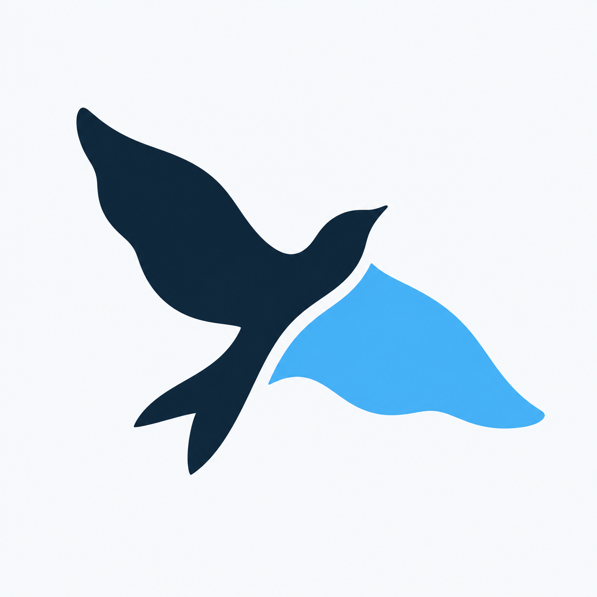

import assetMarkSvg from "./assets/mark.svg?url&no-inline";
import assetMarkInverseSvg from "./assets/mark-inverse.svg?url&no-inline";
import assetMark1024Png from "./assets/mark-1024.png?url&no-inline";
import assetMarkInverse1024Png from "./assets/mark-inverse-1024.png?url&no-inline";
import assetMarkMonoSvg from "./assets/mark-mono.svg?url&no-inline";
import assetMarkMono1024Png from "./assets/mark-mono-1024.png?url&no-inline";
import assetMarkWhiteSvg from "./assets/mark-white.svg?url&no-inline";
import assetMarkWhite1024Png from "./assets/mark-white-1024.png?url&no-inline";
import assetMark16Png from "./assets/mark-16.png?url&no-inline";
import assetMark24Png from "./assets/mark-24.png?url&no-inline";
import assetMark32Png from "./assets/mark-32.png?url&no-inline";
import assetMark48Png from "./assets/mark-48.png?url&no-inline";
import assetMark64Png from "./assets/mark-64.png?url&no-inline";
import assetMark128Png from "./assets/mark-128.png?url&no-inline";
import assetMark256Png from "./assets/mark-256.png?url&no-inline";
import assetMark512Png from "./assets/mark-512.png?url&no-inline";
import assetFavicon16Png from "./assets/favicon-16.png?url&no-inline";
import assetFavicon32Png from "./assets/favicon-32.png?url&no-inline";
import assetFavicon48Png from "./assets/favicon-48.png?url&no-inline";
import assetFaviconSvg from "./assets/favicon.svg?url&no-inline";
import assetFaviconIco from "./assets/favicon.ico?url&no-inline";
import assetAppleTouchIconPng from "./assets/apple-touch-icon.png?url&no-inline";
import assetIcon192Png from "./assets/icon-192.png?url&no-inline";
import assetIcon512Png from "./assets/icon-512.png?url&no-inline";
import assetIconMaskable512Png from "./assets/icon-maskable-512.png?url&no-inline";
import assetAvatar512Png from "./assets/avatar-512.png?url&no-inline";
import assetLogoSvg from "./assets/logo.svg?url&no-inline";
import assetLogoInverseSvg from "./assets/logo-inverse.svg?url&no-inline";
import assetLogo2400Png from "./assets/logo-2400.png?url&no-inline";
import assetLogoInverse2400Png from "./assets/logo-inverse-2400.png?url&no-inline";
import assetLogoMonoSvg from "./assets/logo-mono.svg?url&no-inline";
import assetLogoMono2400Png from "./assets/logo-mono-2400.png?url&no-inline";
import assetWordmarkSvg from "./assets/wordmark.svg?url&no-inline";
import assetOFLOnestTxt from "./assets/OFL-Onest.txt?url&no-inline";
import assetSocialCardPng from "./assets/social-card.png?url&no-inline";
import assetSocialCardSvg from "./assets/social-card.svg?url&no-inline";

Pakshi's bird is in open flight. Two broad shapes and the curved gap between them give the mark its character.

All files are in `docs/assets/`. SVGs are editable vectors; PNGs are ready to use at the listed sizes.

## Bird mark

<Columns cols={2}>
  <Column>
    <Frame caption="Primary mark on a light background">
      

        
      

    </Frame>
  </Column>
  <Column>
    <Frame caption="Inverse mark on a dark background">
      

        
      

    </Frame>
  </Column>
</Columns>

| Variant          | SVG                                                                    | Transparent PNG                                                                |
| ---------------- | ---------------------------------------------------------------------- | ------------------------------------------------------------------------------ |
| Full color       | <a href={assetMarkSvg} download="mark.svg">Download</a>                | <a href={assetMark1024Png} download="mark-1024.png">1024 px</a>                |
| White and blue   | <a href={assetMarkInverseSvg} download="mark-inverse.svg">Download</a> | <a href={assetMarkInverse1024Png} download="mark-inverse-1024.png">1024 px</a> |
| Navy, one color  | <a href={assetMarkMonoSvg} download="mark-mono.svg">Download</a>       | <a href={assetMarkMono1024Png} download="mark-mono-1024.png">1024 px</a>       |
| White, one color | <a href={assetMarkWhiteSvg} download="mark-white.svg">Download</a>     | <a href={assetMarkWhite1024Png} download="mark-white-1024.png">1024 px</a>     |

<Tabs>
  <Tab title="One-color marks">
    <Columns cols={2}>
      <Column>
        <Frame caption="Navy">
          

            
          

        </Frame>
      </Column>
      <Column>
        <Frame caption="White">
          

            
          

        </Frame>
      </Column>
    </Columns>
  </Tab>
  <Tab title="Original concept">
    

    The vector keeps this silhouette and replaces the raster texture with solid fills and smooth curves.

  </Tab>
</Tabs>

Additional transparent PNG sizes: <a href={assetMark16Png} download="mark-16.png">16</a>, <a href={assetMark24Png} download="mark-24.png">24</a>, <a href={assetMark32Png} download="mark-32.png">32</a>, <a href={assetMark48Png} download="mark-48.png">48</a>, <a href={assetMark64Png} download="mark-64.png">64</a>, <a href={assetMark128Png} download="mark-128.png">128</a>, <a href={assetMark256Png} download="mark-256.png">256</a>, and <a href={assetMark512Png} download="mark-512.png">512 px</a>.

## Favicons and app icons

The favicon includes a white tile to keep the bird visible on light and dark browser tabs. The ICO contains 16, 32, and 48 px images.

<Columns cols={3}>
  <Column>
    <Frame caption="16 px favicon">
      
    </Frame>
  </Column>
  <Column>
    <Frame caption="32 px favicon">
      
    </Frame>
  </Column>
  <Column>
    <Frame caption="48 px favicon">
      
    </Frame>
  </Column>
</Columns>

| Use               | Asset                                                                                                                                                                                             |
| ----------------- | ------------------------------------------------------------------------------------------------------------------------------------------------------------------------------------------------- |
| Browser favicon   | <a href={assetFaviconSvg} download="favicon.svg">SVG</a>, <a href={assetFaviconIco} download="favicon.ico">ICO</a>                                                                                |
| PNG favicon       | <a href={assetFavicon16Png} download="favicon-16.png">16 px</a>, <a href={assetFavicon32Png} download="favicon-32.png">32 px</a>, <a href={assetFavicon48Png} download="favicon-48.png">48 px</a> |
| Apple touch icon  | <a href={assetAppleTouchIconPng} download="apple-touch-icon.png">180 × 180 PNG</a>                                                                                                                |
| App icon          | <a href={assetIcon192Png} download="icon-192.png">192 × 192 PNG</a>, <a href={assetIcon512Png} download="icon-512.png">512 × 512 PNG</a>                                                          |
| Maskable app icon | <a href={assetIconMaskable512Png} download="icon-maskable-512.png">512 × 512 PNG</a>                                                                                                              |
| Profile avatar    | <a href={assetAvatar512Png} download="avatar-512.png">512 × 512 PNG</a>                                                                                                                           |

<Columns cols={2}>
  <Column>
    <Frame caption="Profile avatar with a circular crop">
      
    </Frame>
  </Column>
  <Column>
    <Frame caption="Maskable icon with extra space around the bird">
      
    </Frame>
  </Column>
</Columns>

## Optional wordmark

<Tabs>
  <Tab title="Light background">
    <Frame>
      

        
      

    </Frame>
  </Tab>
  <Tab title="Dark background">
    <Frame>
      

        
      

    </Frame>
  </Tab>
</Tabs>

The lowercase wordmark uses custom Devanagari-inspired lettering, with soft curves and short joins across the tops of selected letters. The lettering is outlined in the SVGs, so they need no installed font.

| Variant        | SVG                                                                    | Transparent PNG                                                                   |
| -------------- | ---------------------------------------------------------------------- | --------------------------------------------------------------------------------- |
| Full color     | <a href={assetLogoSvg} download="logo.svg">Download</a>                | <a href={assetLogo2400Png} download="logo-2400.png">2400 × 720</a>                |
| White and blue | <a href={assetLogoInverseSvg} download="logo-inverse.svg">Download</a> | <a href={assetLogoInverse2400Png} download="logo-inverse-2400.png">2400 × 720</a> |
| One color      | <a href={assetLogoMonoSvg} download="logo-mono.svg">Download</a>       | <a href={assetLogoMono2400Png} download="logo-mono-2400.png">2400 × 720</a>       |

<a href={assetWordmarkSvg} download="wordmark.svg">
  Wordmark alone
</a>
·
<a href={assetOFLOnestTxt} download="OFL-Onest.txt">
  Onest font license
</a>

## Colors

<Color variant="compact">
  <Color.Item name="Ink" value="#0D2436" />
  <Color.Item name="Sky" value="#48B0F0" />
  <Color.Item name="White" value="#FFFFFF" />
  <Color.Item name="Mist" value="#F3F9FE" />
</Color>

Use Ink for text on light backgrounds and White on dark backgrounds. Sky is the wing color and an accent, not a small-text color on white. Supporting typography uses Onest, matching Studio.

## Social sharing

<Frame>
  
</Frame>

<a href={assetSocialCardPng} download="social-card.png">
  1200 × 630 PNG
</a>
·
<a href={assetSocialCardSvg} download="social-card.svg">
  Editable SVG
</a>

## Usage

- Preserve the bird's aspect ratio, orientation, and the gap between its wings.
- Leave at least one eighth of the mark's square canvas clear around it.
- Use the inverse mark on dark backgrounds and the one-color versions for single-ink printing.
- Use the symbol alone at small sizes. At 16 px it reads as a silhouette; the wing separation is clearer at 24 px and above.
- Place the logo on a solid background when a photograph or pattern would obscure it.
