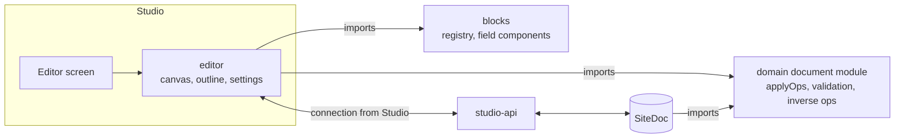
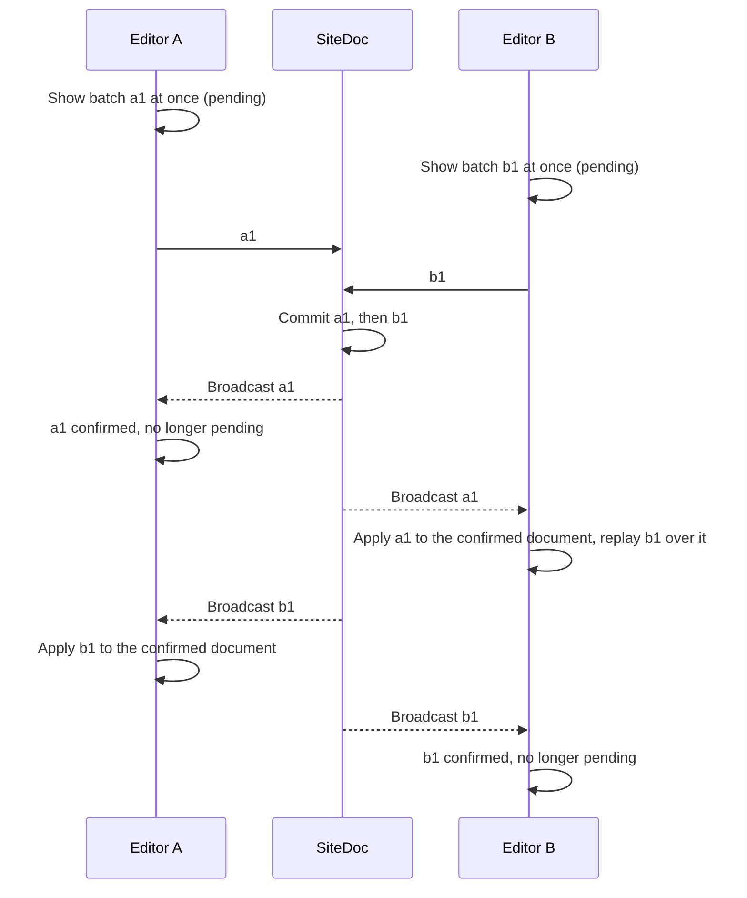

`@repo/editor`, in `packages/editor`, is Studio's visual editor. It edits a draft's page document on a live render of the page, while other people and the agent edit the same draft. It replaces Puck ([decision 025](/decision-log#decision-025)).

This page is the editor's specification. It says what the editor must do and why, where it meets the rest of Pakshi, and which existing implementations to learn from. It leaves the internal design to whoever builds it. Where it names a mechanism, the mechanism is the requirement, and the reason is given. The [technical design](/technical-design#editing-the-site-document-and-the-editor) covers `SiteDoc` and the page document, and the [build plan](/build-plan#2-editing-content) orders the work.

**How to use this spec:**

- Treat "must" as a requirement. Everything under [open questions](#open-questions) is the implementer's decision.
- Read the [references](#references) for a part before designing it. Each link is pinned to the commit that was studied.
- If building the editor shows a requirement is wrong, change this page and record the decision in the [decision log](/decision-log).

## What the editor is

The editor owns:

- **The canvas:** the page rendered in an iframe, with selection, overlays and insert points.
- **Field editing:** plain text and rich text in place, media through a popover, and every other field in the settings panel.
- **Structure editing:** inserting, moving, duplicating and removing blocks, in the canvas and in an outline panel.
- **The settings panel:** the selected block's fields, variant and surface, or the page's meta when nothing is selected.
- **The local copy of the draft:** the confirmed document plus this person's pending batches, kept in step with `SiteDoc`.
- **Undo and redo** for this person's changes.
- **Presence on the canvas:** where other people and the agent are.

It does not own:

- **The document rules.** Ops, validation and inverse ops live in the document module that `SiteDoc` also runs.
- **Transport, sign-in or permission logic.** Studio passes in a connection and the person's permissions for the draft.
- **Other Studio screens.** The page list, drafts, media library, menus, forms, the chat panel and the conflict screen are Studio's. They may reuse the editor's settings controls.

## Goals and non-goals

**Goals:**

1. **Immediate.** Every local change shows in the frame it's made in.
2. **Collaborative.** A change from another person or the agent never costs anyone their caret, selection or unsent input.
3. **Faithful.** The canvas looks exactly like the published page.
4. **Keyboard-complete.** Everything, including moving sections, works without a pointer.
5. **Small.** Its size follows from Pakshi's document (sections and items, two levels), not from general page building.
6. **Extensible in code.** The platform team adds field kinds, commands and canvas marks without changing the editor's core.

**Non-goals:**

- Free layout, nesting deeper than two levels, custom CSS or code. These are [product non-goals](/product-spec#non-goals).
- Plugins, or extensions from anyone outside the platform team.
- Two people typing in one rich text field with shared cursors.
- Dragging blocks from a palette into the canvas. A "+" at each insertion point does that job.
- Server rendering the editor route. It renders on the client only.

## Contracts

### With the page document and `SiteDoc`

- **Ops are the only way the editor changes a draft.** It uses the vocabulary in the [technical design](/technical-design#editing-the-site-document-and-the-editor): `setProp`, `setVariant`, `setSurface`, `insertBlock`, `moveBlock`, `removeBlock`, `setMeta`, `setPath`, `setSlug`, `setRedirect`, `createPage` and `deletePage`. A capability that needs a new op changes the document contract first.
- **One reducer.** The editor imports `applyOps`, validation and inverse ops from `packages/domain`'s document module, the same code `SiteDoc` runs. Applying a batch locally gives the same result the server will, except where the server knows more: another client's batch arrived first, or a permission changed.
- **Client-created IDs.** Every batch carries an ID the editor creates, and so does every new block and list item. `SiteDoc` confirms a batch by broadcasting it with that ID. Sending a batch twice, for example after a reconnect, has no extra effect.
- **Everything by ID.** Blocks, list items inside props, selection and presence are all addressed by ID, never by position. Positions change under concurrent edits; IDs don't.
- **Incomplete drafts are valid.** A field can be empty or shorter than its minimum while someone works on it. Limits the editor can enforce while typing (maximum length, allowed marks and nodes, link protocols) are hard. Completeness is checked at freezing and reported by the checks ([decision 026](/decision-log#decision-026)).

### With blocks

Blocks are versioned code, and from production on a released version never changes ([decision 006](/decision-log#decision-006), [decision 099](/decision-log#decision-099)). Whatever a block uses to make its fields editable is part of every version, so this contract must be small and stable.

- **Field components.** Blocks render every editable field through field components from `packages/blocks`: text, rich text, media, link, and slot (a named list of child blocks). The block's root element also carries the block's identity.
- **Two implementations, one output.** Outside the editor, field components render exactly the markup a block would write by hand, with no attributes or wrappers added. Inside the editor, the editor supplies editing versions through React context. They keep the same element, classes and content, and may add attributes, event handlers and `contenteditable`. They never add wrappers that change layout.
- **Why components.** A `contenteditable` element only works if the editor owns its children. If a block renders a value as React children, each re-render fights the caret. Owning the field components also lets the editor improve without a new block version.
- **No globals.** Blocks never read `window`, `document` or other browser globals while rendering. In the canvas, React renders into the iframe from Studio's window, so those globals would point at Studio.
- **Picker metadata.** Each block definition gives the picker what it needs: title, where the block is allowed (a section that shows an entry's own details declares `entryOf`, such as `post-header` with `entryOf: "blog"`, and goes only on entries of that kind), and the placeholder content a new instance starts with, which is also its preview. Sections and items keep that content in `fixtures/placeholder.json`, and it should look finished ([decision 037](/decision-log#decision-037)). The checks block a submission while placeholders remain.
- **Every field kind has an editor.** Each field builder in `packages/blocks` (`text`, `richText`, `media`, `cta`, `collection`, `number` and the rest) has a matching field kind in the editor. Adding a field builder without one must fail typecheck.

### With Studio

Studio gives the editor:

- **A connection** that sends batches and receives confirmed batches, rejections with structured errors, presence, and a fresh copy of the draft after a long disconnect. Studio builds it on PartySocket through `studio-api`, and the editor resends what `SiteDoc` hasn't confirmed each time it opens ([decision 043](/decision-log#decision-043)).
- **The person and their permissions** for this draft, as answered by `authorize`. The editor hides what the person can't do; `SiteDoc` still checks every batch.
- **Services:** the media picker and upload, reference resolution (media ID to image URL, page ID to title and address, form ID to form definition) and a page picker for links.

The editor gives Studio:

- The current selection, which the agent receives as context.
- Presence to publish: selected block, focused field, and whether the person is typing.
- Notices to show: an edit replaced by a later one, an op dropped because its block was removed, a field that undo skipped, a rejected batch.
- Its panels (canvas, outline, settings), which Studio lays out according to the [Studio designs](https://claude.ai/artifact/Soz1iX7Fw3M1KnotJgL5QU).

### With the agent

- The agent's edits arrive as remote batches, and the canvas highlights each changed block briefly.
- The agent's context includes the selected block's ID, so "make this shorter" works. Presence marks fields someone is typing in, and the agent leaves them alone.
- An agent turn undoes as one step, from `SiteDoc`'s history, started from the chat panel.

## Required behaviour

### Canvas

- The canvas is a same-origin iframe (`srcdoc`) that Studio's React tree renders into through a portal. Studio and the canvas share one store, one drag-and-drop manager and one connection, with no message protocol between them.
- The iframe receives only the platform CSS, the site's theme CSS for the draft's pinned brand revision, and its fonts. Studio's styles never enter it.
- It renders the header, the page and the footer with the components `sites` uses, from the same registry, at the draft's pinned block versions.
- It renders blocks with the same components as `sites`, live in Studio's React tree. An interactive block reads `useEditing` to hold still while it's edited, so a form doesn't submit and a carousel doesn't rotate.
- Width presets (desktop, tablet, mobile) resize the iframe, so the page's own media queries apply. Light and dark fix the theme's color scheme in the frame, because a frame's `prefers-color-scheme` follows the operating system ([decision 036](/decision-log#decision-036)).
- Keyboard shortcuts work whether focus is in the canvas or in Studio's panels.
- The editor's menus and popovers render in Studio, positioned from the canvas, so they use Studio's styles.

### Selection and overlays

- A selection is one block, or one field in one block, by ID. It survives every remote change except removal of the selected block, which clears it with a notice.
- Hover and selection outlines, insert points, other people's presence and agent highlights are drawn inside the iframe in page coordinates, so they scroll with the page without script. Measurements update when elements resize, the page changes or fonts load.
- Overlays never change the page's layout, and never modify block elements beyond the attributes field components add.
- Arrow keys move the selection between blocks. Enter moves into the selected block's first field, and Escape moves out to the parent.

### Editing fields

- **Plain text** is edited in place as an uncontrolled `contenteditable="plaintext-only"` element. The editor writes to it only when the stored value differs from what it shows. Enter commits a single-line field, and Escape reverts the current edit. Pasting inserts plain text. The maximum length is enforced while typing.
- **Rich text** is edited in place with TipTap, using that field's extensions: its allowed marks and nodes. The site renders the same JSON with `@tiptap/static-renderer` and the same extensions, so both produce the same markup. The formatting menu offers only allowed marks, and links accept only allowed protocols. Each field has at most one TipTap editor. The settings panel never opens a second one on the same field.
- **Media** opens a popover to replace the image from the site's or brand's library, and to edit the alt text for this placement. Uploads arrive with the media library ([decision 034](/decision-log#decision-034)).
- **Buttons** have their label edited in place like plain text. While a button is selected, where it goes (a page on the site or a web address) is chosen in a panel under it.
- **A link with no element of its own,** such as a logo's, gets a mark on the part it belongs to, which opens where it goes.
- **A form** is chosen from the form on the page. Its questions belong to the site's forms, not the block.
- **Parts a block may leave out** are added and removed where they'd be. A block's released code renders an optional part only when it's set, so the canvas renders the selected block with an example in each missing part, and the field components draw a dashed "Add" button in its place instead. A part the chosen layout needs can't be removed, and choosing that layout turns it on.
- **List items,** such as an FAQ's questions, have a toolbar on the canvas to move them earlier or later or remove them, within the list's minimum and maximum. A list ends with a button that adds an item, copied from the block's example content.
- **Every other field** opens the settings panel with that field focused.
- **Keyboard:** every field can be reached and edited from the keyboard. Editable text has `role="textbox"` and a label from the field's title.
- **While typing,** the editor sends ops in short batches, so other people and the agent see the text within half a second. One burst of typing in one field is one undo step.

### Settings panel

- It shows the selected block's fields, variant and surface. With no block selected, it shows the page's settings, headed by what the page is: Page, Blog or Post settings. Controls are generated from the block's schema through each field's kind.
- **A page's or blog's address** is edited whole, and a blog's note says its posts move with it. **A post's address** shows its blog's address as a fixed prefix and edits only the slug, with `setSlug`. Both offer a redirect from the old address, sent in the same batch with `setRedirect`.
- **A post** also has a Post section: its date, author, excerpt, tags and cover image, each set with `setMeta`. The document module checks each field against the meta the page's type takes, so a page or blog has no date or cover.
- **A `collection` field,** such as which blog a blog list shows, is chosen from the draft's collections of the field's kind. While it still holds the placeholder collection, the list also offers its sample posts. **A `number` field** takes a whole number within the field's limits, saved as it's typed.
- **Each control reads its value from the local copy of the draft and emits `setProp`.** No form library or local form state holds a second copy of the values. A remote change shows at once, unless the person has an unconfirmed edit in that control.
- Validation messages come from the shared reducer, per field. Incomplete fields show as incomplete and don't block editing.
- Variant and surface are chosen from previews.

### Structure

- **Insert:** a "+" at the edges between blocks and at the end of each slot opens the block picker, and so do the outline and the block menu. The picker lists only blocks allowed at that spot: section types at the top level and item types in a slot. It has search, and previews the highlighted block in the draft's theme ([decision 039](/decision-log#decision-039)). A section with `entryOf` is listed only on entries of its kind. A listing inserted on a collection lists that collection. Anywhere else it lists the site's only collection of its kind, and with several or none it keeps the placeholder until someone chooses. The picker's previews show the same. A new block starts with its placeholder content, and the canvas and outline mark every block that still has some.
- **Move:** blocks move by drag within and between lists, in the canvas and in the outline panel. A drop line shows where the block will land. A drag in progress never changes the document, and the drop emits one `moveBlock`.
- **Move without dragging:** move up, move down and move to work from the keyboard and from menus, and are announced in a live region with where the block landed. An item at either end of its slot moves into the nearest slot that accepts it, and move to puts it at the end of any other ([decision 038](/decision-log#decision-038)). Every drag has this alternative ([WCAG 2.5.7](https://www.w3.org/WAI/WCAG22/Understanding/dragging-movements.html)), so drag handles are for pointers only ([decision 040](/decision-log#decision-040)).
- **Duplicate and remove.** Duplicating gives the copy and its children new IDs. The header and footer belong to every page, so they can't be moved, duplicated or removed.
- **Outline panel:** a tree of the page's sections and items, navigable by keyboard, with the same commands as the canvas.

### Local copy and remote changes [#remote-changes]

The editor shows its pending batches replayed over the latest confirmed document. When a broadcast arrives, the editor advances the confirmed document, removes its own batch if the broadcast confirms one, and replays the rest. An op that fails on replay, for example because its block was removed, is dropped and its author is told. A batch `SiteDoc` rejects is removed, and its error is shown.

Two people edit at once. `SiteDoc` commits A's batch first, so B's editor replays its pending batch over A's:

If a1 and b1 both changed the same field, both editors end with b1's value, and A is told its edit was replaced.

These rules must each hold, and each has a test:

1. **Pending edits stay.** A field with this person's unconfirmed edit keeps showing their value until the edit is confirmed.
2. **Plain text keeps its caret.** A remote change to a focused plain text field applies the new value and keeps the caret in the same place relative to the surrounding text. If it replaced this person's confirmed edit, they are told. Text inputs in the settings panel keep their caret the same way.
3. **Rich text keeps its cursor.** A remote change to a focused rich text field applies as a minimal ProseMirror transaction, computed with `prosemirror-changeset`, that stays out of the field's undo history. If the minimal transaction can't reproduce the new value, the field is replaced whole and the cursor keeps its text offset.
4. **Composition is never interrupted.** Nothing is written into a field while the person is composing text with an input method. The change applies when composition ends, made again around what was composed ([decision 045](/decision-log#decision-045)).
5. **Selection is stable.** Inserts and moves elsewhere never change what is selected.
6. **The view is stable.** Blocks inserted or grown above the viewport don't move what the person is looking at. The editor keeps the view in place itself, with the browser's scroll anchoring off, so every browser behaves the same.
7. **Remote changes aren't undoable locally.** A remote change never enters this person's undo stack.

**Presence:** the editor publishes the person's selected block, focused field and typing state, and draws other people's as outlines labelled with their names. The agent appears as the agent acting for its user.

**Merges and publishing:** a merge reaches the editor as a remote batch led by a `rebase`, like any other change. If it moves the draft to block versions the editor didn't load, the editor asks the person to open the draft again. When someone publishes or closes the draft, everyone in it is told, and it takes no more changes; when another draft goes live, the editor shows that this one is behind.

**Reconnecting:** after a reconnect, the editor resends its unconfirmed batches. If `SiteDoc` sends a fresh copy of the draft instead, the editor replays its pending batches over it.

### Undo

- Undo is per person and per command. When a command applies, the editor keeps its inverse ops, produced by the shared reducer.
- Undo sends the inverse as a batch that applies only to fields where this person's write is still the latest. `SiteDoc` skips the rest and says which, and the editor tells the person.
- One burst of typing in one field is one step, and a chain of commands is one step. Redo works the same way.
- In a focused rich text field, undo goes to TipTap's own history. When the field loses focus, the whole burst becomes one step.
- Shortcuts go to the focused text field first, then to block commands, then to Studio.
- Agent turns undo from the chat panel, as one step from `SiteDoc`'s history.

### Extension points

The platform team extends the editor in code. There is no runtime plugin API. There are three extension points:

- **Field kinds.** Each kind supplies its in-place editor (if it has one), its settings control, and its one-line summary for the outline.
- **Commands.** One definition gives a command its keyboard shortcut, its menu and toolbar entries, and its availability check, which runs the same code as the command. A command returns ops. A chain of commands is one batch and one undo step, and applies all or nothing.
- **Decorations.** Marks on the canvas keyed by block ID and field path. Presence, agent highlights and validation messages all use them.

### Accessibility

The editor meets WCAG 2.2 AA, like the rest of Studio. On top of the requirements above:

- Moves, inserts, removals and remote replacements of the focused field are announced in a live region.
- Focus returns to where it was when a popover or menu closes.
- The outline panel follows the ARIA tree pattern.

### Performance budgets

On a page with 150 blocks:

- A keystroke in a field re-renders only that field's block, and paints in the next frame.
- A remote batch re-renders only the blocks it touches.
- The canvas shows the page within 1 second after the draft arrives.

CI measures these with the thresholds recorded in the tests, as it does for bundle size.

## Dependencies

Use existing packages where the job has clear edges, and pin exact versions:

| Job                                                                   | Package                                                                                             |
| --------------------------------------------------------------------- | --------------------------------------------------------------------------------------------------- |
| Rich text editing in a field                                          | TipTap (`@tiptap/core`, `@tiptap/react`), on ProseMirror                                            |
| Rendering rich text on the site with the editor's extensions          | `@tiptap/static-renderer`                                                                           |
| Converting the agent's Markdown to rich text                          | `@tiptap/markdown`, with a check that rejects syntax the field doesn't allow instead of dropping it |
| Applying a remote rich text change without moving the cursor          | `prosemirror-changeset`                                                                             |
| Drag and drop with a pointer, auto-scroll, dragging across the iframe | `@dnd-kit/react` and `@dnd-kit/dom` 0.5.x. Not the legacy `@dnd-kit/core`                           |
| Popovers, menus, dialogs, the block picker, settings controls         | shadcn/ui on Base UI                                                                                |
| Generating settings controls                                          | Effect Schema, through the field builders                                                           |

**No dependency holds its own copy of page state.** The one exception is a rich text field's value inside its TipTap editor. That is allowed because a field is one value with one editor, and remote changes reach it only through the minimal-transaction path. Puck broke this rule, and most of its integration problems followed from it.

To read a dependency's code at the version in use, such as TipTap or dnd-kit, clone it into a temporary directory outside the repository. Only Effect is vendored under `.repos/`.

## Testing

- **The local copy** is tested through the editor's public interface against an in-process fake `SiteDoc` that runs the real document module. The fake stands in for the connection only.
- **Convergence:** a property test runs several simulated clients making random concurrent batches: inserts, moves, removals, writes to the same field, undo and reconnects. Every client must end showing the server's document.
- **Browser tests** (Vitest browser mode with Playwright, already in the workspace) cover each [remote-change rule](#remote-changes), input-method composition, and keyboard-only journeys.
- **Accessibility:** axe runs on the editor screen.
- **Two browsers:** the [live co-editing checkpoint](/build-plan#4-live-co-editing) runs a scripted session in two browsers against one draft in the dev stack.

## Mistakes to avoid

Each of these caused real problems in an editor we studied:

- **Addressing by position.** Puck's actions and selection use an index and a zone, so every async gap becomes a race ([Puck actions](https://github.com/puckeditor/puck/blob/9be9a85d69c837d70308fd598e027638d81f247d/packages/core/reducer/actions.tsx)). Payload's field paths contain row indexes, so moving a row re-keys every field inside it ([Payload `MOVE_ROW`](https://github.com/payloadcms/payload/blob/0578022c1df1167344da55c3a9225187a1e3ee26/packages/ui/src/forms/Form/fieldReducer.ts#L235-L262)).
- **IDs created while applying an op.** Puck gives duplicated blocks and slot children fresh random IDs inside its reducer, so replaying an op gives a different result. IDs are created by whoever creates the op.
- **Writing a whole block per keystroke.** Puck replaces the whole component on every keystroke, and its sidebar writes whole top-level values. Last-write-wins per field only works if writes are per field.
- **Ignoring the store while a field is focused.** Puck's sidebar fields ignore remote changes while focused, then overwrite them on the next keystroke ([`use-local-value.ts`](https://github.com/puckeditor/puck/blob/9be9a85d69c837d70308fd598e027638d81f247d/packages/core/components/AutoField/lib/use-local-value.ts#L48-L58)).
- **Replacing rich text wholesale and restoring offsets.** Puck calls `setContent` and restores the old numeric cursor position, which lands in the wrong place when text before it changed ([`use-synced-editor.ts`](https://github.com/puckeditor/puck/blob/9be9a85d69c837d70308fd598e027638d81f247d/packages/core/components/RichTextEditor/lib/use-synced-editor.ts)).
- **Snapshot undo and page-wide hotkeys.** Puck's undo restores whole-page snapshots, which erases other people's changes. Its undo hotkeys are page-wide and fire even inside text inputs ([`history.ts`](https://github.com/puckeditor/puck/blob/9be9a85d69c837d70308fd598e027638d81f247d/packages/core/store/slices/history.ts), [`use-hotkey.ts`](https://github.com/puckeditor/puck/blob/9be9a85d69c837d70308fd598e027638d81f247d/packages/core/lib/use-hotkey.ts#L83-L99)).
- **Copying host styles into the frame.** Puck mirrors every Studio stylesheet into the iframe by default, which has frozen the main thread and broken strict CSP ([`AutoFrame`](https://github.com/puckeditor/puck/blob/9be9a85d69c837d70308fd598e027638d81f247d/packages/core/components/AutoFrame/index.tsx#L80-L374)).
- **Changing the block's DOM.** Puck sets `position: relative` on block roots and adds wrapper elements, which breaks layouts.
- **Dropping the keyboard.** Puck replaces dnd-kit's sensors with the pointer sensor only and offers no other way to move a block, so nothing can be moved by keyboard ([`use-sensors.ts`](https://github.com/puckeditor/puck/blob/9be9a85d69c837d70308fd598e027638d81f247d/packages/core/lib/dnd/use-sensors.ts#L34-L53)).
- **Saving only on blur.** EmDash's in-place editing saves on blur and shows every failure as "Save failed" without reverting the text, so text that was never stored stays on screen ([EmDash `toolbar.ts`](https://github.com/emdash-cms/emdash/blob/584f1661e5a2c8533c593af27b0e1852d2a8c663/packages/core/src/visual-editing/toolbar.ts#L846-L872)).
- **Sending the whole document per change.** Payload's live preview sends the whole document to the preview frame on every form change.

## References

Links are pinned to the commits studied on 2026-09-29. ProseMirror's GitHub repositories are mirrors that stopped updating on 2026-04-01; the current code is at [code.haverbeke.berlin](https://code.haverbeke.berlin). The files cited here matched it except for small differences in `prosemirror-view`.

**Canvas and iframe:**

- Puck [`AutoFrame`](https://github.com/puckeditor/puck/blob/9be9a85d69c837d70308fd598e027638d81f247d/packages/core/components/AutoFrame/index.tsx#L440-L465): a portal from one React root into a `srcdoc` iframe. Take the portal; leave out `CopyHostStyles`.
- Puck [`use-inject-css.ts`](https://github.com/puckeditor/puck/blob/9be9a85d69c837d70308fd598e027638d81f247d/packages/core/lib/use-inject-css.ts): injecting chosen CSS into the frame.
- react-frame-component [`Frame.jsx`](https://github.com/ryanseddon/react-frame-component/blob/3f4cb97f4aed9671d7bfd5dcd67bdfed62aa661d/src/Frame.jsx): the smallest version, including a fallback for a frame whose load event never fires.
- Puck [`Preview`](https://github.com/puckeditor/puck/blob/9be9a85d69c837d70308fd598e027638d81f247d/packages/core/components/Puck/components/Preview/index.tsx#L15-L66): passing pointer events from the frame to the host.
- Portal pitfalls, from Puck's issues: the wrong `window` breaking drag and drop ([#1219](https://github.com/puckeditor/puck/issues/1219)), and media queries in script reading Studio's viewport ([#1052](https://github.com/puckeditor/puck/issues/1052)).

**Overlays and selection:**

- Sanity [`controller.ts`](https://github.com/sanity-io/visual-editing/blob/a2c4fab31f584f68741f01c482965c1e1db1b773/packages/visual-editing/src/controller.ts): the best single file. Mutation, resize and intersection observers, re-measuring after fonts load, and a hover stack so only the innermost element highlights.
- Sanity [`geometry.ts`](https://github.com/sanity-io/visual-editing/blob/a2c4fab31f584f68741f01c482965c1e1db1b773/packages/visual-editing/src/util/geometry.ts) and [`elements.ts`](https://github.com/sanity-io/visual-editing/blob/a2c4fab31f584f68741f01c482965c1e1db1b773/packages/visual-editing/src/util/elements.ts): rects in page coordinates, and measuring a non-inline ancestor because resize observers ignore inline elements.
- Puck [`DraggableComponent`](https://github.com/puckeditor/puck/blob/9be9a85d69c837d70308fd598e027638d81f247d/packages/core/components/DraggableComponent/index.tsx#L282-L390): overlays portaled into the frame body, including the `position: fixed` case.

**Insert points and the picker:**

- Sanity [`UnionInsertMenuOverlay.tsx`](https://github.com/sanity-io/visual-editing/blob/a2c4fab31f584f68741f01c482965c1e1db1b773/packages/visual-editing/src/overlay-components/components/UnionInsertMenuOverlay.tsx): a hover strip on each item's edges with a "+" that opens a type menu.
- Payload [`BlockSelector`](https://github.com/payloadcms/payload/blob/0578022c1df1167344da55c3a9225187a1e3ee26/packages/ui/src/fields/Blocks/BlockSelector/index.tsx#L106-L125) and EmDash [`BlocksField.tsx`](https://github.com/emdash-cms/emdash/blob/584f1661e5a2c8533c593af27b0e1852d2a8c663/packages/admin/src/components/BlocksField.tsx): pickers with thumbnails, groups and search.

**Editing text in place:**

- Puck [`InlineTextField`](https://github.com/puckeditor/puck/blob/9be9a85d69c837d70308fd598e027638d81f247d/packages/core/components/InlineTextField/index.tsx#L34-L127): an uncontrolled `plaintext-only` element written only when its value differs, and the Safari workaround of making it editable only on hover or focus. Its gap is the focused-caret case in rule 2.
- EmDash [`toolbar.ts`](https://github.com/emdash-cms/emdash/blob/584f1661e5a2c8533c593af27b0e1852d2a8c663/packages/core/src/visual-editing/toolbar.ts#L887-L972): Enter and Escape handling, and turning ` ` and `
` back into newlines.
- EmDash [`editable.ts`](https://github.com/emdash-cms/emdash/blob/584f1661e5a2c8533c593af27b0e1852d2a8c663/packages/core/src/visual-editing/editable.ts#L29-L100): edit annotations that exist only in edit mode and render nothing otherwise.
- Webstudio [`text-editor.tsx`](https://github.com/webstudio-is/webstudio/blob/432ca1172d6dda65cec7221b076b8399439650d5/apps/builder/app/canvas/features/text-editor/text-editor.tsx): rich text edited in place inside a canvas.

**Rich text:**

- TipTap [`setContent`](https://github.com/ueberdosis/tiptap/blob/aef3880b476b963ad063ef76664cf9d0fbb15cd9/packages/core/src/commands/setContent.ts): replaces the whole document in one step, which moves the cursor and records undo history. Don't use it for remote changes.
- [`prosemirror-changeset`](https://github.com/ProseMirror/prosemirror-changeset/blob/3e1c6668116383b5bd344f3d543b7e2691c15458/src/changeset.ts) and prosemirror-view's [`findDiff`](https://github.com/ProseMirror/prosemirror-view/blob/ca4c78e9b56f1b164c0b3758b59d8748f11b7534/src/domchange.ts): computing a minimal change between two documents. The default encoder ignores marks, so use one that includes marks and node attributes.
- TipTap [static renderer](https://github.com/ueberdosis/tiptap/tree/aef3880b476b963ad063ef76664cf9d0fbb15cd9/packages/static-renderer) and [`MarkdownManager`](https://github.com/ueberdosis/tiptap/blob/aef3880b476b963ad063ef76664cf9d0fbb15cd9/packages/markdown/src/MarkdownManager.ts). The Markdown converter silently drops syntax whose extension isn't installed, so check its tokens against the field first.

**Keeping the local copy in step:**

- [`prosemirror-collab`](https://github.com/ProseMirror/prosemirror-collab/blob/7736c6c9ad4407af2678112a1cad82c1d3c53dcf/src/collab.ts) and the [collaborative editing guide](https://prosemirror.net/docs/guide/#collab): unconfirmed changes replayed over confirmed ones. Pakshi's version is simpler: ops addressed by ID replay without position mapping, and `SiteDoc` never asks a client to retry.
- Payload [`mergeServerFormState.ts`](https://github.com/payloadcms/payload/blob/0578022c1df1167344da55c3a9225187a1e3ee26/packages/ui/src/forms/Form/mergeServerFormState.ts#L76-L129): local edits win until the server has them.
- Webstudio [`sync-client.ts`](https://github.com/webstudio-is/webstudio/blob/432ca1172d6dda65cec7221b076b8399439650d5/apps/builder/app/shared/sync-client.ts#L225): a canvas kept in step as another copy of one ordered stream of changes.

**Undo:**

- [`prosemirror-history`](https://github.com/ProseMirror/prosemirror-history/blob/445409bc99c88550c2312f5610829ecb25105a5f/src/history.ts): grouping by time and adjacency, and keeping remote changes out of the history.

**Commands and extension points:**

- TipTap [`Extendable.ts`](https://github.com/ueberdosis/tiptap/blob/aef3880b476b963ad063ef76664cf9d0fbb15cd9/packages/core/src/Extendable.ts) and [`CommandManager.ts`](https://github.com/ueberdosis/tiptap/blob/aef3880b476b963ad063ef76664cf9d0fbb15cd9/packages/core/src/CommandManager.ts): one object contributing commands, shortcuts and options, command chains, and `can()`. Unlike TipTap's `run()`, Pakshi's chains apply nothing if any command in them can't run.
- TipTap [`useEditorState`](https://github.com/ueberdosis/tiptap/blob/aef3880b476b963ad063ef76664cf9d0fbb15cd9/packages/react/src/useEditorState.ts): components subscribe to a selected slice of state, so a change re-renders only what reads it.
- [`prosemirror-state`](https://github.com/ProseMirror/prosemirror-state/blob/ffad5d9450a0b93438be53a801deee1a223a81bf/src/state.ts#L137): a transaction's origin carried as metadata, so each part of the state can tell remote changes from local ones.

**Drag and drop:**

- dnd-kit [sortable](https://github.com/clauderic/dnd-kit/tree/e522d9c6a3cbe39e6e980ee3b6fd7a78f238ab94/packages/dom/src/sortable), [keyboard sensor](https://github.com/clauderic/dnd-kit/blob/e522d9c6a3cbe39e6e980ee3b6fd7a78f238ab94/packages/dom/src/core/sensors/keyboard/KeyboardSensor.ts), [accessibility plugin](https://github.com/clauderic/dnd-kit/tree/e522d9c6a3cbe39e6e980ee3b6fd7a78f238ab94/packages/dom/src/core/plugins/accessibility) and [iframe support](https://github.com/clauderic/dnd-kit/blob/e522d9c6a3cbe39e6e980ee3b6fd7a78f238ab94/packages/dom/src/utilities/execution-context/getDocuments.ts).
- Puck [`NestedDroppablePlugin`](https://github.com/puckeditor/puck/blob/9be9a85d69c837d70308fd598e027638d81f247d/packages/core/lib/dnd/NestedDroppablePlugin.ts#L68-L235) and [collision detector](https://github.com/puckeditor/puck/blob/9be9a85d69c837d70308fd598e027638d81f247d/packages/core/lib/dnd/collision/dynamic/index.ts#L38-L184): choosing the zone under the pointer, then the position inside it with a dead zone against flicker. With two levels, the zone is either the top level or one section's slot.
- Craft.js [`Positioner.ts`](https://github.com/prevwong/craft.js/blob/23f44f3208ebf78d1632ec4aa7094001f513eb41/packages/core/src/events/Positioner.ts#L119-L224): near a container's edge, drop beside it rather than into it.
- Pragmatic drag and drop's [accessibility guidelines](https://github.com/atlassian/pragmatic-drag-and-drop/blob/361794a6a4d66405f132c852a2847c03850ccc1c/packages/documentation/constellation/09-accessibility-guidelines/index.mdx): move actions in menus as the alternative to dragging.

**Keyboard navigation:**

- Webstudio [`tree.tsx`](https://github.com/webstudio-is/webstudio/blob/432ca1172d6dda65cec7221b076b8399439650d5/packages/design-system/src/components/tree.tsx): a keyboard-navigable layers tree with drag and drop.
- Puck [`use-delete-hotkeys.ts`](https://github.com/puckeditor/puck/blob/9be9a85d69c837d70308fd598e027638d81f247d/packages/core/lib/use-delete-hotkeys.ts#L27-L62): not firing block shortcuts inside inputs, editable text or dialogs.

## Open questions

The implementer decides these:

- The exact shape of the field components, and how a block's root element carries its identity.
- How content a block hides is edited, such as carousel slides after the first. The default is to select it in the outline panel and edit it in the settings panel.
- Whether every rich text field mounts TipTap, or fields show static output until focused. Measure against the performance budgets first.
- How often typing is sent, within the half-second target.
- How the store is built, as long as components subscribe to the slices they read.
- When a reconnect resends pending batches and when it asks for a fresh copy of the draft.
