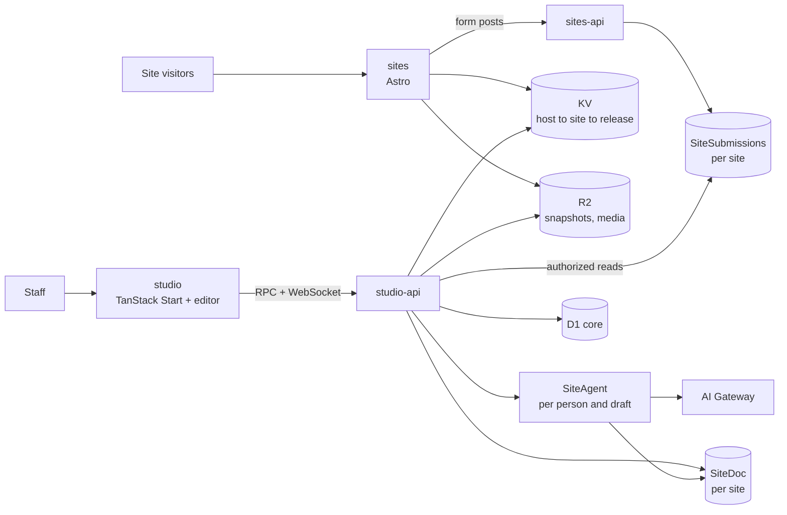
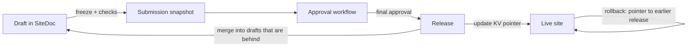
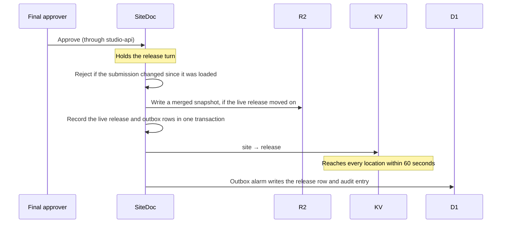

Pakshi is **four Cloudflare Workers** in two pairs, each a web layer and an API layer, sharing one set of packages. `sites` (Astro) serves every public site, and `sites-api` receives form submissions. `studio` (TanStack Start) is the admin UI, and `studio-api` holds the domain logic, the per-site documents and the agent. Each site's drafts live in one Durable Object, where people and the agent edit together in real time and drafts that fall behind merge in published changes. Publishing writes an immutable snapshot to R2 and moves a pointer; rollback moves it back.

This doc follows the [vision](/vision) and the [product spec](/product-spec). Decisions and their reasoning are in the [decision log](/decision-log). **Design rule:** use Cloudflare's primitives fully and design for scale, but add no machinery the product doesn't need: no extra services, fallback chains or recovery layers without a concrete reason.

## Architecture at a glance

Four Workers, connected by service-binding RPC. Public traffic never touches the database that editors use.



- **`sites`** renders published sites from snapshots. It is read-only and forwards form posts to `sites-api`.
- **`sites-api`** is the public-facing API for form intake. It hosts the `SiteSubmissions` Durable Objects, one per site, and is the only writer of submissions.
- **`studio`** is the TanStack Start UI, with Pakshi's own visual [editor](/editor). It has no data bindings of its own: it calls `studio-api` over RPC and reaches site documents and the agent over WebSockets through it. It also serves drafts' previews.
- **Studio's RPC** is one Effect RPC contract, `StudioRpcs` in `packages/contracts`, sent over the service binding to a named `StudioRpc` entrypoint ([decision 029](/decision-log#decision-029)). Its schemas check every call on both sides, and a session middleware turns the forwarded session cookie into the signed-in person, so no method takes the person as an argument. Sign-in itself is forwarded as plain HTTP, because OAuth needs real redirects and cookies.
- **`studio-api`** holds domain logic and permissions, the `SiteDoc` and `SiteAgent` Durable Objects, scheduled jobs, and authorized reads of submissions.
- All four import the same packages (page schema, blocks, themes, permission rules), so the editor and the public site render with the same code.

## Stack

| Concern                   | Choice                                                 | Notes                                                                                                                                                                                                                                                                                                                                         |
| ------------------------- | ------------------------------------------------------ | --------------------------------------------------------------------------------------------------------------------------------------------------------------------------------------------------------------------------------------------------------------------------------------------------------------------------------------------- |
| Hosting and runtime       | Cloudflare Workers                                     | Four Workers: `sites`, `sites-api`, `studio`, `studio-api`                                                                                                                                                                                                                                                                                    |
| Public site rendering     | Astro 7 with React, Alchemy's Cloudflare adapter       | Server-rendered from snapshots; interactive blocks hydrate as islands. Alchemy's Astro resource adds its fork of `@astrojs/cloudflare` and owns the Worker entry, so the host lookup and page cache run in Astro middleware ([decision 027](/decision-log#decision-027)). Bindings come from `cloudflare:workers`, not `Astro.locals.runtime` |
| Admin app                 | TanStack Start, Router, Query, Form, Table             | Studio UI; calls studio-api over RPC                                                                                                                                                                                                                                                                                                          |
| Visual editor             | `@repo/editor`, our own                                | Edits the page document directly on a live render of the page, with others; see [Editor](/editor)                                                                                                                                                                                                                                             |
| Drag and drop             | dnd-kit (`@dnd-kit/react`)                             | Reordering blocks in the editor with a pointer; the keyboard moves blocks with the editor's move commands                                                                                                                                                                                                                                     |
| UI primitives and styling | shadcn/ui, Tailwind v4                                 | Theme tokens as CSS variables                                                                                                                                                                                                                                                                                                                 |
| Schema and validation     | Effect Schema (Effect v4)                              | Same library as the starter. One schema drives validation, editor controls and agent tool definitions through its Standard Schema and JSON Schema output                                                                                                                                                                                      |
| Rich text                 | TipTap (ProseMirror JSON)                              | Each field's extensions drive the editor, the site's static renderer (`@tiptap/static-renderer`) and Markdown conversion for the agent (`@tiptap/markdown`). A rich text field is one value; no shared-cursor editing                                                                                                                         |
| Site drafts               | Durable Objects (SQLite)                               | One `SiteDoc` per site, built on PartyServer for live editing and presence                                                                                                                                                                                                                                                                    |
| Form submissions          | Durable Objects (SQLite)                               | One `SiteSubmissions` per site, so each site's customer data is its own database                                                                                                                                                                                                                                                              |
| Relational data           | D1                                                     | One `core` database, queried with Effect SQL through `@effect/sql-d1`; Better Auth reads and writes its own tables directly                                                                                                                                                                                                                   |
| Files and snapshots       | R2                                                     | Media, snapshots, source documents                                                                                                                                                                                                                                                                                                            |
| Routing                   | KV                                                     | Hostname → site → current release                                                                                                                                                                                                                                                                                                             |
| Images                    | Cloudflare Images                                      | Resizing and format conversion                                                                                                                                                                                                                                                                                                                |
| Agent runtime             | Effect AI in a PartyServer Durable Object              | One `SiteAgent` per person and draft; tools are Effect schemas, and models are reached through Effect's OpenAI-compatible provider ([decision 058](/decision-log#decision-058))                                                                                                                                                               |
| Model access              | AI Gateway                                             | Logging, cost tracking, one spend limit for the product                                                                                                                                                                                                                                                                                       |
| Document conversion       | Workers AI `toMarkdown`                                | For uploaded source documents                                                                                                                                                                                                                                                                                                                 |
| Staff sign-in             | Better Auth                                            | Runs in studio-api; the `genericOAuth` plugin connects to the organization's identity provider over OIDC; sessions in D1                                                                                                                                                                                                                      |
| Custom domains            | Cloudflare for SaaS                                    | Custom hostnames with automatic certificates                                                                                                                                                                                                                                                                                                  |
| Email                     | Cloudflare Email Service                               | Sending is in public beta; sender domains must use Cloudflare DNS                                                                                                                                                                                                                                                                             |
| Monorepo                  | application-platform-starter: pnpm, Turborepo, Alchemy | Effect for services, Alchemy for infrastructure as code, oxlint and oxfmt, Vitest, Playwright for visual regression                                                                                                                                                                                                                           |

**Cloudflare plan: Workers Paid, no Enterprise features.** Production runs on Workers Paid (from $5 a month per account plus usage), which covers Workers, Durable Objects, D1, R2, KV, Email Service and everything else in this design ([pricing](https://developers.cloudflare.com/workers/platform/pricing/)). Cloudflare for SaaS includes 100 custom hostnames. The only Enterprise-only feature we'd considered, root-domain proxying, is left out (see Domains).

## Repository and environments

We start from [application-platform-starter](https://github.com/AdiRishi/application-platform-starter): a pnpm and Turborepo monorepo where Alchemy declares all Cloudflare infrastructure in TypeScript and Effect implements application services. We keep its conventions and tooling (oxlint and oxfmt with its lint rules, TypeScript 7, Vitest, Playwright, Blume docs and repository ADRs) and replace its sample CSV app with Pakshi.

| Path                 | Contents                                                                                                                                                                                                                  |
| -------------------- | ------------------------------------------------------------------------------------------------------------------------------------------------------------------------------------------------------------------------- |
| `infra/`             | Alchemy graph: all four Workers, Durable Objects, D1, R2, KV, bindings and domains. No per-app Wrangler config                                                                                                            |
| `apps/studio`        | TanStack Start app (the starter's `apps/web`): Studio UI and drafts' previews                                                                                                                                             |
| `apps/sites`         | Astro app: public sites                                                                                                                                                                                                   |
| `workers/studio-api` | Domain logic, `SiteDoc` and `SiteAgent` Durable Objects, scheduled jobs. A plain Worker with its own entry file, because PartyServer's Durable Objects are plain classes that a starter-style Effect Worker can't host    |
| `workers/sites-api`  | Form intake and the `SiteSubmissions` Durable Objects                                                                                                                                                                     |
| `packages/contracts` | Effect schemas for pages, sites, snapshots and edit operations, plus each API's RPC contract                                                                                                                              |
| `packages/domain`    | Permission checks, three-way merge, database access, audit writes, and the document module: `applyOps`, validation and inverse ops. The document module imports no server code, because the editor runs it in the browser |
| `packages/blocks`    | Block versions, each in its own frozen folder, the generated registry, and the field builders and field components blocks are written with                                                                                |
| `packages/tokens`    | Theme schema, the default theme, palette generation, contrast checks, the font list and the Vite plugin that serves fonts, CSS output                                                                                     |
| `packages/ui`        | shadcn/ui components for Studio and the editor, set up with shadcn's monorepo layout                                                                                                                                      |
| `packages/editor`    | `@repo/editor`, the visual editor: canvas, field editing, structure editing, settings panel, undo and the local copy of the draft ([Editor](/editor))                                                                     |
| `packages/agent`     | Agent tools, prompts and the eval suite                                                                                                                                                                                   |
| `tooling/`           | Shared TypeScript configs and the starter's oxlint rules                                                                                                                                                                  |
| `docs/`              | Blume documentation site and repository ADRs                                                                                                                                                                              |

**Environments** are two Alchemy stacks ([decision 028](/decision-log#decision-028)): `dev`, which runs locally on Alchemy's emulation, and `prod`, in its own Cloudflare account so customer data and limits stay separate. Infrastructure test suites deploy throwaway local stages. Everything is built and checked in `dev` first; production comes with the last checkpoint of the [build plan](/build-plan) ([decision 071](/decision-log#decision-071)).

**A stage starts empty.** Nothing seeds users, brands or sites. The first person to open Studio sets Pakshi up: they name the organization and make their account, and become its org admin. Everyone else joins by invitation. Tests and demos set up what they need the same way, through Studio or the endpoints it calls.

**Destroying a stack** deletes everything in it: its Workers with their Durable Object data, its D1 database, its KV namespace and its R2 bucket, which is emptied first. A Durable Object's data is keyed by its binding name, so renaming a binding also deletes the class and its data; renaming the class keeps them.

## Where data lives

Each kind of data has exactly one home. Page bodies never go in D1, and customer data never goes in the core database.

| Store                                                 | Holds                                                                                                                                                                                                                                                                                                                             | Why here                                                                                                                                                                                                                                                                                 |
| ----------------------------------------------------- | --------------------------------------------------------------------------------------------------------------------------------------------------------------------------------------------------------------------------------------------------------------------------------------------------------------------------------- | ---------------------------------------------------------------------------------------------------------------------------------------------------------------------------------------------------------------------------------------------------------------------------------------- |
| `SiteDoc` Durable Object (one per site)               | Drafts, each with the release it started from and its sharing, one row per page: pages and posts, header and footer, navigation, form definitions, block lockfile, brand revision. Submissions for approval and their approval progress. The site's live release, site settings, revision history, presence, and an outbox for D1 | One writer per site, so edits, merges, approvals and publishes are applied in order. The source of truth for which release is live and how far each approval has got. SQLite storage up to 10 GB per site ([limits](https://developers.cloudflare.com/durable-objects/platform/limits/)) |
| D1 `core`                                             | Organizations, brands (theme and identity revisions, voice guide), sites, users, sessions, roles, permissions, grants and overrides, copies of the block versions each site pins, page and draft index, copies of draft shares, approval workflow definitions, copies of submissions and releases, media records, audit log       | Everything queried across sites. Metadata only, well within 10 GB per database ([limits](https://developers.cloudflare.com/d1/platform/limits/))                                                                                                                                         |
| `SiteSubmissions` Durable Object (one per site)       | That site's form submissions                                                                                                                                                                                                                                                                                                      | Keeps customer data apart from everything else, and each site's apart from every other site's. Created by the site's first form post, with no provisioning or redeploy, and up to 10 GB per site                                                                                         |
| R2                                                    | Media originals, release and submission snapshots, uploaded source documents                                                                                                                                                                                                                                                      | Cheap and unlimited, and a new object is readable immediately after it's written                                                                                                                                                                                                         |
| KV                                                    | Hostname → site; site → current release (a copy of `SiteDoc`'s)                                                                                                                                                                                                                                                                   | Read on every public request, fast everywhere                                                                                                                                                                                                                                            |
| `SiteAgent` Durable Object (one per person and draft) | The conversation, the agent's working brief, and the changes each turn made                                                                                                                                                                                                                                                       | One writer per conversation, beside the turns that run in it                                                                                                                                                                                                                             |

**Deleting a site** removes its `host → site` entries from KV at once, so it stops serving, then releases its domains and marks it in D1. KV changes first here, and when restoring a site or removing a domain, so a change that stops partway leaves D1 as it was and can simply be made again. For 30 days an org admin can restore it at its platform subdomain. After that, the daily job erases its `SiteDoc` and `SiteSubmissions` storage, its R2 prefixes, its library and its rows in D1 ([decision 077](/decision-log#decision-077)).

**Media:** an upload goes to R2 as it is, with its format and size read from its own bytes, and a row in D1 records its library, name, size and uploader. A file is kept while any site's live release or open draft shows it, and for three months after: the daily job asks each site's `SiteDoc` which images it shows, records that they're in use, and deletes what nothing has shown for longer, apart from the logos and icons a brand revision names. `sites` resizes images with the Images binding ([decision 075](/decision-log#decision-075)).

`SiteDoc` copies what's queried across sites into D1, so dashboards never need to open every site's Durable Object. A Durable Object write and a D1 write can't share a transaction, so each change writes an outbox row in the same SQLite transaction, and an alarm drains the outbox to D1 with idempotent upserts keyed on ID. Each copy arrives with the screen that reads it: release rows for the reconcile job, submissions for the Approvals screen, draft shares for "Shared with you", and the page and draft index with the dashboards ([decision 051](/decision-log#decision-051)).

## The page document

A page is a flat map of block instances plus an ordered list of top-level IDs, in the style of json-render. A block's address (`/blocks/b_hero1/props/heading`) never changes when blocks move, which keeps agent edits, concurrent edits, merges and history diffs simple.

```json
{
  "schema": "pakshi.page/1",
  "id": "pg_01J9ZK4Q2M",
  "type": "page",
  "path": "/summer-school",
  "recipe": "event-landing",
  "meta": { "title": "Summer School 2027", "description": "Five days of hands-on workshops." },
  "root": ["b_hero1", "b_feat1", "b_form1"],
  "blocks": {
    "b_hero1": {
      "type": "hero",
      "variant": "split-image",
      "surface": "brand",
      "props": {
        "heading": "Learn by building",
        "image": { "$ref": "media", "id": "med_7X4P", "alt": "Students sanding a hull" }
      }
    },
    "b_feat1": {
      "type": "feature-grid",
      "variant": "icons-3up",
      "surface": "default",
      "props": { "heading": "What you'll do" },
      "slots": { "items": ["b_fi1", "b_fi2"] }
    },
    "b_fi1": { "type": "feature-item", "variant": "default", "props": { "title": "Workshops" } },
    "b_fi2": { "type": "feature-item", "variant": "default", "props": { "title": "Mentors" } },
    "b_form1": {
      "type": "form-section",
      "variant": "card",
      "surface": "muted",
      "props": { "form": { "$ref": "form", "id": "frm_2B7C" } }
    }
  }
}
```

**Rules:**

- **Nesting** goes through named slots, at most two levels (a section and its items).
- **Integrity:** every block ID appears in exactly one list (`root` or one slot), and every listed ID exists in `blocks`. Validation rejects orphans and dangling IDs.
- **Lists inside props**, such as a gallery's images, are arrays of items that each carry an `id`. A path steps into a list by item ID, never by index, for the same reason blocks are addressed by ID: a concurrent insert would shift an index onto the wrong item.
- **Block versions** are not stored on instances. They come from the draft's lockfile, so an upgrade changes one place.
- **Blogs and posts** are pages too ([decision 091](/decision-log#decision-091)). A document's `type` is `page`; `collection`, a page that holds entries of one built-in `kind`; or `entry`, a page in a collection, which records its `kind` and its `collection`. The one kind is `blog`, whose entries are posts. An entry stores a `slug` instead of a `path`, and its address is its collection's address plus the slug, so moving a collection moves its entries with no ops on them. A collection at `/` puts its entries at `/{slug}`. Neither a collection's kind nor an entry's collection ever changes. An entry records its kind as well as its collection because `sites` reads a page object on its own. A post's meta adds a date, author, tags, excerpt and optional cover image. `listingsOf` in `@repo/contracts/snapshot` is the one place addresses are resolved, and everything that shows an address reads its listings. A collection's entries are listed in its kind's order, which for a blog is newest first, then by title. Entries reuse drafts, previews, approvals and history.
- **Collection rules** are kept by the document module. A post goes only in a blog. A blog can't be deleted while it holds posts (rule `in-use`), so Studio deletes its posts in the same batch. An entry changes its address with `setSlug`, never `setPath`. No two pages, collections or entries share an address once a batch has applied.
- **Listings and post headers:** a `post-list` block shows one blog, named by its `collection` field. It starts on a placeholder collection of sample posts, which the checks report as a placeholder. A section that shows an entry's own details, such as `post-header`, declares `entryOf: "blog"` and goes only on a post. It reads the post's title, date, author, excerpt and cover from its meta, which is their only copy.
- **References** to media, forms and other pages are IDs, resolved at render time from the same snapshot. Media files never change, so a media ID always renders the same file. A media reference carries the image's alt text for that placement; an empty alt marks it as decorative ([decision 030](/decision-log#decision-030)).
- **Rich text** is stored as TipTap JSON, with allowed marks and nodes set per field. The agent writes restricted Markdown, which is converted and validated.
- **Links** allow only `https`, `http`, `mailto` and `tel`, checked on save and again when rendering. There is no raw HTML anywhere.
- **Unpublished pages** stay in the draft with `status: "unpublished"`. Freezing leaves them out of the pages the snapshot serves and adds their addresses to the manifest's `gone` list, so `sites` answers them with 410 unless a redirect exists. An entry is served only when it and its collection are both published, so unpublishing a blog takes its posts off the site too, while each keeps its own status. The manifest keeps the page objects it doesn't serve in its `unpublished` list, which `sites` never reads, so later drafts start with them and can publish them again.
- A reserved `locale` field keeps localization possible later without a migration.

**Site-level parts** live in the draft beside its pages, and merge the same way:

- **Header and footer** are one block instance each, from the header and footer block types, versioned through the lockfile like any block.
- **Menus** (`main` and `footer`) are ordered lists of items. Each item has a label and a target, either a page ID or an external URL, and `main` items can have one level of children. Targeting pages by ID means a menu follows a page when its address changes. Unpublishing or deleting a page removes its menu items in the same batch.

## Blocks and versioning

Each block version is one folder with one definition. Everything else (editor controls, agent tool schemas, validation) is generated from that definition.

```ts
// packages/blocks/src/hero/v2/index.tsx
import { defineBlock } from "../../block.tsx";
import { cta, media, optional, richText, text } from "../../fields.ts";
import placeholder from "./fixtures/placeholder.json" with { type: "json" };

export default defineBlock({
  type: "hero",
  version: 2,
  title: "Hero",
  placement: "section",
  props: {
    heading: text({ title: "Heading", min: 3, max: 80 }),
    body: optional(richText({ title: "Text", marks: ["bold", "italic", "link"] })),
    image: media({ title: "Image" }),
    cta: optional(cta({ title: "Button" })),
  },
  variants: ["split-image", "centered"],
  surfaces: ["default", "muted", "brand", "inverse"],
  slots: {},
  interactive: false,
  placeholder,
  component: Hero,
  agent: {
    purpose: "Opening message of a page, one primary action",
    avoid: ["more than one per page"],
  },
  migrate: (v1Props) => ({ ...v1Props, cta: toCta(v1Props.buttonText, v1Props.buttonLink) }),
});
```

Fixtures sit beside the definition, in `fixtures/*.json`, and the registry generator lists them with the block versions. A section or item also imports its `fixtures/placeholder.json` as `placeholder`: the content a new instance starts with, which the checks treat as a placeholder until someone changes it ([decision 037](/decision-log#decision-037)).

How people see a block sits beside its versions, so it can change after a release ([decision 088](/decision-log#decision-088)). `src/<type>/presentation.ts` names the block, its layouts and its lists, labels and hints its fields, and places it in the gallery. It's checked against the newest version, and a contract's title and field titles come from it. `src/<type>/sample.ts` is showcase content for the newest version, which Studio's block gallery and block pages show in a throwaway draft.

A block's placement says where it goes: a section at the top of a page, with a surface and optional slots of items; an item in a section's slot; or the site's header or footer. Each field has a title and two schemas: a draft schema with the limits enforced while typing, and a complete schema that adds minimum lengths and filled-in required values, which freezing checks ([decision 026](/decision-log#decision-026)).

**Versioning rules** (refines [decision 001](/decision-log#decision-001)):

- Editors see versions as v1, v2, v3 and so on, and each site's lockfile pins those numbers. A number is never reused, so `hero@2` always names one folder of code ([decision 063](/decision-log#decision-063)).
- Any change that alters a block's output is a new version. A version is released once its folder is on the base branch. Released versions are frozen: CI rejects any change to a released version's folder, except removing the whole folder. An urgent fix is a new version, and the platform team can create upgrade drafts on every site that uses the block.
- Frozen folders import field builders (`text`, `richText`, `media`, `cta`) and helpers from `packages/blocks`, which build Effect schemas; they never import Effect directly, so a dependency upgrade never forces an edit to frozen code. Golden tests pin each version's placement, variants, surfaces and slots, and the generated JSON Schema of its props as drafts and as published.
- A block's component renders its fields through the field components in `packages/blocks` (text, rich text, media, link and slot). On the site they output plain markup. In Studio the [editor](/editor#with-blocks) makes the same markup editable, so a block needs no editor-specific code and the editor can improve without a new block version.
- New sites start on the latest version of every block. A new draft also takes every block type its live release doesn't pin, at its latest version, so new blocks reach existing sites ([decision 067](/decision-log#decision-067)).
- Each version after the first says in a sentence what it changes, which the upgrade banner and the block catalog show.
- **Any number of versions can be live.** Studio encourages upgrades (a banner on the site, and a count of sites behind in the block catalog) but never forces them.
- **Retention:** a version stays in the registry while any draft or live release uses it, and for 3 months after the last one stops. The latest version of every block always stays. `SiteDoc` copies the versions its live release and open drafts pin to D1 through its outbox, which also notes when each version stopped being used, and the block catalog lists the versions the platform team may remove. A version an older version of its block still in use upgrades through stays too, and the scheduled job asks any site that hasn't reported its versions for them; until every site has, the catalog lists none. Removing one is a code change that deletes its folder. Rollback and restoring a release are refused for releases whose versions are no longer in the registry.
- **Upgrading** one block creates a draft from the live release, runs each version's `migrate` function in turn (v1 → v2 → v3) over that block's instances, and the draft follows the site's workflow. Nothing changes live until it's published. A site has at most one open upgrade draft for each block version; adopting again opens it.
- Every live version adds code to the `sites` bundle and screenshots to the test run. Lazy loading keeps startup small, and CI tracks bundle size and test time as the library grows.

**One registry, two renderers.** A generated registry maps `hero@2` to a dynamic import. Both `sites` and the editor canvas render from it, so they use the same component code. `sites` awaits the import and renders the component directly, not through `React.lazy`: inside Astro's React renderer, a suspending component streams its fallback and a swap script instead of finished HTML. Dynamic imports keep the `sites` Worker inside the 1-second startup limit ([Workers limits](https://developers.cloudflare.com/workers/platform/limits/)); the bundle limit is 64 MiB uncompressed.

**shadcn/ui:** its primitives are the foundation and its blocks are design inspiration. Its registry, which copies code into projects, isn't used to deliver blocks: every site renders from our versioned registry instead.

**Interactive blocks** (gallery lightbox, form, carousel) hydrate as Astro islands. Astro can't hydrate a component chosen at runtime ([directives](https://docs.astro.build/en/reference/directives-reference/)), so a generated island map imports them statically, and interactive blocks must be top-level sections. The editor canvas shows their server-rendered markup without running their island behaviour.

**Quality gates on every block release and every shared dependency upgrade** (React, Tailwind, shadcn, Astro, TipTap):

- A Playwright screenshot of every fixture of every live version, rendered in both the published site and the editor canvas, each compared with the other and with its baseline. Any unexpected difference fails the build. The fixture sites come in generations, one per lockfile, because a site pins one version of each block. Frozen versions still share `packages/ui`, Tailwind and React, so a dependency upgrade can shift an old version's screenshots. When that difference is intended, a platform developer accepts the new baselines in a reviewed change that adds an entry to the rendering changes log naming the versions and why; CI refuses changed baselines of released versions without one. Each site's Blocks screen shows the entries for the versions it uses, and the audit log records them once it exists ([decision 068](/decision-log#decision-068)). It's the only way a released version's output changes.
- Automated accessibility checks (axe) on every fixture, plus a manual keyboard and screen-reader review before a new block's first release.
- A lint rule that rejects literal colors, fonts or spacing in block code: blocks may use theme tokens only.

## Themes

A theme is a small set of tokens compiled into a CSS file of variables. Every site shares one Tailwind build; sites differ only in their variable file.

| Token group     | Values                                                  |
| --------------- | ------------------------------------------------------- |
| Color           | Brand color (OKLCH), neutral tone (cool, neutral, warm) |
| Surfaces        | Section backgrounds: default, muted, brand, inverse     |
| Typography      | Heading and body fonts, type scale, heading weight      |
| Shape and depth | Corner radius, shadow style (flat, soft, raised)        |
| Density         | Section spacing (compact, comfortable, spacious)        |
| Imagery         | Image corner style                                      |
| Motion          | On or off                                               |

**How it works:**

- **Resolution:** a brand stores every theme value, and resolving them generates the palettes. A new brand starts from the default theme in `@repo/tokens` with its own brand color; a code change to the default never restyles an existing brand ([decision 087](/decision-log#decision-087)). Sites don't override the theme. The resolved theme is part of every snapshot.
- **Brand revisions:** each save of a brand's theme or identity (logo, logo for dark backgrounds, favicon) is an immutable, numbered brand revision in D1, with the theme as set and as resolved. Each draft pins a revision, the way its lockfile pins block versions, and carries its resolved theme and identity, so freezing and rendering read the pinned revision, never the brand's latest, without reading D1. A merge keeps the newer revision ([decision 065](/decision-log#decision-065)). The voice guide isn't part of a revision: the agent follows the latest.
- **Brand updates:** a new brand revision creates a Brand update draft on every site in the brand that moves its pin to the new revision. If a site already has an unpublished Brand update draft, that draft's pin moves instead. Each follows its site's workflow, so a live site changes only when that draft publishes. Other drafts pick up the revision by merging after it's live. Each site's `SiteDoc` records the newest revision it has taken, and the scheduled job offers the brand's newest again to a site a save couldn't reach ([decision 066](/decision-log#decision-066)). The revision reaches the draft as a batch of the person who saved it, so they count as having edited it. Rolling back the publish of a Brand update takes the site back to its older revision, so the newer one comes back as a Brand update draft.
- **Identity:** the logos and favicon are images in the brand's library. The header shows the logo from its second version, and the version for dark backgrounds where the header's surface is dark; each page links the favicon.
- **Surfaces:** blocks choose a surface, never a color. `[data-surface="brand"]` re-scopes shadcn's semantic variables (`--background`, `--primary` and so on), so every primitive inside that section adapts.
- **Palette:** generated in OKLCH from the one brand color and a neutral tone (cool, neutral or warm). Text colors are moved in lightness until they pass WCAG 2.2 AA contrast on what's behind them, and form field and focus outlines reach 3:1. The light scheme uses the brand color as chosen for buttons and links, so a brand color too light to read fails the check, and the theme can't be saved while any pair fails ([decision 069](/decision-log#decision-069)).
- **Fonts:** a curated list of variable fonts, served from each app's own `/_fonts/` path as static assets, so no font request leaves the site ([decision 064](/decision-log#decision-064)).
- **Motion:** with motion on, sections fade in as they scroll into view, through CSS alone; visitors who ask for less motion never see it, and the editor's canvas shows sections at once.

Light and dark: palette generation produces both modes from the same brand color, each surface has light and dark values, and the contrast check runs on both. Sites follow the visitor's system setting, with an optional toggle.

## Publishing, serving and previews

Everything that leaves a draft to be published is a **snapshot**. A snapshot is an immutable manifest in R2 that holds the site's published settings, navigation, header and footer, forms, redirects, block lockfile and brand revision with its resolved theme and identity, plus one listing per served page with its address and meta, so menus and blog lists need no page objects. Each listing points at a page object stored under its content hash, and the manifest also lists the page objects it doesn't serve: unpublished pages, and the posts of unpublished blogs. Snapshots share unchanged pages, so a site with hundreds of posts doesn't rewrite them on every save, and rendering one page reads only the manifest and that page. Submissions and releases are both pointers to snapshots.



**Freezing** validates the whole draft first: block contracts at the pinned versions and the checks. A snapshot that fails is never written. The checks list everything a person must fix before submitting: incomplete fields, including images without alt text; content that is still a block's placeholder; pages without a title or description; links to pages that don't exist or are unpublished; links that show no text; and form fields without a label. In the editor, the top bar lists what they find, and each issue goes to where it's fixed ([decision 089](/decision-log#decision-089)).

**Publishing** runs inside the site's `SiteDoc`. Submitting, deciding on a submission, publishing, rolling back, updating a draft and closing a draft all hold the site's release turn, so they happen one at a time, and nothing changes a submission or the live release while `SiteDoc` waits on R2 ([decision 057](/decision-log#decision-057)). Edits carry on meanwhile. A submission publishes only if it's based on the current live release; otherwise it's merged first, and its merged snapshot is written to R2. Then `SiteDoc` records the new live release in its own storage. `SiteDoc` is the source of truth for the live release and the only writer of `site → release` in KV; a site whose `SiteDoc` has recorded no release takes the one KV serves as its first, which is how seeded sites start ([decision 050](/decision-log#decision-050)). It writes the release row and audit entry to D1 through its outbox. The `host → site` entries are written once, when a domain is set up, so a publish is a single KV write. A scheduled job compares KV with D1, and where they differ it asks that site's `SiteDoc` to write both again. The job never writes KV itself, so it can't put back a stale release. KV changes can take up to 60 seconds to reach every location ([KV](https://developers.cloudflare.com/kv/concepts/how-kv-works/)), which is why the product promises "live within about a minute".



**Approvals** follow the applicable workflow: the site's, else the brand's, else the organization's. A workflow is an ordered list of any number of steps, each naming who can approve (roles or people) and how many approvals it needs. Workflow definitions are rows in D1. Submitting freezes the draft, writes its snapshot to R2, and records a submission in `SiteDoc` with the workflow's steps as they were then. With no steps, it publishes at once. Submitting a draft again replaces its submission under review.

Submissions and their approval progress live in `SiteDoc`, next to the snapshot they approve and the live release, so approvals, merges and the final publish happen in one order. D1 holds a copy for the Approvals screen, and the outbox emails each step's approvers when their step starts. A person may decide on the current step if the step names them, or names a role they hold on a scope that covers the site, and they hold `site.approve` there. Someone who edited the draft also needs `site.approve_own`. Editing means committing a batch to the draft, or saving the brand revision a Brand update draft moves to; the merges `SiteDoc` commits don't count. Each person's approval counts once per submission. A decision names the submission snapshot the approver saw, and `SiteDoc` rejects it if the submission has a different one now. Requesting changes closes the submission with the approver's note. Completing the last step publishes. No workflow engine is needed. A visual, node-based workflow editor can be added later on the same definitions with an off-the-shelf flow library such as React Flow.

**Merging:** when a release publishes, every other draft on the site is behind. People already editing a draft when it falls behind keep working. The update is required the next time someone opens the draft, and before it's submitted. Updating a draft is a three-way merge of the release it started from, the draft, and the new live release, done by block ID and field across pages and the site-level parts (navigation, header and footer, lockfile, brand revision). Items in lists inside props and in menus merge by item ID the same way ([decision 049](/decision-log#decision-049)). Before diffing, all three sides are migrated to the newest version of each block that any side uses, through each version's `migrate` function, so edits are always compared in the same shape. Different fields, blocks or pages merge automatically. The same change made on both sides isn't a conflict, and blocks added to the same list on both sides are all kept, with live's additions first. Conflicts are limited to three cases: the same field changed to different values on both sides, a block edited on one side and removed on the other, and existing blocks in the same list (`root` or a slot) reordered on both sides. The editor picks a side for each, or accepts a merged value that a model suggests for a text field. The merged draft is then checked for structure only: block schemas, document integrity and references. Anything that fails is shown as a conflict, such as a page on each side taking one address, where keeping one side's page removes the other's. An entry merges its slug as its address, so a post added on one side lands at its blog's address from the other. A collection removed on one side and kept on the other is decided with its entries: it goes quietly if the keeping side left it and its entries as they were, and otherwise one conflict keeps or removes the collection and its entries together. A merge that needs no one applies on its own when someone opens the draft or publishes it ([decision 053](/decision-log#decision-053)), and every merge commits to the draft as one batch of ops led by a `rebase` ([decision 047](/decision-log#decision-047)). The checks before submitting, such as no placeholders left, run at submission, not at merge. When a publish or a rollback changes the live release, `SiteDoc` merges every submission under review the same way. A clean merge writes a new submission snapshot and keeps the approvals. A merge with conflicts sends the submission back to its draft ([decision 056](/decision-log#decision-056)): the submitter is told, updates the draft, and submits again, which restarts the workflow.

**Closing drafts:** publishing closes the draft, unless it was edited after it was submitted. Then it stays open with those edits, rebased onto the release it just published by a three-way merge whose base is the submission as it was last frozen. Only changes made after freezing carry over, so the rebase can never undo what was just published. If that merge has conflicts, which happens only when the submission was merged during review, the draft stays behind and updates like any other.

**Serving:** in Astro middleware, `sites` reads the site for the hostname and its current release from KV, then looks in the Workers Cache API under a key of hostname, release ID, `sites` Worker version, path, and the query parameters the page reads, such as `page` on a blog list. Only a whole number from 2 to 1000 counts as a page; anything else reads as the first page, and the key carries the number only past the first. Other query parameters are left out of the key. The hostname is in it because canonical addresses, the sitemap and feeds name the address the visitor used. On a miss it loads the snapshot's manifest and the page's object from R2, renders the page with Astro, and caches the result. Because the release ID and Worker version are part of the key, neither a publish nor a deploy needs a cache purge, and a cached page never points at CSS or JavaScript that a deploy removed. The Cache API is per data centre, so each location renders its own first request.

**Feeds and moved blogs:** each served blog has an RSS feed at its address plus `/rss.xml`, or `/rss.xml` for a blog at `/`, served by the `[...path]/rss.xml` endpoint, which Astro ranks above the `[...path]` page. A feed holds the blog's newest 50 posts in the blog's order, and each post's guid is its page ID, so moving a blog doesn't show its posts again as new. Every page links each blog's feed. A redirect from a blog's old address covers its posts: `/{old}/{slug}` goes to the post with that slug wherever the blog is now, and the old feed address goes to the new feed. `sites` looks for a redirect before answering 410, so this works although freezing lists the posts' old addresses as gone.

**Rollback** undoes the most recent publish: `SiteDoc` records a release of the snapshot that was live before it, and updates KV and D1 the same way as a publish ([decision 048](/decision-log#decision-048)). Nothing is re-rendered or re-approved. It can't be repeated to walk further back. Bringing back an older release creates a draft from it, which goes through the site's workflow like any other change, so content that was deliberately removed can't return without approval. Every release is kept, but a release can come back only while its block versions and media are still retained. After a rollback, drafts are behind and update as after any publish.

**Sharing** is stored with each draft in `SiteDoc` ([decision 055](/decision-log#decision-055)): the people it's shared with, each with view or edit access, and its general access, which is only those people, everyone in the organization, or anyone with the link, with view or edit access of its own. People who may edit the site's pages can open every draft, and sharing adds access to one draft for anyone else. Edit access needs a signed-in Pakshi user, so a link shared for editing gives everyone else view access, and it never includes submitting or publishing. Changing a draft's sharing needs `draft.share`, and `SiteDoc` then tells anyone connected whom it no longer lets edit the draft, and closes their connection. The outbox copies the people each draft is shared with to D1, for "Shared with you".

**Previews** show a draft's latest saved state. Studio serves them at `/preview/{site}/{draft}/{page path}` ([decision 054](/decision-log#decision-054)):

- For each request, Studio asks `studio-api` for the page, forwarding the session cookie when the visitor has one. `SiteDoc` checks the draft's sharing against the person, or against an anonymous visitor, and returns the page with what it reads from the rest of the draft: settings, header and footer, menus, forms, theme and the page list. Revoking access therefore blocks the next request.
- Studio renders the page with `renderPage` and the theme CSS, the code `sites` and the editor canvas use, in a document of its own. Links between pages stay inside the preview, and images load from the preview's `/_media/` path after the same check. The editor loads a draft's images from there too, so anyone the draft is shared with for editing sees them.
- The draft ID in the address is random, so the address can't be guessed. A published or closed draft has no preview.
- Previews carry `X-Robots-Tag: noindex`, `Referrer-Policy: no-referrer` and `Cache-Control: private, no-store` headers and a "Preview" bar, and their forms don't submit.

Approvers review a submission the same way: Studio renders the submission's snapshot, or the live release beside it, for anyone who holds a permission on the site.

**Trade-off we accept:** pages render on request with the current `sites` code. Everything editors control (content, theme, block versions) is frozen in the snapshot. Shared code, such as page layout, the field components, the rich-text renderer or the primitives blocks use, could still change a live page. The visual regression gate over every live block version is the control for that, and an intended difference goes through a reviewed, audited screenshot update. The alternative, pre-rendering every page to static HTML at publish, needs a build pipeline and an archive of old assets, and doesn't pay for itself (see [decision 004](/decision-log#decision-004)).

## Editing: the site document and the editor

Every change, from a person or the agent, goes through one method on the site's Durable Object: `applyOps(actor, draftId, ops)`.

**`SiteDoc`, one per site:**

- **Built on PartyServer,** Cloudflare's library from the PartyKit team that adds rooms, broadcast, connection state and hibernation to Durable Objects ([cloudflare/partykit](https://github.com/cloudflare/partykit)). Each site is one room, with presence tracked per draft and page, and clients connect with PartySocket, which handles reconnects. Hibernation is off by default, so `SiteDoc` sets `hibernate: true`. Plain RPC calls skip PartyServer's `onStart`, so other code reaches `SiteDoc` through `getServerByName`, which waits for startup.
- **Storage:** each draft page is its own SQLite row, because a row can hold at most 2 MB and a large draft saved as one value would exceed it.
- **Ops** address blocks by ID, never by position, and name their page, or `site` for the header and footer ([decision 031](/decision-log#decision-031)): `setProp(target, blockId, path, value)`, `setVariant`, `setSurface`, `insertBlock(page, list, afterId, block)`, `moveBlock(page, blockId, list, afterId)`, `removeBlock(page, blockId)`, page-level `setMeta`, `setPath`, `setSlug` (an entry's address in its collection), `setStatus`, `createPage` and `deletePage`, and site-level `setForm`, `removeForm`, `setMenu` and `setRedirect`, which set one form, menu or redirect whole ([decision 073](/decision-log#decision-073)). A `rebase` moves the draft onto a release with the block lockfile and brand revision; only `SiteDoc` makes one ([decision 047](/decision-log#decision-047)). Page addresses are checked once the whole batch has applied, with each entry at its collection's address, so a batch can swap two pages' addresses. A concurrent insert can't make an op hit the wrong block. A batch is applied atomically, or rejected with structured errors (path, rule, message). Each batch carries an ID its sender creates, and new blocks and list items carry IDs their sender creates, so a batch sent twice, for example after a reconnect, has no extra effect. The same vocabulary drives the editor, agent tools, undo and merging.
- **Validation** on every batch: value types and limits from the block schema at the draft's pinned version (maximum lengths, allowed marks and nodes, variants, surfaces), document integrity, link rules, and a path allowlist. Completeness (required fields and minimum lengths) isn't checked on people's batches, so someone can clear a heading and retype it; freezing checks it, and the checks report what's missing ([decision 026](/decision-log#decision-026)). The agent's batches are checked for completeness too, so it gets a structured error instead of leaving a field empty. The lockfile changes only through the block upgrade flow and merges; form notification addresses only through site settings.
- **One document module:** `applyOps`, validation and inverse ops are one pure module in `packages/domain` that imports no server code. `SiteDoc` runs it to commit batches, and the editor runs the same code to show a person's edits before the server confirms them.
- **Live collaboration:** several people, and their agents, can edit the same draft and page at once. Each committed batch is broadcast to everyone in that draft. Presence shows who is on which page, block and field, so people can see each other and avoid overlap.
- **Connections:** Studio's Worker forwards `/api/live/{site}/{draft}` to `studio-api` before TanStack Start sees it. `studio-api` refuses other origins, checks the session and that the person may edit the draft, through `page.edit` on the site or edit access the draft is shared with, and passes the WebSocket to the site's `SiteDoc` with the person and their permissions in a header it sets ([decision 044](/decision-log#decision-044)). Each connection opens with the editor's revision, and `SiteDoc` answers with the batches committed since, from its history, or the whole draft when the editor is far behind. The editor then sends every batch `SiteDoc` hasn't confirmed, and a batch `SiteDoc` already has is answered as known ([decision 043](/decision-log#decision-043)). `SiteDoc` handles messages and commits one at a time, so broadcasts leave in commit order, and it broadcasts batches committed over RPC too.
- **Conflicts:** the server orders every batch. Clients send ops without a base revision, keep their own unconfirmed batches in a pending queue, and treat the server's broadcast as the truth: the editor shows its pending batches replayed over the latest confirmed state ([Editor](/editor#remote-changes)). If two people change the same field, the later write wins and the earlier writer, if they wrote it since opening the editor, is told their change was replaced; someone still typing in the field is told when they stop ([decision 046](/decision-log#decision-046)). An op on a block that was removed meanwhile is dropped, and its author is told.
- **Rich text:** a rich text field is one value, like any other field, edited in place with TipTap. While someone types in it, presence marks the field as theirs for others and for the agent. The marker is a hint, not a lock. Two people typing in the same paragraph with shared cursors isn't in this version.
- **History:** every committed batch is stored with its actor, time, revision, the ops that applied and their inverse, which also lets `SiteDoc` apply a batch sent twice only once. Revisions per editing session or agent turn, and a full checkpoint every so often, are derived for the audit log, restore and agent-turn undo when those arrive ([decision 033](/decision-log#decision-033)). Typing reaches `SiteDoc` in short batches, never one per keystroke.
- **Undo** is per person. A person undoes one command at a time: the editor sends the command's inverse ops as a batch marked as an undo, which `SiteDoc` applies only to parts where that person's write is still the latest, and it reports the ops it skipped. `SiteDoc` keeps the latest writer of each field, block and page part in a `writes` table for this ([decision 042](/decision-log#decision-042)). Redo goes the same way. An agent turn undoes as one step, from the history, with the same rule. The agent's writes count as its turn's own, so undoing a turn passes over anything changed since, even by the person it acts for.
- **Authorization:** `SiteDoc` accepts connections and calls only through `studio-api`, which has verified the session and permission. `SiteDoc` keeps what each person may do on the site in its own storage: `studio-api` records it when someone opens a live connection or a conversation with the agent, and every batch from either is checked against it without a D1 read. A grant, override or role change tells every `SiteDoc` it covers what the people it changed may do now before the change returns, and `SiteDoc` closes the connections of anyone who can no longer edit their draft, so a removed permission stops their next batch ([decision 080](/decision-log#decision-080)).
- **Restore:** Durable Object point-in-time recovery must be called from inside the object, so `SiteDoc` exposes an admin `restoreTo(time)` method. Every restore is recorded in the audit log. If a restore changes the live release, `SiteDoc` updates KV and D1 as it would for a rollback, so the live site never changes silently.

**The editor:** Studio edits drafts with `@repo/editor`, Pakshi's own visual editor in `packages/editor` ([decision 025](/decision-log#decision-025)). It renders the page into a same-origin iframe with the same block components and CSS as `sites`, edits fields in place, and keeps a local copy of the draft in step with `SiteDoc` through the shared document module. It uses TipTap for rich text fields and dnd-kit for drag and drop, and no library in Studio keeps its own copy of the page. Its specification, including how remote changes reach a person without costing them their caret or selection, is on the [Editor](/editor) page.

## The agent

The agent is a constrained editor. Its only way to change a site is the same validated `applyOps` that the visual editor uses, and it has no way to submit or publish.

**Runtime:**

- Each conversation is a `SiteAgent` Durable Object on PartyServer, like `SiteDoc`, named by its site, draft and person ([decision 061](/decision-log#decision-061)). It keeps the conversation, the working brief and the changes each turn made in its own SQLite storage. Turns run on Effect AI: `Chat` holds the prompt, a `Toolkit` holds the tools, and `LanguageModel` streams the model's text and tool calls ([decision 058](/decision-log#decision-058)).
- A conversation belongs to one person and works in one draft. The agent always acts as that person, identified on the server, never from what the browser sends. It can do nothing they couldn't.
- Studio's chat panel connects over a WebSocket to `/api/agent/{site}/{draft}`, which Studio's Worker forwards to `studio-api` before TanStack Start, as it does live connections. `studio-api` refuses other origins, checks the session and that the person may edit the draft, and passes the socket to the person's own `SiteAgent` with the person and their permissions in a header it sets, replacing any the browser sent. The route reaches `SiteAgent` and nothing else.
- A connection opens with the conversation so far and any turn in progress, and every connection to the conversation follows a turn as it streams. The browser sends only the person's messages, their answers to the agent's questions and plans, and requests to stop a turn, undo one or clear the conversation. A turn cut off because the Durable Object was evicted ends as interrupted; what it committed stays in the draft and can be undone.
- The agent writes to `SiteDoc` through Durable Object RPC, passing the person as the actor and the turn the batch belongs to, and appears in presence as the agent acting for that person. It doesn't open a WebSocket to `SiteDoc`, because outgoing WebSockets can't hibernate ([Durable Object WebSockets](https://developers.cloudflare.com/durable-objects/best-practices/websockets/)).

**Tools** (every input and output has an Effect schema):

| Tool                 | Does                                                                                                       |
| -------------------- | ---------------------------------------------------------------------------------------------------------- |
| `get_site_outline`   | Pages and the sections on each, one line per section                                                       |
| `get_page`           | Full content of a page, or of chosen sections, or of the site's header, footer, menus, redirects and forms |
| `get_block_contract` | A block's schema, variants, limits and examples at the site's pinned version                               |
| `get_recipe`         | Composition rules for a page type                                                                          |
| `read_source`        | An uploaded source document, as Markdown                                                                   |
| `apply_ops`          | Validated edit operations on a page, and on the site's menus, redirects and forms                          |
| `insert_section`     | Adds a block after a given section (simpler than raw ops for common edits)                                 |
| `create_page`        | New page or blog from a recipe, with placeholders                                                          |
| `create_entry`       | New post in a blog, from the post recipe, dated today with the person as author                            |
| `get_preview_link`   | The draft's preview link                                                                                   |
| `fetch_url`          | A web page the user linked to, as Markdown                                                                 |
| `ask_user`           | A question with choices, shown as buttons in chat                                                          |
| `propose_plan`       | A site plan, shown in chat for the person to build or change                                               |
| `check_draft`        | What the checks find, each with its IDs and how to fix it, or that only a person can                       |
| `prepare_submission` | Runs the checks and opens the submit dialog; a person clicks Submit                                        |
| `request_block`      | Files a block request in Pakshi when nothing in the catalog fits                                           |

There are no tools for submitting, publishing, approving, site settings, domains or form submissions. Publishing an unpublished page again with `setStatus` only marks it to go live with the draft, and the agent asks before it does.

**Fixing what the checks find:** `check_draft` describes each issue with the IDs the agent edits by, and says which ones only a person can fix: choosing an image, writing or accepting alt text, and setting where a form's entries go, a site setting. The agent fixes the rest, leaves placeholders where it lacks the facts, and says what's left. Studio marks the same issues for the person, from the same rule in `@repo/agent/issues` ([decision 089](/decision-log#decision-089)).

**Context:** a short, cacheable prefix is generated from the block registry, filtered to the draft's pinned versions. This is json-render's catalog-to-prompt idea applied to whole blocks. The prefix holds a one-line index of blocks and recipes, the brand's voice guide, the site outline and the agent's working brief. Full block contracts and page content are fetched only when needed. If the user has a section selected on the canvas, its ID is included, so "make this shorter" works. Fields someone is typing in are marked, and the agent leaves them alone.

**Merge suggestions:** when updating a draft leaves a conflict on a text field, a model proposes a merged value. A person accepts it or picks a side.

**Building a site:** the agent proposes a plan with `propose_plan` (pages, recipe per page, sections), the person builds it from the plan card, then the agent builds one section per tool call. The plan becomes the agent's working brief ([decision 060](/decision-log#decision-060)). Each call is validated, committed and broadcast, so the user watches the page assemble. This takes json-render's streamed-patches idea at section granularity. Each turn can be undone in one step.

**Validation errors** come back as structured messages the model can act on, for example `heading: max 80 characters, got 94`. The agent gets 2 repair attempts, then explains the problem to the user in plain language.

**Source material:** documents attached in chat go to the conversation's `SiteAgent` through the same agent route, which stores them in R2 and converts them to Markdown with Workers AI `toMarkdown` ([docs](https://developers.cloudflare.com/workers-ai/features/markdown-conversion/)); plain text and Markdown are kept as they are. It doesn't convert `.doc` or `.pptx` files, so Studio asks for PDF or `.docx` instead. The agent reads them through `read_source`, marked as untrusted content. Marking doesn't stop prompt injection, so the real controls are structural: the agent can't submit or publish, and approvers review every change. `fetch_url` accepts only URLs that appear in the user's own messages: GET only, with size and time limits, no redirects to other hosts, and no requests to the platform's own domains. There is no vector search. A vision model suggests image alt text, and a person confirms it.

**Models:** any number of models, chosen per task in configuration and called through AI Gateway ([AI Gateway](https://developers.cloudflare.com/ai-gateway/)). The default for routine edits is Z.ai GLM-5.3 Flash on Workers AI (`@cf/zai-org/glm-5.3-flash`): tool calling, vision, a 1M-token context, and $0.15 input ($0.03 cached) / $0.50 output per million tokens ([model page](https://developers.cloudflare.com/workers-ai/models/glm-5.3-flash/)). It reasons at its highest effort unless told otherwise, which makes routine calls slow enough to time out, so the agent asks for low effort. Other tasks, such as planning a new site, long copy or image descriptions, can point at other models, and any model can be swapped at any time without a code change. Every request is tagged with brand, site and person for cost tracking, and one spend limit on the gateway caps model spend for the whole product ([decision 059](/decision-log#decision-059)). The platform team curates which models are used; users never choose them.

**Evals:** about 25 scripted tasks with exact expected outcomes, run on demand when prompts, models or block contracts change, never as routine, because every run calls the model and costs money ([decision 062](/decision-log#decision-062)). They cover a new site from a brief, routine edits, asking when a request is ambiguous, filing a block request for a catalog gap, ignoring instructions inside uploaded documents and web pages, leaving placeholders for missing facts, suggesting merges for text conflicts and alt text, and, once a block has a second version, writing content valid for a pinned older one. They run the agent's real turns in Node, against the document module and an in-memory `SiteDoc`, and reach the model through AI Gateway's REST endpoint with a Cloudflare API token that may use Workers AI. Real conversations become new tasks.

## Site settings

A site's settings are one registry in `@repo/contracts/settings`. Each setting is a field with its schema and default, in one of two groups that says how a saved value reaches the site ([decision 072](/decision-log#decision-072)):

- **Published** settings change what visitors see: the site's name and its default sharing image. Freezing copies them into the snapshot, so they go live with the next publish, and a rollback brings back the values its release had.
- **Live** settings change how the site runs, such as where each form's entries are emailed. They take effect when they're saved.

`SiteDoc` keeps the values outside any draft, one row per setting someone has saved, and anything unset reads as its default. A save names the settings revision the screen started from, and `SiteDoc` refuses it if someone saved since. Every save goes through the outbox to D1's copy of the site's name and to the site's `SiteSubmissions`, which keeps the live settings. A site `SiteDoc` imports from KV takes the published settings of the release it imports.

## Forms, submissions and email

Form definitions live in the draft and ship in the snapshot. Submissions go straight from the public Worker to the site's own `SiteSubmissions` Durable Object, which is that site's submissions database. The first form post for a site creates it, so there's nothing to provision and no redeploy, and one binding covers every site. Nothing queries submissions across sites.

1. A visitor submits a form. `sites` forwards the request to `sites-api` over a service binding.
2. `sites-api` rejects bodies over 64 KB, then validates the fields against the form definition in the live release, which it reads from KV and R2 as `sites` does.
3. The submission is written to the site's `SiteSubmissions`, with the field labels it was sent with. The submitter's email address goes in an indexed column, so deleting everything for one person is one query.
4. Notification emails are sent to the form's configured addresses through the Email Service binding ([Email Service](https://developers.cloudflare.com/email-service/)). Notifications link to the submission in Studio rather than repeating personal data.
5. `sites` sends the visitor back to the page, which thanks them in place of the form. A post that fails validation gets a short page listing what to fix.

**Other details:**

- **No spam protection.** Forms send no email to submitters, so a form can't be used to send mail to addresses a visitor types in. Each site's submissions are their own database, so a flood on one form fills only that site's 10 GB and every other site's forms keep working.
- **Reads:** `studio-api` binds the same `SiteSubmissions` namespace and calls it over RPC for authorized views, exports and deletions. Turnstile's limit of 20 widgets per non-Enterprise account ([plans](https://developers.cloudflare.com/turnstile/plans/)) shapes the design when spam protection is added: one widget for the sites domain, which covers its subdomains, and custom domains grouped 10 to a widget.
- **Retention:** submissions are kept for the life of the site, as part of its data; nothing deletes them automatically. Deleting one submission, or all records for one email address, is available for privacy requests.
- **Email Service** sends all email (sending is in public beta), from domains that use Cloudflare DNS. No fallback provider is built. Each notification waits in its `SiteSubmissions` until it's sent, and the object's alarm tries a failed one again, waiting twice as long each time, up to six hours.
- **Settings:** where each form's entries are emailed is a live site setting. `SiteDoc` sends the site's live settings to its `SiteSubmissions` through the outbox whenever they're saved, with the Studio address its emails link to ([site settings](#site-settings)).

## Domains

All public hostnames point to the `sites` Worker through Cloudflare for SaaS, using the Worker as the origin ([Worker as origin](https://developers.cloudflare.com/cloudflare-for-platforms/cloudflare-for-saas/start/advanced-settings/worker-as-origin/)).

- Every site gets `{site}.{sites-domain}` immediately.
- A site's own domains are rows in D1, each with an ownership token for its TXT record. Checking a waiting domain, on the scheduled job or from Studio's Check now, writes its `host → site` entry once ownership is proven. Until production, only names under `.localhost` are proven, at once ([decision 076](/decision-log#decision-076)).
- A custom hostname is created through the Cloudflare API. Studio shows the DNS records to add, including a TXT record with an ownership token unique to that request, and a scheduled job checks until ownership is proven and the certificate is active, then writes the `host → site` entry. A hostname belongs to one site only. A brand-new hostname can take about a minute to start serving.
- Worker as origin needs a fallback origin on the SaaS zone.
- Pricing: 100 custom hostnames are included, then $0.10 each ([plans](https://developers.cloudflare.com/cloudflare-for-platforms/cloudflare-for-saas/plans/)).
- Root domains (example.org) are not supported directly, because that needs Cloudflare's Enterprise-only apex proxying. Sites use a subdomain such as www.example.org, and the domain owner redirects the root to it at their DNS provider.

## Security and access

- **Sign-in:** Better Auth runs in `studio-api`, behind Studio's sign-in pages. People sign in with an email address and password, and reset a forgotten password through a link emailed to them. Production adds the organization's identity provider over OIDC through Better Auth's `genericOAuth` plugin ([Generic OAuth](https://better-auth.com/docs/plugins/generic-oauth)), which loads no SAML libraries and needs no database transactions. Better Auth is pinned at 1.7.6 or later, which includes the fixes for its 2026 security advisories. Users, sessions and accounts are tables in D1 `core`.
- **Accounts:** Better Auth's own sign-up is closed to browsers. An account is made in one of two ways, each through `studio-api`: setting up the organization on an empty stage, which makes its first org admin, or accepting an invitation. An invitation names an email address, a default role and a scope; its link carries a random token whose hash D1 keeps, works once, only for that address, and expires after 14 days. Someone with an account accepts it signed in. A person can invite only with a role whose permissions they all hold on that scope, where they hold `members.manage`.
- **Permissions:** one system for everything. Permissions are fine-grained named actions (`page.edit`, `draft.share`, `site.publish`, `site.approve`, `site.approve_own`, `workflow.edit`, `brand.theme.edit`, `submissions.read`, `submissions.export`, `members.manage` and so on), and they decide what a person can do. Roles are sets of permissions: Pakshi ships default roles in code, and admins who hold `roles.manage` and every permission in a role can create and change custom ones, stored in D1 ([decision 081](/decision-log#decision-081)). Grants give a person a role on the organization, a brand or a site, and inherit downward. An override switches one permission on or off for one person on one scope and everything below it, and beats any role; where several overrides cover a resource, the most specific one decides. A person can grant, override or take away only permissions they hold, on scopes where they hold `members.manage`, and the organization always keeps an org admin. Org admins hold every permission, so they can grant any role. Draft shares add view or edit access to one draft, and never grant submitting or publishing; they live with the draft in `SiteDoc`. One `authorize(actor, permission, resource)` in `packages/domain` is called by every `studio-api` method, every agent tool and every `SiteDoc` batch, and Studio uses the same check to hide what a person can't do. Roles, permissions, grants and overrides live in D1 `core`.
- **The agent** acts as the person the conversation belongs to and has no tools for submitting, publishing, approving, settings, domains or submissions.
- **Customer data:** only `sites-api` writes submissions, each site's to its own `SiteSubmissions`, and only authorized Studio users read them. Every view, export and deletion is logged. Submissions are never sent to a model.
- **Public pages:** no raw HTML is stored or rendered, links are limited to safe protocols, and each site sends a strict content security policy: Astro's own, which lets a page load only the site's styles, fonts and images, runs no scripts, forbids framing, and names the theme's inline stylesheet by its hash. Responses that aren't pages carry a policy that loads nothing. Astro's dev server injects scripts of its own, so a page's policy is sent only by built sites ([decision 084](/decision-log#decision-084)). Media is served only through Cloudflare Images, which sanitizes SVG files.
- **Audit log:** every edit session, agent turn, draft share, permission change, workflow change, settings change, submission for approval, approval decision, publish, rollback and submissions access is recorded with who, when and what, in D1's `audit_log`. `studio-api` writes what it changes itself; each `SiteDoc` sends its entries through its outbox, and the entries for publishes and rollbacks are made from the release records, so none goes live without one. An editing session is one person's run of edits in a draft until half an hour passes without one. Entries outlive the sites they name. Org admins read it on the Audit log screen and export it as CSV ([decision 082](/decision-log#decision-082)).
- **Secrets:** Worker secrets for credentials; model provider keys stored in AI Gateway.

## Operations

- **Observability:** Workers Logs and tracing on all four Workers; AI Gateway for model cost, latency and errors per brand and site. Alerts on top of them come later ([decision 085](/decision-log#decision-085)).
- **Success metrics:** org admins read them on Studio's Metrics page, worked out from what Pakshi records anyway: D1's copies of releases and submissions, the audit log and block requests. The agent's cost per launch is read in AI Gateway, which tags every model call with its site ([decision 083](/decision-log#decision-083)).
- **Backups:** D1 Time Travel restores `core` to any minute in the last 30 days ([Time Travel](https://developers.cloudflare.com/d1/reference/time-travel/)). Durable Objects offer 30-day point-in-time recovery, through `restoreTo` on `SiteDoc` and `SiteSubmissions`. Every published snapshot in R2 is already a full copy of that release. A restore drill in production, before real sites launch, restores one `SiteDoc` and the `core` database, then runs the D1/KV reconcile.

## Deliberately not built

These came up during design review and were cut to keep Pakshi simple. Each can be added later if a real need appears.

| Not building                                                             | Instead                                                                                                   |
| ------------------------------------------------------------------------ | --------------------------------------------------------------------------------------------------------- |
| Separate Workers for the agent, forms, rendering and jobs                | Four Workers: a web and API pair for sites and for Studio; the agent and jobs live in `studio-api`        |
| Pre-rendering every page to static HTML at publish                       | Server rendering from immutable snapshots, cached per release                                             |
| Per-brand databases, projection queues, envelope encryption              | One `core` database and one `SiteSubmissions` per site; `SiteDoc` writes the page index through an outbox |
| A D1 database per site                                                   | A `SiteSubmissions` Durable Object per site: no provisioning, and no binding or redeploy per site         |
| Workflow engine for approvals                                            | Workflow definitions in D1, approval progress in `SiteDoc`; completing the last step publishes            |
| Fallback chains (routing files, queue buffers, automatic email failover) | One path per job, with Cloudflare's own durability                                                        |
| Major, minor and patch semantics, prebuilt frozen modules, opaque IDs    | v1, v2, v3 pinned by number, frozen source per version                                                    |
| Theme versions that editors choose between                               | Each draft pins a brand revision; Brand update drafts move it forward                                     |
| Brand locks and site theme overrides                                     | Sites use their brand's theme as it is                                                                    |
| Media file versions                                                      | Files never change; the brand logo and favicon are brand settings                                         |
| In-place fixes to released block versions                                | A new version, with upgrade drafts created on every affected site                                         |
| Spam protection (Turnstile, honeypot, rate limits)                       | Deferred; forms send no email to submitters, and each site's submissions are isolated                     |
| SAML sign-in, Better Auth's SSO plugin                                   | OIDC through `genericOAuth`                                                                               |
| One-click rollback to any past release                                   | One-click undo of the latest publish; older releases come back as drafts                                  |
| Kinds of collection defined by editors                                   | Built-in kinds in code; the one kind is a blog of posts                                                   |
| Hard-coded model tiers and automatic escalation                          | Models chosen per task in configuration                                                                   |
| The Agents SDK's `AIChatAgent` and the AI SDK                            | Effect AI in a PartyServer Durable Object, with its chat protocol in `@repo/contracts`                    |
| Spend limits per brand                                                   | One spend limit on AI Gateway for the whole product                                                       |
| Vector search over uploads, AI judges for voice and visuals              | Source documents read directly; deterministic checks before submitting                                    |
| Speculative token-by-token streaming into the canvas                     | One validated section per tool call, broadcast as it commits                                              |
| A preview domain with signed tokens, cookies and an access counter       | Studio serves previews, checking the draft's sharing on every request                                     |
| Page locks                                                               | Live field-level editing with presence                                                                    |
| Shared-cursor editing of one paragraph (Yjs)                             | A rich text field is one value; presence marks who is typing in it                                        |
| Index-based JSON Patch                                                   | Ops addressed by block ID                                                                                 |
| A third-party page builder with its own copy of the page                 | `@repo/editor`, which edits the page document directly                                                    |
| Dragging blocks from a palette into the canvas                           | A "+" at each insertion point opens the block picker                                                      |
| Validating completeness on every keystroke                               | Completeness checked at freezing and reported by the checks                                               |

## Unproven assumptions

These parts of the design rest on behaviour nobody has shown working yet. The [build plan](/build-plan) orders its checkpoints so each one is proven early, before much else depends on it.

- **Live co-editing in the editor:** while two people and the agent edit one draft, a remote change never costs anyone their caret, selection or unsent input ([rules](/editor#remote-changes)).
- **Three-way merge:** merging by block ID and field gives the expected, valid result for every conflict type, for site-level parts, and for sides on different block versions or brand revisions.
- **Render parity:** a block renders the same in the editor canvas and on the Astro site.
- **Block versions at runtime:** several versions of one block live on one site while `sites` stays well inside the 1-second startup limit.
- **The agent on a cheap model:** GLM-5.3 Flash completes routine edits through AI Gateway with streamed tool calls.
- **The chat path:** an agent turn streams to Studio's chat panel over a WebSocket through `studio-api`, while its edits reach everyone in the draft through `SiteDoc`.
- **Hosting in Alchemy:** the Astro app, the plain `studio-api` Worker and all three Durable Object classes deploy through the starter's Alchemy graph with local emulation.

## Sources

Limits and product details were checked against these pages on 2026-09-29.

- [Workers limits](https://developers.cloudflare.com/workers/platform/limits/) and the [64 MiB size increase](https://developers.cloudflare.com/changelog/post/2026-09-04-increased-worker-size-limit/)
- [D1 limits](https://developers.cloudflare.com/d1/platform/limits/), [D1 Time Travel](https://developers.cloudflare.com/d1/reference/time-travel/), [D1 data location](https://developers.cloudflare.com/d1/configuration/data-location/)
- [Durable Objects limits](https://developers.cloudflare.com/durable-objects/platform/limits/)
- [How KV works](https://developers.cloudflare.com/kv/concepts/how-kv-works/)
- [Cloudflare for SaaS plans](https://developers.cloudflare.com/cloudflare-for-platforms/cloudflare-for-saas/plans/), [Worker as origin](https://developers.cloudflare.com/cloudflare-for-platforms/cloudflare-for-saas/start/advanced-settings/worker-as-origin/)
- [application-platform-starter](https://github.com/AdiRishi/application-platform-starter)
- [Better Auth Generic OAuth plugin](https://better-auth.com/docs/plugins/generic-oauth)
- [Turnstile plans](https://developers.cloudflare.com/turnstile/plans/)
- [Email Service](https://developers.cloudflare.com/email-service/)
- [AI Gateway](https://developers.cloudflare.com/ai-gateway/), [AI Gateway spend limits](https://developers.cloudflare.com/ai-gateway/features/spend-limits/), [GLM-5.3 Flash](https://developers.cloudflare.com/workers-ai/models/glm-5.3-flash/), [Workers AI Markdown conversion](https://developers.cloudflare.com/workers-ai/features/markdown-conversion/)
- [Durable Object WebSockets](https://developers.cloudflare.com/durable-objects/best-practices/websockets/)
- [Astro React integration](https://docs.astro.build/en/guides/integrations-guide/react/), [Astro Cloudflare adapter](https://docs.astro.build/en/guides/integrations-guide/cloudflare/), [Astro directives](https://docs.astro.build/en/reference/directives-reference/)
- [json-render](https://github.com/vercel-labs/json-render)
- [shadcn/ui theming](https://ui.shadcn.com/docs/theming)
