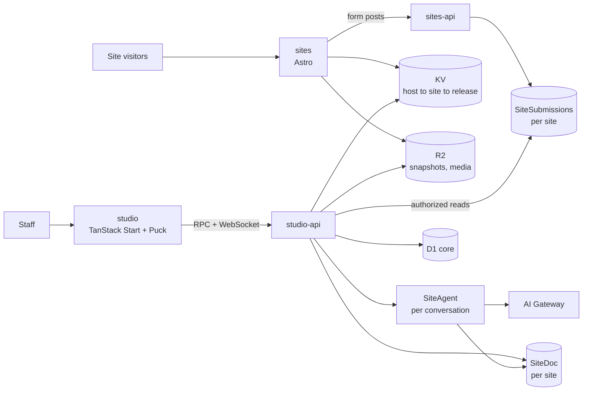
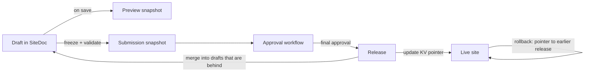

Pakshi is **four Cloudflare Workers** in two pairs, each a web layer and an API layer, sharing one set of packages. `sites` (Astro) serves every public site and preview, and `sites-api` receives form submissions. `studio` (TanStack Start) is the admin UI, and `studio-api` holds the domain logic, the per-site documents and the agent. Each site's drafts live in one Durable Object, where people and the agent edit together in real time and drafts that fall behind merge in published changes. Publishing writes an immutable snapshot to R2 and moves a pointer; rollback moves it back.

This doc follows the [vision](/vision) and the [product spec](/product-spec). Decisions and their reasoning are in the [decision log](/decision-log). **Design rule:** use Cloudflare's primitives fully and design for scale, but add no machinery the product doesn't need: no extra services, fallback chains or recovery layers without a concrete reason.

## Architecture at a glance

Four Workers, connected by service-binding RPC. Public traffic never touches the database that editors use.



- **`sites`** renders published sites and previews from snapshots. It is read-only and forwards form posts to `sites-api`.
- **`sites-api`** is the public-facing API: form intake now, payment webhooks later. It hosts the `SiteSubmissions` Durable Objects, one per site, and is the only writer of submissions.
- **`studio`** is the TanStack Start UI with Puck. It has no data bindings of its own: it calls `studio-api` over RPC and reaches site documents and the agent over WebSockets through it.
- **`studio-api`** holds domain logic and permissions, the `SiteDoc` and `SiteAgent` Durable Objects, scheduled jobs, and authorized reads of submissions.
- All four import the same packages (page schema, blocks, themes, permission rules), so the editor and the public site render with the same code.

## Stack

| Concern                   | Choice                                                 | Notes                                                                                                                                                |
| ------------------------- | ------------------------------------------------------ | ---------------------------------------------------------------------------------------------------------------------------------------------------- |
| Hosting and runtime       | Cloudflare Workers                                     | Four Workers: `sites`, `sites-api`, `studio`, `studio-api`                                                                                           |
| Public site rendering     | Astro 7 with React, `@astrojs/cloudflare`              | Server-rendered from snapshots; interactive blocks hydrate as islands. Bindings come from `cloudflare:workers`, not `Astro.locals.runtime`           |
| Admin app                 | TanStack Start, Router, Query, Form, Table             | Studio UI; calls studio-api over RPC                                                                                                                 |
| Visual editor             | Puck                                                   | Fed from our schema through an adapter                                                                                                               |
| UI primitives and styling | shadcn/ui, Tailwind v4                                 | Theme tokens as CSS variables                                                                                                                        |
| Schema and validation     | Effect Schema (Effect v4)                              | Same library as the starter. One schema drives validation, Puck fields and agent tool definitions through its Standard Schema and JSON Schema output |
| Rich text                 | TipTap (ProseMirror JSON)                              | Chosen over Lexical because Puck's rich text field is built on TipTap. A rich text field is one value; no shared-cursor editing in the MVP           |
| Site drafts               | Durable Objects (SQLite)                               | One `SiteDoc` per site, built on PartyServer for live editing and presence                                                                           |
| Form submissions          | Durable Objects (SQLite)                               | One `SiteSubmissions` per site, so each site's customer data is its own database                                                                     |
| Relational data           | D1                                                     | One `core` database                                                                                                                                  |
| Files and snapshots       | R2                                                     | Media, published and preview snapshots, source documents                                                                                             |
| Routing                   | KV                                                     | Hostname → site → current release                                                                                                                    |
| Images                    | Cloudflare Images                                      | Resizing and format conversion                                                                                                                       |
| Agent runtime             | Cloudflare Agents SDK, `@cloudflare/ai-chat`           | One `SiteAgent` Durable Object per conversation                                                                                                      |
| Model access              | AI Gateway                                             | Logging, cost tracking, per-brand spend limits                                                                                                       |
| Document conversion       | Workers AI `toMarkdown`                                | For uploaded source documents                                                                                                                        |
| Staff sign-in             | Better Auth                                            | Runs in studio-api; the `genericOAuth` plugin connects to the organization's identity provider over OIDC; sessions in D1                             |
| Custom domains            | Cloudflare for SaaS                                    | Custom hostnames with automatic certificates                                                                                                         |
| Email                     | Cloudflare Email Service                               | Sending is in public beta; sender domains must use Cloudflare DNS                                                                                    |
| Payments (later)          | Stripe Checkout                                        | Not in the MVP                                                                                                                                       |
| Monorepo                  | application-platform-starter: pnpm, Turborepo, Alchemy | Effect for services, Alchemy for infrastructure as code, oxlint and oxfmt, Vitest, Playwright for visual regression                                  |

**Cloudflare plan: Workers Paid, no Enterprise features.** Production runs on Workers Paid (from $5 a month per account plus usage), which covers Workers, Durable Objects, D1, R2, KV, Email Service and everything else in this design ([pricing](https://developers.cloudflare.com/workers/platform/pricing/)). Cloudflare for SaaS includes 100 custom hostnames. The only Enterprise-only feature we'd considered, root-domain proxying, is left out (see Domains).

## Repository and environments

We start from [application-platform-starter](https://github.com/AdiRishi/application-platform-starter): a pnpm and Turborepo monorepo where Alchemy declares all Cloudflare infrastructure in TypeScript and Effect implements application services. We keep its conventions and tooling (oxlint and oxfmt with its lint rules, TypeScript 7, Vitest, Playwright, Blume docs and repository ADRs) and replace its sample CSV app with Pakshi.

| Path                 | Contents                                                                                                                                                                                                                              |
| -------------------- | ------------------------------------------------------------------------------------------------------------------------------------------------------------------------------------------------------------------------------------- |
| `infra/`             | Alchemy graph: all four Workers, Durable Objects, D1, R2, KV, bindings and domains. No per-app Wrangler config                                                                                                                        |
| `apps/studio`        | TanStack Start app (the starter's `apps/web`): Studio UI with Puck                                                                                                                                                                    |
| `apps/sites`         | Astro app: public sites and previews                                                                                                                                                                                                  |
| `workers/studio-api` | Domain logic, `SiteDoc` and `SiteAgent` Durable Objects, scheduled jobs. A plain Worker with its own entry file, because PartyServer and `AIChatAgent` are plain Durable Object classes that a starter-style Effect Worker can't host |
| `workers/sites-api`  | Form intake and the `SiteSubmissions` Durable Objects, later payment webhooks                                                                                                                                                         |
| `packages/contracts` | Effect schemas for pages, sites, snapshots and edit operations, plus each API's RPC contract                                                                                                                                          |
| `packages/domain`    | Permission checks, validation, three-way merge, database access, audit writes                                                                                                                                                         |
| `packages/blocks`    | Block versions, each in its own frozen folder, plus the generated registry                                                                                                                                                            |
| `packages/tokens`    | Theme schema, palette generation, contrast checks, CSS output                                                                                                                                                                         |
| `packages/ui`        | shadcn/ui primitives bound to tokens                                                                                                                                                                                                  |
| `packages/editor`    | Puck config generation and the schema ↔ Puck adapter                                                                                                                                                                                  |
| `packages/agent`     | Agent tools, prompts and the eval suite                                                                                                                                                                                               |
| `tooling/`           | Shared TypeScript configs and the starter's oxlint rules                                                                                                                                                                              |
| `docs/`              | Blume documentation site and repository ADRs                                                                                                                                                                                          |

**Environments** are Alchemy stages: local development uses Alchemy's local emulation, per-branch and staging stages run in a non-production Cloudflare account, and production runs in its own account so customer data and limits stay separate. CI deploys with the starter's commands, and `test:infra-live` deploys, tests and removes an isolated stage. Only staging and production have custom hostnames and a preview domain; branch stages use `workers.dev`.

**First change to the starter:** remove the sample CSV app and its disposable-data settings. That means the `prod:destroy` script and `forceDestroy` on buckets. Production D1 databases and R2 buckets are retained on removal. Durable Object data can't be retained that way: when a class leaves a Worker, Alchemy deploys a migration that deletes the class and all its data. So CI fails if a production plan deletes a D1 database, an R2 bucket or a Durable Object class. `AGENTS.md` is updated for the new layout in the same change.

## Where data lives

Each kind of data has exactly one home. Page bodies never go in D1, and customer data never goes in the core database.

| Store                                             | Holds                                                                                                                                                                                                                                                                                                             | Why here                                                                                                                                                                                                                                                                                 |
| ------------------------------------------------- | ----------------------------------------------------------------------------------------------------------------------------------------------------------------------------------------------------------------------------------------------------------------------------------------------------------------- | ---------------------------------------------------------------------------------------------------------------------------------------------------------------------------------------------------------------------------------------------------------------------------------------- |
| `SiteDoc` Durable Object (one per site)           | Drafts, each with the release it started from, one row per page: pages and posts, header and footer, navigation, form definitions, block lockfile, brand revision. Submissions for approval and their approval progress. The site's live release, site settings, revision history, presence, and an outbox for D1 | One writer per site, so edits, merges, approvals and publishes are applied in order. The source of truth for which release is live and how far each approval has got. SQLite storage up to 10 GB per site ([limits](https://developers.cloudflare.com/durable-objects/platform/limits/)) |
| D1 `core`                                         | Organizations, brands (theme and identity revisions, voice guide), sites, users, sessions, roles, permissions, grants and overrides, block catalog, page and draft index, draft sharing, approval workflow definitions, copies of approval progress and releases, media records, audit log                        | Everything queried across sites. Metadata only, well within 10 GB per database ([limits](https://developers.cloudflare.com/d1/platform/limits/))                                                                                                                                         |
| `SiteSubmissions` Durable Object (one per site)   | That site's form submissions                                                                                                                                                                                                                                                                                      | Keeps customer data apart from everything else, and each site's apart from every other site's. Created by the site's first form post, with no provisioning or redeploy, and up to 10 GB per site                                                                                         |
| R2                                                | Media originals, release and submission snapshots, the latest preview of each draft, uploaded source documents                                                                                                                                                                                                    | Cheap and unlimited, and a new object is readable immediately after it's written                                                                                                                                                                                                         |
| KV                                                | Hostname → site; site → current release (a copy of `SiteDoc`'s)                                                                                                                                                                                                                                                   | Read on every public request, fast everywhere                                                                                                                                                                                                                                            |
| `SiteAgent` Durable Object (one per conversation) | Chat history and the agent's working brief                                                                                                                                                                                                                                                                        | Built into the Agents SDK                                                                                                                                                                                                                                                                |

`SiteDoc` keeps the page and draft index in D1, so dashboards never need to open every site's Durable Object. A Durable Object write and a D1 write can't share a transaction, so each change writes an outbox row in the same SQLite transaction, and an alarm drains the outbox to D1 with idempotent upserts keyed on ID and revision.

## The page document

A page is a flat map of block instances plus an ordered list of top-level IDs, in the style of json-render. A block's address (`/blocks/b_hero1/props/heading`) never changes when blocks move, which keeps agent edits, concurrent edits, merges and history diffs simple.

```json
{
  "schema": "pakshi.page/1",
  "id": "pg_01J9ZK4Q2M",
  "type": "page",
  "path": "/summer-school",
  "recipe": "event-landing",
  "meta": { "title": "Summer School 2027", "description": "Five days of hands-on workshops." },
  "root": ["b_hero1", "b_feat1", "b_form1"],
  "blocks": {
    "b_hero1": {
      "type": "hero",
      "variant": "split-image",
      "surface": "brand",
      "props": { "heading": "Learn by building", "image": { "$ref": "media", "id": "med_7X4P" } }
    },
    "b_feat1": {
      "type": "feature-grid",
      "variant": "icons-3up",
      "surface": "default",
      "props": { "heading": "What you'll do" },
      "slots": { "items": ["b_fi1", "b_fi2"] }
    },
    "b_fi1": { "type": "feature-item", "variant": "default", "props": { "title": "Workshops" } },
    "b_fi2": { "type": "feature-item", "variant": "default", "props": { "title": "Mentors" } },
    "b_form1": {
      "type": "form-section",
      "variant": "card",
      "surface": "muted",
      "props": { "form": { "$ref": "form", "id": "frm_2B7C" } }
    }
  }
}
```

**Rules:**

- **Nesting** goes through named slots, at most two levels (a section and its items).
- **Integrity:** every block ID appears in exactly one list (`root` or one slot), and every listed ID exists in `blocks`. Validation rejects orphans and dangling IDs.
- **Block versions** are not stored on instances. They come from the draft's lockfile, so an upgrade changes one place.
- **Blog posts** are pages with `type: "post"` and extra meta fields (date, author, tags, excerpt, cover image). They reuse drafts, previews, approvals and history. A `post-list` block shows them.
- **References** to media, forms and other pages are IDs, resolved at render time from the same snapshot. Media files never change, so a media ID always renders the same file.
- **Rich text** is stored as TipTap JSON, with allowed marks and nodes set per field. The agent writes restricted Markdown, which is converted and validated.
- **Links** allow only `https`, `http`, `mailto` and `tel`, checked on save and again when rendering. There is no raw HTML anywhere.
- A reserved `locale` field keeps localization possible later without a migration.

## Blocks and versioning

Each block version is one folder with one definition. Everything else (Puck fields, agent tool schemas, validation) is generated from that definition.

```ts
// packages/blocks/hero/v2/index.ts
import { cta, defineBlock, media, richText, text } from "../../fields.ts";

export default defineBlock({
  type: "hero",
  version: 2,
  title: "Hero",
  props: {
    heading: text({ min: 3, max: 80, inline: true }),
    body: richText({ marks: ["bold", "italic", "link"], optional: true }),
    image: media(),
    cta: cta({ optional: true }),
  },
  variants: ["split-image", "centered"],
  surfaces: ["default", "muted", "brand", "inverse"],
  interactive: false,
  component: Hero,
  agent: {
    purpose: "Opening message of a page, one primary action",
    avoid: ["more than one per page"],
  },
  migrate: (v1Props) => ({ ...v1Props, cta: toCta(v1Props.buttonText, v1Props.buttonLink) }),
  fixtures: ["./fixtures/*.json"],
});
```

**Versioning rules** (refines [decision 001](/decision-log#decision-001)):

- Editors see versions as v1, v2, v3 and so on. Under the hood each released version has an opaque ID in the registry, and each site's lockfile records those IDs.
- Any change that alters a block's output is a new version. Released versions are frozen; CI rejects edits to them, with no exceptions. An urgent fix is a new version, and the platform team can create upgrade drafts on every site that uses the block.
- Frozen folders import field builders (`text`, `richText`, `media`, `cta`) from `packages/blocks`, which build Effect schemas; they never import Effect directly, so a dependency upgrade never forces an edit to frozen code. Golden tests pin each version's generated JSON Schema.
- New sites start on the latest version of every block.
- **Any number of versions can be live.** Studio encourages upgrades (a banner on the site, and a count of sites behind in the block catalog) but never forces them.
- **Retention:** a version stays in the registry while any draft or live release uses it, and for 3 months after the last one stops. The latest version of every block always stays. Rollback is limited to releases whose versions are still in the registry.
- **Upgrading** creates a draft, runs each version's `migrate` function in turn (v1 → v2 → v3) over it, and the draft follows the site's workflow. Nothing changes live until it's published.
- Every live version adds code to the `sites` bundle and screenshots to the test run. Lazy loading keeps startup small, and CI tracks bundle size and test time as the library grows.

**One registry, two renderers.** A generated registry maps `hero@2` to a dynamic import. Both Astro and Puck render from it, so they use the same component code. `sites` awaits the import and renders the component directly, not through `React.lazy`: inside Astro's React renderer, a suspending component streams its fallback and a swap script instead of finished HTML. Dynamic imports keep the `sites` Worker inside the 1-second startup limit ([Workers limits](https://developers.cloudflare.com/workers/platform/limits/)); the bundle limit is 64 MiB uncompressed.

**shadcn/ui:** its primitives are the foundation and its blocks are design inspiration. Its registry, which copies code into projects, isn't used to deliver blocks: every site renders from our versioned registry instead.

**Interactive blocks** (gallery lightbox, form, carousel) hydrate as Astro islands. Astro can't hydrate a component chosen at runtime ([directives](https://docs.astro.build/en/reference/directives-reference/)), so a generated island map imports them statically, and interactive blocks must be top-level sections.

**Quality gates on every block release and every shared dependency upgrade** (React, Tailwind, shadcn, Astro, Puck):

- A Playwright screenshot of every fixture of every live version, rendered in both the published site and the Puck canvas. Any unexpected difference fails the build. Frozen versions still share `packages/ui`, Tailwind and React, so a dependency upgrade can shift an old version's screenshots. When that difference is intended, a platform developer accepts the new screenshots in a reviewed change, which is recorded in the audit log and announced to site admins. It's the only way a released version's output changes.
- Automated accessibility checks (axe) on every fixture, plus a manual keyboard and screen-reader review before a new block's first release.
- A lint rule that rejects literal colors, fonts or spacing in block code: blocks may use theme tokens only.

## Themes

A theme is a small set of tokens compiled into a CSS file of variables. Every site shares one Tailwind build; sites differ only in their variable file.

| Token group     | Values                                                  |
| --------------- | ------------------------------------------------------- |
| Color           | Brand color (OKLCH), neutral tone (cool, neutral, warm) |
| Surfaces        | Section backgrounds: default, muted, brand, inverse     |
| Typography      | Heading and body fonts, type scale, heading weight      |
| Shape and depth | Corner radius, shadow style (flat, soft, raised)        |
| Density         | Section spacing (compact, comfortable, spacious)        |
| Imagery         | Image corner style                                      |
| Motion          | On or off                                               |

**How it works:**

- **Resolution:** organization preset → brand values. Sites don't override the theme. The resolved theme is part of every snapshot.
- **Brand revisions:** each save of a brand's theme or identity (logo, favicon) is an immutable brand revision in D1. Each draft pins a revision, the way its lockfile pins block versions, and freezing resolves the theme from the pinned revision, never the brand's latest.
- **Brand updates:** a new brand revision creates a Brand update draft on every site in the brand that moves its pin to the new revision. If a site already has an unpublished Brand update draft, that draft's pin moves instead. Each follows its site's workflow, so a live site changes only when that draft publishes. Other drafts pick up the revision by merging after it's live.
- **Surfaces:** blocks choose a surface, never a color. `[data-surface="brand"]` re-scopes shadcn's semantic variables (`--background`, `--primary` and so on), so every primitive inside that section adapts.
- **Palette:** generated from the one brand color in OKLCH. Text and button pairs are picked to pass WCAG 2.2 AA contrast; the theme can't be saved if any pair fails.
- **Fonts:** a curated list, self-hosted from R2 so no third-party font requests leave the site.

Light and dark: palette generation produces both modes from the same brand color, each surface has light and dark values, and the contrast check runs on both. Sites follow the visitor's system setting, with an optional toggle.

## Publishing, serving and previews

Everything that leaves a draft is a **snapshot**. A snapshot is an immutable manifest in R2 that holds the site's settings, navigation, header and footer, block lockfile and resolved theme, plus one entry per page. Each entry points at a page object stored under its content hash. Snapshots share unchanged pages, so a site with hundreds of posts doesn't rewrite them on every save, and rendering one page reads only the manifest and that page. Previews, submissions and releases are all just pointers to snapshots.



**Freezing** validates the whole draft first: block contracts at the pinned versions and pre-flight checks. A snapshot that fails is never written.

**Publishing** runs inside the site's `SiteDoc`, so publishes and rollbacks for one site happen one at a time. A submission publishes only if it's based on the current live release; otherwise it's merged first. `SiteDoc` writes the release's snapshot objects to R2 first. A Durable Object serves other requests while it waits on R2, so after that I/O it checks again that the submission is still fully approved and still based on the current live release, and only then records the new live release in its own storage. If the check fails, nothing goes live. `SiteDoc` is the source of truth for the live release and the only writer of `site → release` in KV. It writes the release row and audit entry to D1 through its outbox. The `host → site` entries are written once, when a domain is set up, so a publish is a single KV write. A scheduled job compares KV with D1, and where they differ it asks that site's `SiteDoc` to write both again. The job never writes KV itself, so it can't put back a stale release. KV changes can take up to 60 seconds to reach every location ([KV](https://developers.cloudflare.com/kv/concepts/how-kv-works/)), which is why the product promises "live within about a minute".

**Approvals** follow the applicable workflow: the site's, else the brand's, else the organization's. A workflow is an ordered list of any number of steps, each naming who can approve (roles or people) and how many approvals it needs. Workflow definitions are rows in D1. Submissions and their approval progress live in `SiteDoc`, next to the snapshot they approve and the live release, so approvals, workflow restarts after a merge, and the final publish happen in one order. D1 holds a copy for dashboards and the Approvals screen. An approval decision goes to `SiteDoc`, which rejects it if the submission has changed since the approver loaded it. Completing the last step calls publish. No workflow engine is needed. A visual, node-based workflow editor can be added later on the same definitions with an off-the-shelf flow library such as React Flow.

**Merging:** when a release publishes, every other draft on the site is behind. People already editing a draft when it falls behind keep working. The update is required the next time someone opens the draft, and before it's submitted. Updating a draft is a three-way merge of the release it started from, the draft, and the new live release, done by block ID and field across pages and the site-level parts (navigation, header and footer, lockfile, brand revision). Before diffing, all three sides are migrated to the newest version of each block that any side uses, through each version's `migrate` function, so edits are always compared in the same shape. Different fields, blocks or pages merge automatically. The same change made on both sides isn't a conflict, and blocks added to the same list on both sides are all kept, with live's additions first. Conflicts are limited to three cases: the same field changed to different values on both sides, a block edited on one side and removed on the other, and existing blocks in the same list (`root` or a slot) reordered on both sides. The editor picks a side for each, or accepts a merged value that a model suggests for a text field. The merged draft is then checked for structure only: block schemas, document integrity and references. Anything that fails is shown as a conflict. Pre-flight checks, such as no placeholders left, run at submission, not at merge. A submission under review is merged the same way when another draft publishes: if the merge is clean its approvals stand, and if it needed a person the workflow restarts.

**Closing drafts:** publishing closes the draft, unless it was edited after it was submitted. Then it stays open with those edits, rebased onto the release it just published by a three-way merge whose base is the submission as it was last frozen. Only changes made after freezing carry over, so the rebase can never undo what was just published.

**Serving:** `sites` reads the site for the hostname and its current release from KV, then looks in the Workers Cache API under a key of release ID, `sites` Worker version, path, and the query parameters the page reads, such as `page` on a blog list. Other query parameters are left out of the key. On a miss it loads the snapshot's manifest and the page's object from R2, renders the page with Astro, and caches the result. Because the release ID and Worker version are part of the key, neither a publish nor a deploy needs a cache purge, and a cached page never points at CSS or JavaScript that a deploy removed. The Cache API is per data centre, so each location renders its own first request.

**Rollback** undoes the most recent publish: `SiteDoc` makes the release that was live before it live again, and updates KV and D1 the same way as a publish. Nothing is re-rendered or re-approved. It can't be repeated to walk further back. Bringing back an older release creates a draft from it, which goes through the site's workflow like any other change, so content that was deliberately removed can't return without approval. Every release is kept, but a release can come back only while its block versions and media are still retained. After a rollback, drafts are behind and update as after any publish.

**Previews** show a draft's latest saved state, served by the same `sites` Worker at `{preview-id}.{preview-domain}`:

- `SiteDoc` writes a preview snapshot a few seconds after edits settle, to a fixed R2 key for the preview ID, with whether its link is public. R2 returns the new object immediately after a write, where a KV change can take up to 60 seconds to reach other locations. The preview ID is a random 128-bit value.
- The preview domain is its own registrable domain, separate from Studio and the sites domain, so each preview is a first-level subdomain covered by the standard certificate.
- Access follows the draft's sharing. A link shared with anyone opens directly. Otherwise the preview opens through Studio: it checks that the person may view the draft, then redirects to the preview host with a signed token that is bound to the preview ID and expires in 60 seconds. `sites` exchanges it for a host-only `HttpOnly`, `Secure` cookie signed over the preview ID, user, expiry and access counter, valid for at most 8 hours, and redirects to the clean URL.
- The preview's R2 object carries an access counter that goes up whenever the draft's sharing changes. `sites` rejects a cookie whose counter doesn't match, so revoking access takes effect on the next request.
- Preview snapshots are deleted when their draft publishes or is deleted.
- Previews carry no-index and `Referrer-Policy: no-referrer` headers and a "Preview" ribbon, and their forms don't submit.

**Trade-off we accept:** pages render on request with the current `sites` code. Everything editors control (content, theme, block versions) is frozen in the snapshot. Shared code, such as page layout, the rich-text renderer or the primitives blocks use, could still change a live page. The visual regression gate over every live block version is the control for that, and an intended difference goes through a reviewed, audited screenshot update. The alternative, pre-rendering every page to static HTML at publish, needs a build pipeline and an archive of old assets, and doesn't pay for itself (see [decision 004](/decision-log#decision-004)).

## Editing: the site document and Puck

Every change, from a person or the agent, goes through one method on the site's Durable Object: `applyOps(actor, draftId, ops)`.

**`SiteDoc`, one per site:**

- **Built on PartyServer,** Cloudflare's library from the PartyKit team that adds rooms, broadcast, connection state and hibernation to Durable Objects ([cloudflare/partykit](https://github.com/cloudflare/partykit)). Each site is one room, with presence tracked per draft and page, and clients connect with PartySocket, which handles reconnects and buffering. Hibernation is off by default, so `SiteDoc` sets `hibernate: true`. Plain RPC calls skip PartyServer's `onStart`, so other code reaches `SiteDoc` through `getServerByName`, which waits for startup.
- **Storage:** each draft page is its own SQLite row, because a row can hold at most 2 MB and a large draft saved as one value would exceed it.
- **Ops** address blocks by ID, never by position: `setProp(blockId, path, value)`, `insertBlock(parent, slot, afterId, block)`, `moveBlock(blockId, parent, slot, afterId)`, `removeBlock(blockId)`, and page-level `setMeta`, `createPage` and `deletePage`. A concurrent insert can't make an op hit the wrong block. A batch is applied atomically, or rejected with structured errors (path, rule, message). The same vocabulary drives Puck sync, agent tools, undo and merging.
- **Validation** on every batch: the block schema at the draft's pinned version, document integrity, link rules, and a path allowlist. The lockfile changes only through the block upgrade flow; form notification addresses only through site settings.
- **Live collaboration:** several people, and their agents, can edit the same draft and page at once. Each committed batch is broadcast to everyone in that draft. Presence shows who is on which page, block and field, so people can see each other and avoid overlap.
- **Conflicts:** the server orders every batch. Clients send ops without a base revision, keep their own unconfirmed ops in a pending queue, and treat the server's broadcast as the truth. If two people change the same field, the later write wins and the earlier writer is told their change was replaced. An op on a block that was removed meanwhile is dropped, and its author is told.
- **Rich text:** a rich text field is one value, like any other field, edited in Puck's rich text field. While someone types in it, presence marks the field as theirs for others and for the agent. The marker is a hint, not a lock. Two people typing in the same paragraph with shared cursors is on the Later list.
- **History:** one revision per editing session or agent turn, stored as operations with a full checkpoint every so often. It never stores a revision per keystroke. Undo applies inverse ops to fields nobody else has changed since, and reports the rest.
- **Authorization:** `SiteDoc` accepts connections and calls only through `studio-api`, which has verified the session and permission. Each connection carries its user, and every batch it sends is checked again against permissions that `SiteDoc` caches per connection. A permission change clears the cache, so a removed permission takes effect on the next batch without a D1 read per keystroke.
- **Restore:** Durable Object point-in-time recovery must be called from inside the object, so `SiteDoc` exposes an admin `restoreTo(time)` method. Every restore is recorded in the audit log. If a restore changes the live release, `SiteDoc` updates KV and D1 as it would for a rollback, so the live site never changes silently.

**Puck integration:**

- **Adapter:** our schema stays canonical. `toPuck` and `fromPuck` convert between our flat document and Puck's tree. Property tests check that a round trip changes nothing ([Puck data model](https://puckeditor.com/docs/api-reference/data-model/data)).
- **Generated config:** the Puck config for a draft is generated from its lockfile. Fields come from each block's schema.
- **Rich text:** Puck's rich text field uses TipTap but saves HTML, so the adapter converts it to TipTap JSON with our extension set ([rich text field](https://puckeditor.com/docs/api-reference/fields/richtext)).
- **Resolved data:** resolved values such as image URLs live under a reserved key that `fromPuck` drops, so they're never saved into the document.
- **Same CSS:** the canvas iframe loads the same platform CSS and site theme CSS as the published site, with Studio's own styles kept out.
- **Live updates in the canvas:** a sync module in `packages/editor` connects Puck to `SiteDoc` through Puck's public API. Local changes arrive through Puck's `onAction` callback and become our operations; a prop edit arrives as a replace of the whole block and is diffed down to fields. Changes from others become Puck's small built-in actions (insert, move, remove, replace), dispatched without entering Puck's history, never a whole-page reload. Puck's actions address blocks by index and zone, so the module converts each remote op to an index against the local state at that moment, using Puck's lookup by ID. Selection is restored by block ID.
- **Undo** is per person, through `SiteDoc`'s history. Puck's own undo restores whole-page snapshots, which would erase other people's changes, and has its keyboard shortcuts built in. We take the undo shortcuts in capture-phase key listeners before Puck sees them, and hide its undo buttons, so no patch is needed. If the spike shows that isn't enough, a pnpm patch replaces its history slice instead. `setHistories([])` resets the document, so it's never used to clear history. The sync never dispatches from inside `onAction`; it defers to the next microtask. We don't fork Puck (see [decision 013](/decision-log#decision-013)). This is still the riskiest integration, so it's the first Phase 0 spike.

## The agent

The agent is a constrained editor. Its only way to change a site is the same validated `applyOps` that the visual editor uses, and it has no way to submit or publish.

**Runtime:**

- Each conversation is a `SiteAgent` Durable Object built on `AIChatAgent` from `@cloudflare/ai-chat`, which gives persisted history and resumable streaming ([chat agents](https://developers.cloudflare.com/agents/communication-channels/chat/chat-agents/)).
- A conversation belongs to one user and works in one draft. The agent always acts as that user, identified on the server, never from what the browser sends. It can do nothing the user couldn't.
- Studio's chat panel uses the Agents SDK React hooks over a WebSocket through `studio-api`. `studio-api` authenticates the connection in `onBeforeConnect` and adds the user in a trusted header, which the agent stores on the connection in `onConnect`. The SDK's `props` option reaches the agent only when it starts, so it can't carry the user. The hooks' `/get-messages` request takes the same route.
- `studio-api` routes agent requests to `SiteAgent` only; `routeAgentRequest` would otherwise reach any Durable Object binding in `env`, including `SiteDoc`. It strips client-sent trusted headers, including `x-agents-lifecycle-props`, and checks that the signed-in user owns the conversation. Each turn stores its acting user, because a turn resumed after eviction has no connection to read it from.
- The agent writes to `SiteDoc` through Durable Object RPC, passing the user as the actor, and appears in presence as the agent acting for that user. It doesn't open a WebSocket to `SiteDoc`, because outgoing WebSockets can't hibernate ([Durable Object WebSockets](https://developers.cloudflare.com/durable-objects/best-practices/websockets/)).

**Tools** (every input and output has an Effect schema):

| Tool                 | Does                                                                         |
| -------------------- | ---------------------------------------------------------------------------- |
| `get_site_outline`   | Pages and the sections on each, one line per section                         |
| `get_page`           | Full content of a page, or of chosen sections                                |
| `get_block_contract` | A block's schema, variants, limits and examples at the site's pinned version |
| `get_recipe`         | Composition rules for a page type                                            |
| `read_source`        | An uploaded source document, as Markdown                                     |
| `apply_ops`          | Validated edit operations on a page                                          |
| `insert_section`     | Adds a block after a given section (simpler than raw ops for common edits)   |
| `create_page`        | New page or post from a recipe, with placeholders                            |
| `get_preview_link`   | The draft's preview link                                                     |
| `fetch_url`          | A web page the user linked to, as Markdown                                   |
| `ask_user`           | A question with choices, shown as buttons in chat                            |
| `prepare_submission` | Runs pre-flight and opens the submit dialog; a person clicks Submit          |
| `request_block`      | Files a block request when nothing in the catalog fits                       |

There are no tools for submitting, publishing, approving, site settings, domains or form submissions.

**Context:** a short, cacheable prefix is generated from the block registry, filtered to the draft's pinned versions. This is json-render's catalog-to-prompt idea applied to whole blocks. The prefix holds a one-line index of blocks and recipes, the brand's voice guide, the site outline and the agent's working brief. Full block contracts and page content are fetched only when needed. If the user has a section selected on the canvas, its ID is included, so "make this shorter" works. Fields someone is typing in are marked, and the agent leaves them alone.

**Merge suggestions:** when updating a draft leaves a conflict on a text field, a model proposes a merged value. A person accepts it or picks a side.

**Building a site:** the agent proposes a plan (pages, recipe per page, sections), the user confirms it, then the agent builds one section per tool call. Each call is validated, committed and broadcast, so the user watches the page assemble. This takes json-render's streamed-patches idea at section granularity. Each turn can be undone in one step.

**Validation errors** come back as structured messages the model can act on, for example `heading: max 80 characters, got 94`. The agent gets 2 repair attempts, then explains the problem to the user in plain language.

**Source material:** uploads are stored in R2 and converted to Markdown with Workers AI `toMarkdown` ([docs](https://developers.cloudflare.com/workers-ai/features/markdown-conversion/)). It doesn't convert `.doc` or `.pptx` files, so Studio asks for PDF or `.docx` instead. The agent reads them through `read_source`, marked as untrusted content. Marking doesn't stop prompt injection, so the real controls are structural: the agent can't submit or publish, and approvers review every change. `fetch_url` accepts only URLs that appear in the user's own messages: GET only, with size and time limits, no redirects to other hosts, and no requests to the platform's own domains. There is no vector search in the MVP. A vision model suggests image alt text, and a person confirms it.

**Models:** any number of models, chosen per task in configuration and called through AI Gateway ([AI Gateway](https://developers.cloudflare.com/ai-gateway/)). The default for routine edits is Z.ai GLM-5.3 Flash on Workers AI: tool calling, a 1.3M-token context, and $0.15 input / $0.50 output per million tokens ([model page](https://developers.cloudflare.com/workers-ai/models/glm-5.3-flash/)). Other tasks, such as planning a new site, long copy or image descriptions, can point at other models, and any model can be swapped at any time without a code change. Every request is tagged with brand, site and user for cost tracking, with a monthly spend limit per brand. The platform team curates which models are used; users never choose them.

**Evals:** about 25 scripted tasks with exact expected outcomes run whenever prompts, models or block contracts change. They cover a new site from a brief, routine edits, asking when a request is ambiguous, filing a block request for a catalog gap, ignoring instructions inside uploaded documents, suggesting merges for text conflicts, and writing content valid for a pinned older block version. Real pilot conversations become new tasks.

## Forms, submissions and email

Form definitions live in the draft and ship in the snapshot. Submissions go straight from the public Worker to the site's own `SiteSubmissions` Durable Object, which is that site's submissions database. The first form post for a site creates it, so there's nothing to provision and no redeploy, and one binding covers every site. Nothing queries submissions across sites.

1. A visitor submits a form. `sites` forwards the request to `sites-api` over a service binding.
2. `sites-api` rejects posts from preview hosts and bodies over 64 KB, then validates the fields against the form definition in the live release.
3. The submission is written to the site's `SiteSubmissions`, with the field labels it was sent with. The submitter's email address goes in an indexed column, so deleting everything for one person is one query.
4. Notification emails are sent to the form's configured addresses through the Email Service binding ([Email Service](https://developers.cloudflare.com/email-service/)). Notifications link to the submission in Studio rather than repeating personal data.

**Other details:**

- **No spam protection in the MVP.** Forms send no email to submitters, so a form can't be used to send mail to addresses a visitor types in. Each site's submissions are their own database, so a flood on one form fills only that site's 10 GB and every other site's forms keep working.
- **Reads:** `studio-api` binds the same `SiteSubmissions` namespace and calls it over RPC for authorized views, exports and deletions. Turnstile's limit of 20 widgets per non-Enterprise account ([plans](https://developers.cloudflare.com/turnstile/plans/)) shapes the design when spam protection is added: one widget for the sites domain, which covers its subdomains, and custom domains grouped 10 to a widget.
- **Retention:** submissions are kept for the life of the site, as part of its data; nothing deletes them automatically. Deleting one submission, or all records for one email address, is available for privacy requests.
- **Email Service** sends all email (sending is in public beta), from domains that use Cloudflare DNS. No fallback provider is built. Each notification records when it was sent, and a scheduled job retries unsent ones.

## Domains

All public hostnames point to the `sites` Worker through Cloudflare for SaaS, using the Worker as the origin ([Worker as origin](https://developers.cloudflare.com/cloudflare-for-platforms/cloudflare-for-saas/start/advanced-settings/worker-as-origin/)).

- Every site gets `{site}.{sites-domain}` immediately.
- A custom hostname is created through the Cloudflare API. Studio shows the DNS records to add, including a TXT record with an ownership token unique to that request, and a scheduled job checks until ownership is proven and the certificate is active, then writes the `host → site` entry. A hostname belongs to one site only. A brand-new hostname can take about a minute to start serving.
- Worker as origin needs a fallback origin on the SaaS zone.
- Pricing: 100 custom hostnames are included, then $0.10 each ([plans](https://developers.cloudflare.com/cloudflare-for-platforms/cloudflare-for-saas/plans/)).
- Root domains (example.org) are not supported directly, because that needs Cloudflare's Enterprise-only apex proxying. Sites use a subdomain such as www.example.org, and the domain owner redirects the root to it at their DNS provider.

## Security and access

- **Sign-in:** Better Auth runs in `studio-api`, behind Studio's sign-in pages, with its `genericOAuth` plugin connected to the organization's one identity provider over OIDC ([Generic OAuth](https://better-auth.com/docs/plugins/generic-oauth)). The provider is set in configuration. Unlike the SSO plugin, `genericOAuth` loads no SAML libraries and needs no database transactions. Better Auth is pinned at 1.7.6 or later, which includes the fixes for its 2026 security advisories. Users, sessions and accounts are tables in D1 `core`.
- **Permissions:** one system for everything. Permissions are fine-grained named actions (`page.edit`, `draft.share`, `site.publish`, `site.approve`, `site.approve_own`, `workflow.edit`, `brand.theme.edit`, `submissions.read`, `submissions.export`, `members.manage` and so on), and they decide what a person can do. Roles are sets of permissions: Pakshi ships default roles, and admins can create custom ones. Grants give a person a role on the organization, a brand or a site, and inherit downward. An override switches one permission on or off for one person on one scope, and beats any role. A person can grant only permissions they hold, on scopes they control. Org admins hold every permission, so they can grant any role. Draft shares add view or edit access to one draft, and never grant submitting or publishing. One `authorize(actor, permission, resource)` in `packages/domain` is called by every `studio-api` method, every agent tool and every `SiteDoc` batch, and Studio uses the same check to hide what a person can't do. Roles, permissions, grants, overrides and shares live in D1 `core`.
- **The agent** acts as the conversation's owner and has no tools for submitting, publishing, approving, settings, domains or submissions.
- **Customer data:** only `sites-api` writes submissions, each site's to its own `SiteSubmissions`, and only authorized Studio users read them. Every view, export and deletion is logged. Submissions are never sent to a model.
- **Public pages:** no raw HTML is stored or rendered, links are limited to safe protocols, and each site sends a strict content security policy. Media is served only through Cloudflare Images, which sanitizes SVG files.
- **Audit log:** every edit session, agent turn, draft share, permission change, workflow change, submission for approval, approval decision, publish, rollback and submissions access is recorded with who, when and what.
- **Secrets:** Worker secrets for credentials; model provider keys stored in AI Gateway.

## Operations

- **Observability:** Workers Logs and tracing on all four Workers; AI Gateway for model cost, latency and errors per brand.
- **Alerts:** error rate on `sites`, form intake failures, publish failures and D1/KV mismatches, unsent emails, custom hostname certificate problems, and agent cost per brand per day.
- **Backups:** D1 Time Travel restores `core` to any minute in the last 30 days ([Time Travel](https://developers.cloudflare.com/d1/reference/time-travel/)). Durable Objects offer 30-day point-in-time recovery, through `restoreTo` on `SiteDoc` and `SiteSubmissions`. Every published snapshot in R2 is already a full copy of that release. Before the pilot we run one restore drill in staging: restore one `SiteDoc` and the `core` database, then run the D1/KV reconcile.

## Deliberately not built

These came up during design review and were cut to keep Pakshi simple. Each can be added later if a real need appears.

| Not building                                                             | Instead                                                                                                   |
| ------------------------------------------------------------------------ | --------------------------------------------------------------------------------------------------------- |
| Separate Workers for the agent, forms, rendering and jobs                | Four Workers: a web and API pair for sites and for Studio; the agent and jobs live in `studio-api`        |
| Pre-rendering every page to static HTML at publish                       | Server rendering from immutable snapshots, cached per release                                             |
| Per-brand databases, projection queues, envelope encryption              | One `core` database and one `SiteSubmissions` per site; `SiteDoc` writes the page index through an outbox |
| A D1 database per site                                                   | A `SiteSubmissions` Durable Object per site: no provisioning, and no binding or redeploy per site         |
| Workflow engine for approvals                                            | Workflow definitions in D1, approval progress in `SiteDoc`; completing the last step publishes            |
| Fallback chains (routing files, queue buffers, automatic email failover) | One path per job, with Cloudflare's own durability                                                        |
| Major, minor and patch semantics, prebuilt frozen modules                | v1, v2, v3 for editors, opaque IDs underneath, frozen source per version                                  |
| Theme versions that editors choose between                               | Each draft pins a brand revision; Brand update drafts move it forward                                     |
| Brand locks and site theme overrides                                     | Sites use their brand's theme as it is                                                                    |
| Media file versions                                                      | Files never change; the brand logo and favicon are brand settings                                         |
| In-place fixes to released block versions                                | A new version, with upgrade drafts created on every affected site                                         |
| Spam protection (Turnstile, honeypot, rate limits)                       | Deferred; forms send no email to submitters, and each site's submissions are isolated                     |
| SAML sign-in, Better Auth's SSO plugin                                   | OIDC through `genericOAuth`                                                                               |
| One-click rollback to any past release                                   | One-click undo of the latest publish; older releases come back as drafts                                  |
| Typed content collections                                                | Blog posts are pages with `type: "post"`                                                                  |
| Hard-coded model tiers and automatic escalation                          | Models chosen per task in configuration                                                                   |
| Vector search over uploads, AI judges for voice and visuals              | Source documents read directly; deterministic pre-flight checks                                           |
| Speculative token-by-token streaming into the canvas                     | One validated section per tool call, broadcast as it commits                                              |
| Page locks                                                               | Live field-level editing with presence                                                                    |
| Shared-cursor editing of one paragraph (Yjs)                             | A rich text field is one value; presence marks who is typing in it                                        |
| Index-based JSON Patch                                                   | Ops addressed by block ID                                                                                 |

## Phase 0 spikes and open technical questions

These are the riskiest assumptions. Each spike should be proven before the pilot starts.

- [ ] **Puck round trip:** our schema → Puck → our schema is lossless, including rich text, and the canvas stays usable while two people and the agent edit the same draft live, with Puck's undo replaced. Puck has no official TanStack Start recipe; if it fails under server rendering, the editor route renders on the client only. The spike also covers the gaps found in Puck 0.23's source:
  - Replaying an insert gives the new block's children fresh random IDs, so the sync sends the IDs itself.
  - Selection is stored as an index, so another person's insert moves it; the sync restores it by block ID.
  - A focused sidebar field ignores remote changes, and overwrites a remote edit to the same field on its next keystroke.
  - A remote rich text change replaces the whole field and makes the local cursor jump.
  - Interleaved moves and removes can leave a client out of step with no notice, so the sync detects that and reloads the draft.
  - The undo hotkeys are attached to the whole page with no check for text fields.
  - The npm package ships as hashed, bundled chunks, which makes any patch fragile across releases.
- [ ] **Three-way merge:** scripted merge cases over the page document, covering every conflict type, the site-level parts of a draft, and sides on different block versions or brand revisions, produce the expected valid result.
- [ ] **Render parity:** the same block renders identically in the Puck canvas and on the Astro site, checked by screenshot, with block imports awaited in Astro.
- [ ] **Two block versions** live on one site, with dynamic imports keeping `sites` startup well under the 1-second limit.
- [ ] **Agent loop:** GLM-5.3 Flash completes 8 of 10 scripted edits with the expected result through AI Gateway, including tool-call streaming.
- [ ] **Chat layer:** Agents SDK chat hooks inside TanStack Start, connected to SiteAgent through studio-api. Cloudflare doesn't document WebSocket passthrough over a service binding, so this covers the upgrade and the `/get-messages` request.
- [ ] **Publish and rollback** on a test custom hostname, live within about a minute.
- [ ] **Astro and the Durable Objects in the starter's Alchemy graph:** the `sites` Astro app deploys through Alchemy alongside the other three Workers, with the same bindings and local emulation. `studio-api` deploys as a plain Worker with its own entry file hosting `SiteDoc` and `SiteAgent`, and `sites-api` hosts `SiteSubmissions`, bound from `studio-api` too.

## Sources

Limits and product details were checked against these pages on 2026-09-29.

- [Workers limits](https://developers.cloudflare.com/workers/platform/limits/) and the [64 MiB size increase](https://developers.cloudflare.com/changelog/post/2026-09-04-increased-worker-size-limit/)
- [D1 limits](https://developers.cloudflare.com/d1/platform/limits/), [D1 Time Travel](https://developers.cloudflare.com/d1/reference/time-travel/), [D1 data location](https://developers.cloudflare.com/d1/configuration/data-location/)
- [Durable Objects limits](https://developers.cloudflare.com/durable-objects/platform/limits/)
- [How KV works](https://developers.cloudflare.com/kv/concepts/how-kv-works/)
- [Cloudflare for SaaS plans](https://developers.cloudflare.com/cloudflare-for-platforms/cloudflare-for-saas/plans/), [Worker as origin](https://developers.cloudflare.com/cloudflare-for-platforms/cloudflare-for-saas/start/advanced-settings/worker-as-origin/)
- [application-platform-starter](https://github.com/AdiRishi/application-platform-starter)
- [Better Auth Generic OAuth plugin](https://better-auth.com/docs/plugins/generic-oauth)
- [Turnstile plans](https://developers.cloudflare.com/turnstile/plans/)
- [Email Service](https://developers.cloudflare.com/email-service/)
- [Agents SDK chat agents](https://developers.cloudflare.com/agents/communication-channels/chat/chat-agents/), [AI Gateway](https://developers.cloudflare.com/ai-gateway/), [Workers AI Markdown conversion](https://developers.cloudflare.com/workers-ai/features/markdown-conversion/)
- [Durable Object WebSockets](https://developers.cloudflare.com/durable-objects/best-practices/websockets/)
- [Puck data model](https://puckeditor.com/docs/api-reference/data-model/data), [Puck rich text field](https://puckeditor.com/docs/api-reference/fields/richtext)
- [Astro React integration](https://docs.astro.build/en/guides/integrations-guide/react/), [Astro Cloudflare adapter](https://docs.astro.build/en/guides/integrations-guide/cloudflare/), [Astro directives](https://docs.astro.build/en/reference/directives-reference/)
- [json-render](https://github.com/vercel-labs/json-render)
- [shadcn/ui theming](https://ui.shadcn.com/docs/theming)
