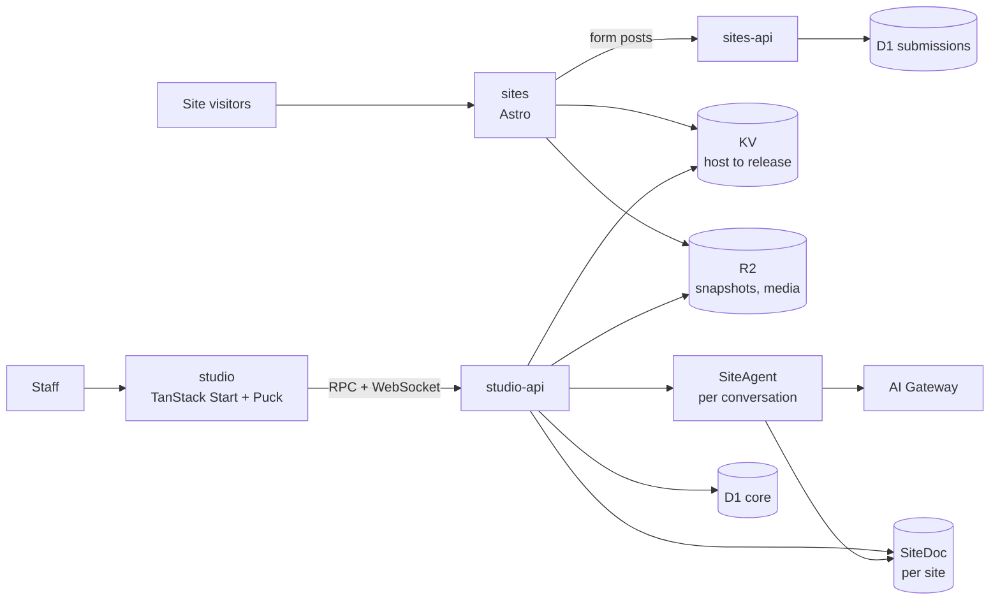
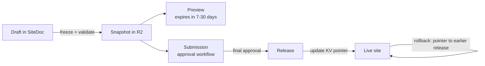

Pakshi is **four Cloudflare Workers** in two pairs, each a web layer and an API layer, sharing one set of packages. `sites` (Astro) serves every public site and preview, and `sites-api` receives form submissions. `studio` (TanStack Start) is the admin UI, and `studio-api` holds the domain logic, the per-site documents and the agent. Each site's draft lives in one Durable Object that people and the agent edit together in real time. Publishing writes an immutable snapshot to R2 and moves a pointer; rollback moves it back.

This doc follows the [vision](/vision) and the [product spec](/product-spec). Decisions and their reasoning are in the [decision log](/decision-log). **Design rule:** use Cloudflare's primitives fully and design for scale, but add no machinery the product doesn't need: no extra services, fallback chains or recovery layers without a concrete reason.

## Architecture at a glance

Four Workers, connected by service-binding RPC. Public traffic never touches the database that editors use.



- **`sites`** renders published sites and previews from snapshots. It is read-only and forwards form posts to `sites-api`.
- **`sites-api`** is the public-facing API: form intake now, payment webhooks later. It is the only writer of submissions.
- **`studio`** is the TanStack Start UI with Puck. It has no data bindings of its own: it calls `studio-api` over RPC and reaches site documents and the agent over WebSockets through it.
- **`studio-api`** holds domain logic and permissions, the `SiteDoc` and `SiteAgent` Durable Objects, scheduled jobs, and authorized reads of submissions.
- All four import the same packages (page schema, blocks, themes, permission rules), so the editor and the public site render with the same code.

## Stack

| Concern                   | Choice                                                 | Notes                                                                                                                                                |
| ------------------------- | ------------------------------------------------------ | ---------------------------------------------------------------------------------------------------------------------------------------------------- |
| Hosting and runtime       | Cloudflare Workers                                     | Four Workers: `sites`, `sites-api`, `studio`, `studio-api`                                                                                           |
| Public site rendering     | Astro with React, `@astrojs/cloudflare`                | Server-rendered from snapshots; interactive blocks hydrate as islands                                                                                |
| Admin app                 | TanStack Start, Router, Query, Form, Table             | Studio UI; calls studio-api over RPC                                                                                                                 |
| Visual editor             | Puck                                                   | Fed from our schema through an adapter                                                                                                               |
| UI primitives and styling | shadcn/ui, Tailwind v4                                 | Theme tokens as CSS variables                                                                                                                        |
| Schema and validation     | Effect Schema (Effect v4)                              | Same library as the starter. One schema drives validation, Puck fields and agent tool definitions through its Standard Schema and JSON Schema output |
| Rich text                 | TipTap (ProseMirror JSON)                              | Chosen over Lexical because Puck's rich text field is built on TipTap; collaborative editing through Yjs                                             |
| Site drafts               | Durable Objects (SQLite)                               | One `SiteDoc` per site, built on PartyServer for live editing and presence                                                                           |
| Relational data           | D1                                                     | `core` and `submissions` databases                                                                                                                   |
| Files and snapshots       | R2                                                     | Media, published and preview snapshots, source documents                                                                                             |
| Routing                   | KV                                                     | Hostname → current release                                                                                                                           |
| Images                    | Cloudflare Images                                      | Resizing and format conversion                                                                                                                       |
| Agent runtime             | Cloudflare Agents SDK                                  | One `SiteAgent` Durable Object per conversation                                                                                                      |
| Model access              | AI Gateway                                             | Logging, cost tracking, per-brand spend limits                                                                                                       |
| Document conversion       | Workers AI `toMarkdown`                                | For uploaded source documents                                                                                                                        |
| Staff sign-in             | Better Auth                                            | Runs in studio-api; SSO plugin connects to the organization's identity provider (OIDC or SAML); sessions in D1                                       |
| Custom domains            | Cloudflare for SaaS                                    | Custom hostnames with automatic certificates                                                                                                         |
| Form spam                 | Turnstile, Rate Limiting binding                       | Plus a honeypot field                                                                                                                                |
| Email                     | Cloudflare Email Service                               | Sending is in public beta                                                                                                                            |
| Payments (later)          | Stripe Checkout                                        | Not in the MVP                                                                                                                                       |
| Monorepo                  | application-platform-starter: pnpm, Turborepo, Alchemy | Effect for services, Alchemy for infrastructure as code, oxlint and oxfmt, Vitest, Playwright for visual regression                                  |

**Cloudflare plan: Workers Paid, no Enterprise features.** Production runs on Workers Paid (from $5 a month per account plus usage), which covers Workers, Durable Objects, D1, R2, KV, Email Service and everything else in this design ([pricing](https://developers.cloudflare.com/workers/platform/pricing/)). Cloudflare for SaaS includes 100 custom hostnames. The only Enterprise-only feature we'd considered, root-domain proxying, is left out (see Domains).

## Repository and environments

We start from [application-platform-starter](https://github.com/AdiRishi/application-platform-starter): a pnpm and Turborepo monorepo where Alchemy declares all Cloudflare infrastructure in TypeScript and Effect implements application services. We keep its conventions and tooling (oxlint and oxfmt with its lint rules, TypeScript 7, Vitest, Playwright, Blume docs and repository ADRs) and replace its sample CSV app with Pakshi.

| Path                 | Contents                                                                                                       |
| -------------------- | -------------------------------------------------------------------------------------------------------------- |
| `infra/`             | Alchemy graph: all four Workers, Durable Objects, D1, R2, KV, bindings and domains. No per-app Wrangler config |
| `apps/studio`        | TanStack Start app (the starter's `apps/web`): Studio UI with Puck                                             |
| `apps/sites`         | Astro app: public sites and previews                                                                           |
| `workers/studio-api` | Domain logic, `SiteDoc` and `SiteAgent` Durable Objects, scheduled jobs                                        |
| `workers/sites-api`  | Form intake, later payment webhooks                                                                            |
| `packages/contracts` | Effect schemas for pages, sites, snapshots and edit operations, plus each API's RPC contract                   |
| `packages/domain`    | Permission checks, validation, brand locks, database access, audit writes                                      |
| `packages/blocks`    | Block versions, each in its own frozen folder, plus the generated registry                                     |
| `packages/tokens`    | Theme schema, palette generation, contrast checks, CSS output                                                  |
| `packages/ui`        | shadcn/ui primitives bound to tokens                                                                           |
| `packages/editor`    | Puck config generation and the schema ↔ Puck adapter                                                           |
| `packages/agent`     | Agent tools, prompts and the eval suite                                                                        |
| `tooling/`           | Shared TypeScript configs and the starter's oxlint rules                                                       |
| `docs/`              | Blume documentation site and repository ADRs                                                                   |

**Environments** are Alchemy stages: local development uses Alchemy's local emulation, per-branch and staging stages run in a non-production Cloudflare account, and production runs in its own account so customer data and limits stay separate. CI deploys with the starter's commands, and `test:infra-live` deploys, tests and removes an isolated stage.

## Where data lives

Each kind of data has exactly one home. Page bodies never go in D1, and customer data never goes in the core database.

| Store                                             | Holds                                                                                                                                                                                                                    | Why here                                                                                                                                                                                |
| ------------------------------------------------- | ------------------------------------------------------------------------------------------------------------------------------------------------------------------------------------------------------------------------ | --------------------------------------------------------------------------------------------------------------------------------------------------------------------------------------- |
| `SiteDoc` Durable Object (one per site)           | Draft pages and posts, header and footer, navigation, site settings, form definitions, block lockfile, theme overrides, revision history, presence                                                                       | One writer per site, so agent and editor edits are applied in order. SQLite storage up to 10 GB per site ([limits](https://developers.cloudflare.com/durable-objects/platform/limits/)) |
| D1 `core`                                         | Organizations, brands (theme, locks, voice guide), sites, users, sessions, roles, permissions and grants, block catalog, page index, approval workflows and their progress, releases, previews, media records, audit log | Everything queried across sites. Metadata only, well within 10 GB per database ([limits](https://developers.cloudflare.com/d1/platform/limits/))                                        |
| D1 `submissions`                                  | Form submissions                                                                                                                                                                                                         | Keeps customer data apart from everything else                                                                                                                                          |
| R2                                                | Media originals, release and preview snapshots, uploaded source documents                                                                                                                                                | Immutable files, cheap and unlimited                                                                                                                                                    |
| KV                                                | Hostname → site and current release; preview ID → snapshot                                                                                                                                                               | Read on every public request, fast everywhere                                                                                                                                           |
| `SiteAgent` Durable Object (one per conversation) | Chat history and the agent's working brief                                                                                                                                                                               | Built into the Agents SDK                                                                                                                                                               |

`SiteDoc` writes the page index to D1 when a page is created, renamed or deleted, so dashboards never need to open every site's Durable Object.

## The page document

A page is a flat map of block instances plus an ordered list of top-level IDs, in the style of json-render. A block's address (`/blocks/b_hero1/props/heading`) never changes when blocks move, which keeps agent edits, concurrent edits and history diffs simple.

```json
{
  "schema": "pakshi.page/1",
  "id": "pg_01J9ZK4Q2M",
  "type": "page",
  "path": "/summer-school",
  "recipe": "event-landing",
  "meta": { "title": "Summer School 2027", "description": "Five days of hands-on workshops." },
  "root": ["b_hero1", "b_feat1", "b_form1"],
  "blocks": {
    "b_hero1": {
      "type": "hero",
      "variant": "split-image",
      "surface": "brand",
      "props": { "heading": "Learn by building", "image": { "$ref": "media", "id": "med_7X4P" } }
    },
    "b_feat1": {
      "type": "feature-grid",
      "variant": "icons-3up",
      "surface": "default",
      "props": { "heading": "What you'll do" },
      "slots": { "items": ["b_fi1", "b_fi2"] }
    },
    "b_fi1": { "type": "feature-item", "variant": "default", "props": { "title": "Workshops" } },
    "b_fi2": { "type": "feature-item", "variant": "default", "props": { "title": "Mentors" } },
    "b_form1": {
      "type": "form-section",
      "variant": "card",
      "surface": "muted",
      "props": { "form": { "$ref": "form", "id": "frm_2B7C" } }
    }
  }
}
```

**Rules:**

- **Nesting** goes through named slots, at most two levels (a section and its items).
- **Block versions** are not stored on instances. They come from the site's lockfile, so an upgrade changes one place.
- **Blog posts** are pages with `type: "post"` and extra meta fields (date, author, tags, excerpt, cover image). They reuse drafts, previews, approvals and history. A `post-list` block shows them.
- **References** to media, forms and other pages are IDs, resolved at render time from the same snapshot.
- **Rich text** is stored as TipTap JSON, with allowed marks and nodes set per field. The agent writes restricted Markdown, which is converted and validated.
- **Links** allow only `https`, `http`, `mailto` and `tel`, checked on save and again when rendering. There is no raw HTML anywhere.
- A reserved `locale` field keeps localization possible later without a migration.

## Blocks and versioning

Each block version is one folder with one definition. Everything else (Puck fields, agent tool schemas, validation) is generated from that definition.

```ts
// packages/blocks/hero/v2/index.ts
import { Schema } from "effect";

export default defineBlock({
  type: "hero",
  version: 2,
  title: "Hero",
  props: Schema.Struct({
    heading: Schema.String.check(Schema.isLengthBetween(3, 80)).annotate({ inline: true }),
    body: Schema.optional(richText({ marks: ["bold", "italic", "link"] })),
    image: MediaRef,
    cta: Schema.optional(Cta),
  }),
  variants: ["split-image", "centered"],
  surfaces: ["default", "muted", "brand", "inverse"],
  interactive: false,
  component: Hero,
  agent: {
    purpose: "Opening message of a page, one primary action",
    avoid: ["more than one per page"],
  },
  migrate: (v1Props) => ({ ...v1Props, cta: toCta(v1Props.buttonText, v1Props.buttonLink) }),
  fixtures: ["./fixtures/*.json"],
});
```

**Versioning rules** (refines [decision 001](/decision-log#decision-001)):

- Editors see versions as v1, v2, v3 and so on. Under the hood each released version has an opaque ID in the registry, and each site's lockfile records those IDs.
- Any change that alters a block's output is a new version. Released versions are frozen; CI rejects edits to them.
- The one exception is an urgent security or accessibility fix to a released version. It needs an explicit override, is recorded in the audit log, and site admins are notified.
- New sites start on the latest version of every block.
- **Any number of versions can be live.** Studio encourages upgrades (a banner on the site, and a count of sites behind in the block catalog) but never forces them. A version leaves the registry only when no draft or retained release uses it.
- **Upgrading** runs each version's `migrate` function in turn (v1 → v2 → v3) over the draft, creates a preview and goes through approval. Nothing changes live until it's published.
- Every live version adds code to the `sites` bundle and screenshots to the test run. Lazy loading keeps startup small, and CI tracks bundle size and test time as the library grows.

**One registry, two renderers.** A generated registry maps `hero@2` to a lazy import. Both Astro and Puck render from it, so they use the same component code. Lazy imports keep the `sites` Worker inside the 1-second startup limit ([Workers limits](https://developers.cloudflare.com/workers/platform/limits/)); the bundle limit is 64 MiB.

**shadcn/ui:** its primitives are the foundation and its blocks are design inspiration. Its registry, which copies code into projects, isn't used to deliver blocks: every site renders from our versioned registry instead.

**Interactive blocks** (gallery lightbox, form, carousel) hydrate as Astro islands. Astro needs statically imported components for hydration, so a generated island map lists them, and interactive blocks must be top-level sections.

**Quality gates on every block release and every shared dependency upgrade** (React, Tailwind, shadcn, Astro, Puck):

- A Playwright screenshot of every fixture of every live version, rendered in both the published site and the Puck canvas. Any unexpected difference fails the build.
- Automated accessibility checks (axe) on every fixture, plus a manual keyboard and screen-reader review before a new block's first release.
- A lint rule that rejects literal colors, fonts or spacing in block code: blocks may use theme tokens only.

## Themes and brand locks

A theme is a small set of tokens compiled into a CSS file of variables. Every site shares one Tailwind build; sites differ only in their variable file.

| Token group     | Values                                                  |
| --------------- | ------------------------------------------------------- |
| Color           | Brand color (OKLCH), neutral tone (cool, neutral, warm) |
| Surfaces        | Section backgrounds: default, muted, brand, inverse     |
| Typography      | Heading and body fonts, type scale, heading weight      |
| Shape and depth | Corner radius, shadow style (flat, soft, raised)        |
| Density         | Section spacing (compact, comfortable, spacious)        |
| Imagery         | Image corner style                                      |
| Motion          | On or off                                               |

**How it works:**

- **Resolution:** organization preset → brand values → site overrides (only for tokens the brand leaves flexible). The resolved theme is part of every snapshot.
- **Surfaces:** blocks choose a surface, never a color. `[data-surface="brand"]` re-scopes shadcn's semantic variables (`--background`, `--primary` and so on), so every primitive inside that section adapts.
- **Palette:** generated from the one brand color in OKLCH. Text and button pairs are picked to pass WCAG 2.2 AA contrast; the theme can't be saved if any pair fails.
- **Locks:** a brand's lock settings compile into a validator that runs on every save and again at publish. Studio hides locked controls, and the agent is only told about allowed options.
- **Fonts:** a curated list, self-hosted from R2 so no third-party font requests leave the site.

Light and dark: palette generation produces both modes from the same brand color, each surface has light and dark values, and the contrast check runs on both. Sites follow the visitor's system setting, with an optional toggle.

## Publishing, serving and previews

Everything that leaves the draft is a **snapshot**: an immutable JSON file in R2 containing the site's pages, header and footer, settings, block lockfile and resolved theme. Previews, submissions and releases are all just pointers to snapshots.



**Freezing** validates the whole site first: block contracts at the pinned versions, brand locks and pre-flight checks. A snapshot that fails is never written.

**Publishing** is one function: insert a release row in D1, write `host → release` to KV for each of the site's hostnames, and write an audit entry. KV changes can take up to 60 seconds to reach every location ([KV](https://developers.cloudflare.com/kv/concepts/how-kv-works/)), which is why the product promises "live within about a minute". Approvals follow the site's workflow: an ordered list of any number of steps, each naming who can approve (roles or people) and how many approvals it needs. Workflow definitions and each submission's progress are rows in D1, and completing the last step calls publish. No workflow engine is needed. A visual, node-based workflow editor can be added later on the same definitions with an off-the-shelf flow library such as React Flow.

**Serving:** `sites` reads the release for the hostname from KV, then looks in the Workers Cache API under a key of release ID plus path. On a miss it loads the snapshot from R2, renders the page with Astro, and caches the result. Because the release ID is part of the cache key, publishing never needs a cache purge.

**Rollback** points KV at an earlier release. Nothing is re-rendered or re-approved. Every release is kept.

**Previews** are snapshots served by the same `sites` Worker at `{id}.{preview-domain}`:

- The preview domain is its own zone, so each preview is a first-level subdomain covered by the standard certificate.
- Previews open through Studio: it checks the person's session, then redirects to the preview host with a short-lived signed token, which sites exchanges for a preview cookie. `sites` also checks that the preview exists and hasn't expired.
- Expiry needs no cleanup job: the KV entry is written with an expiry time, and an R2 lifecycle rule deletes preview snapshots after 30 days.
- Previews carry a no-index header and a "Preview" ribbon, and their forms don't submit.

**Trade-off we accept:** pages render on request with the current `sites` code. Everything editors control (content, theme, block versions) is frozen in the snapshot. Shared code outside blocks, such as page layout or the rich-text renderer, could still change a live page. The visual regression gate over every live block version is the control for that. The alternative, pre-rendering every page to static HTML at publish, needs a build pipeline and an archive of old assets, and doesn't pay for itself (see [decision 004](/decision-log#decision-004)).

## Editing: the site document and Puck

Every change, from a person or the agent, goes through one method on the site's Durable Object: `applyOps(actor, baseRev, ops)`.

**`SiteDoc`, one per site:**

- **Built on PartyServer,** Cloudflare's library from the PartyKit team that adds rooms, broadcast, connection state and hibernation to Durable Objects ([cloudflare/partykit](https://github.com/cloudflare/partykit)). The Agents SDK builds on it too. Each site is one room, and clients connect with PartySocket, which handles reconnects and buffering.
- **Ops** are RFC 6902 JSON Patch operations against a page document ([RFC 6902](https://www.rfc-editor.org/rfc/rfc6902)). A batch is applied atomically, or rejected with structured errors (path, rule, message).
- **Validation** on every batch: the block schema at the site's pinned version, brand locks, link rules, and a path allowlist. The lockfile changes only through the block upgrade flow; form notification addresses only through site settings.
- **Live collaboration:** several people, and their agents, can edit the same site and page at once. Each committed batch is broadcast to everyone in the room. Presence shows who is on which page and which block, so people can see each other and avoid overlap.
- **Conflicts:** edits are field-level, so changes to different fields or blocks never conflict. If two people change the same field, the later write wins and the earlier editor sees it replaced. A batch based on an older revision is rebased if it touches different paths, and rejected only if a path it changes has changed since.
- **Rich text:** rich text fields are the exception to field-level edits. Each one is shared Yjs text inside one Yjs document per page, hosted by y-partyserver alongside SiteDoc and edited through TipTap's collaboration extension. Two people can type in the same paragraph, each keeps their cursor, and everyone sees each other's cursors. The content is validated against the field's allowed marks and nodes when a revision is saved and again when a snapshot is frozen.
- **History:** one revision per editing session or agent turn, stored as operations with a full checkpoint every so often. It never stores a revision per keystroke.
- **Authorization:** `SiteDoc` accepts connections and calls only through `studio-api`, which has verified the session and grant. Each connection carries its user and role, and every change it sends is checked against them.

**Puck integration:**

- **Adapter:** our schema stays canonical. `toPuck` and `fromPuck` convert between our flat document and Puck's tree. Property tests check that a round trip changes nothing ([Puck data model](https://puckeditor.com/docs/api-reference/data-model/data)).
- **Generated config:** the Puck config for a site is generated from its lockfile and brand locks. Fields come from each block's schema; locked variants and surfaces are hidden.
- **Rich text:** Puck's rich text field uses TipTap but saves HTML, so the adapter converts it to TipTap JSON with our extension set ([rich text field](https://puckeditor.com/docs/api-reference/fields/richtext)).
- **Resolved data:** resolved values such as image URLs live under a reserved key that `fromPuck` drops, so they're never saved into the document.
- **Same CSS:** the canvas iframe loads the same platform CSS and site theme CSS as the published site, with Studio's own styles kept out.
- **Live updates in the canvas:** a sync module in `packages/editor` connects Puck to `SiteDoc` through Puck's public API. Local changes arrive through Puck's `onAction` callback and become our operations. Changes from others become Puck's small built-in actions (insert, move, remove, replace), dispatched without entering Puck's history, never a whole-page reload. Selection is restored by block ID. Rich text syncs through Yjs, not this path. Undo is per person: Yjs's undo for text, `SiteDoc`'s history for structure. Puck's own undo stores whole-page snapshots and has its keyboard shortcuts built in, so we replace it with a small patch applied through pnpm (as the starter already does for Alchemy) and offer the change upstream. We don't fork Puck (see [decision 013](/decision-log#decision-013)). This is still the riskiest integration, so it's the first Phase 0 spike.

## The agent

The agent is a constrained editor. Its only way to change a site is the same validated `applyOps` that the visual editor uses, and it has no way to publish.

**Runtime:**

- Each conversation is a `SiteAgent` Durable Object built on the Agents SDK's `AIChatAgent`, which gives persisted history and resumable streaming ([chat agents](https://developers.cloudflare.com/agents/communication-channels/chat/chat-agents/)).
- A conversation belongs to one user. The agent always acts as that user, identified on the server, never from what the browser sends. It can do nothing the user couldn't.
- Studio's chat panel uses the Agents SDK React hooks over a WebSocket through `studio-api`.
- The agent is one more participant in the site's room. Its edits appear live for everyone, labelled as the agent acting for that user.

**Tools** (every input and output has an Effect schema):

| Tool                  | Does                                                                         |
| --------------------- | ---------------------------------------------------------------------------- |
| `get_site_outline`    | Pages and the sections on each, one line per section                         |
| `get_page`            | Full content of a page, or of chosen sections                                |
| `get_block_contract`  | A block's schema, variants, limits and examples at the site's pinned version |
| `get_recipe`          | Composition rules for a page type                                            |
| `read_source`         | An uploaded source document, as Markdown                                     |
| `apply_ops`           | Validated edit operations on a page                                          |
| `insert_section`      | Adds a block after a given section (simpler than raw ops for common edits)   |
| `create_page`         | New page or post from a recipe, with placeholders                            |
| `create_preview`      | A preview link for the user                                                  |
| `ask_user`            | A question with choices, shown as buttons in chat                            |
| `submit_for_approval` | Submits, only after the user confirms in chat                                |
| `request_block`       | Files a block request when nothing in the catalog fits                       |

There are no tools for publishing, approving, site settings, domains or form submissions.

**Context:** a short, cacheable prefix is generated from the block registry, filtered to the site's pinned versions and brand locks. This is json-render's catalog-to-prompt idea applied to whole blocks. The prefix holds a one-line index of blocks and recipes, the brand's voice guide, the site outline and the agent's working brief. Full block contracts and page content are fetched only when needed. If the user has a section selected on the canvas, its ID is included, so "make this shorter" works.

**Building a site:** the agent proposes a plan (pages, recipe per page, sections), the user confirms it, then the agent builds one section per tool call. Each call is validated, committed and broadcast, so the user watches the page assemble. This takes json-render's streamed-patches idea at section granularity. Each turn can be undone in one step.

**Validation errors** come back as structured messages the model can act on, for example `heading: max 80 characters, got 94`. The agent gets 2 repair attempts, then explains the problem to the user in plain language.

**Source material:** uploads are stored in R2 and converted to Markdown with Workers AI `toMarkdown` ([docs](https://developers.cloudflare.com/workers-ai/features/markdown-conversion/)). The agent reads them through `read_source`, wrapped as untrusted content that can't give it instructions. It fetches only links the user provides. There is no vector search in the MVP. A vision model suggests image alt text, and a person confirms it.

**Models:** any number of models, chosen per task in configuration and called through AI Gateway ([AI Gateway](https://developers.cloudflare.com/ai-gateway/)). The default for routine edits is Z.ai GLM-5.3 Flash on Workers AI: tool calling, a 1.3M-token context, and $0.15 input / $0.50 output per million tokens ([model page](https://developers.cloudflare.com/workers-ai/models/glm-5.3-flash/)). Other tasks, such as planning a new site, long copy or image descriptions, can point at other models, and any model can be swapped at any time without a code change. Every request is tagged with brand, site and user for cost tracking, with a monthly spend limit per brand. The platform team curates which models are used; users never choose them.

**Evals:** about 25 scripted tasks with exact expected outcomes run whenever prompts, models or block contracts change. They cover a new site from a brief, routine edits, asking when a request is ambiguous, filing a block request for a catalog gap, refusing locked options, ignoring instructions inside uploaded documents, and writing content valid for a pinned older block version. Real pilot conversations become new tasks.

## Forms, submissions and email

Form definitions live in the site document and ship in the snapshot. Submissions go straight from the public Worker to their own database.

1. A visitor submits a form. `sites` forwards the request to `sites-api` over a service binding.
2. `sites-api` checks the Turnstile token, the honeypot field and a rate limit per form and IP address, then validates the fields against the form definition in the live snapshot.
3. The submission is inserted into D1 `submissions`.
4. Notification and confirmation emails are sent through the Email Service binding ([Email Service](https://developers.cloudflare.com/email-service/)). Notifications link to the submission in Studio rather than repeating personal data.

**Other details:**

- **Turnstile** allows 10 hostnames per widget ([hostname management](https://developers.cloudflare.com/turnstile/additional-configuration/hostname-management/)), so each site gets its own widget, created when the site is set up.
- **Retention:** submissions are kept for the life of the site, as part of its data; nothing deletes them automatically. Deleting one submission, or all records for one email address, is available for privacy requests.
- **Email Service** sends all email (sending is in public beta). No fallback provider is built.

## Domains

All public hostnames point to the `sites` Worker through Cloudflare for SaaS, using the Worker as the origin ([Worker as origin](https://developers.cloudflare.com/cloudflare-for-platforms/cloudflare-for-saas/start/advanced-settings/worker-as-origin/)).

- Every site gets `{site}.{sites-domain}` immediately.
- A custom hostname is created through the Cloudflare API. Studio shows the DNS records to add, and a scheduled job checks until the certificate is active, then writes the KV route. A brand-new hostname can take about a minute to start serving.
- Pricing: 100 custom hostnames are included, then $0.10 each ([plans](https://developers.cloudflare.com/cloudflare-for-platforms/cloudflare-for-saas/plans/)).
- Root domains (example.org) are not supported directly, because that needs Cloudflare's Enterprise-only apex proxying. Sites use a subdomain such as www.example.org, and the domain owner redirects the root to it at their DNS provider.

## Security and access

- **Sign-in:** Better Auth runs in `studio-api`, behind Studio's sign-in pages, with its SSO plugin connected to the organization's identity provider over OIDC or SAML ([SSO plugin](https://better-auth.com/docs/plugins/sso)). Users, sessions and accounts are tables in D1 `core`. Previews are opened through Studio, which hands the preview host a short-lived signed token.
- **Permissions:** one role-based system for everything. Permissions are named actions (`page.edit`, `site.publish`, `workflow.edit`, `brand.theme.edit`, `submissions.read`, `submissions.export`, `members.manage` and so on). Roles are sets of permissions: Pakshi ships default roles, and admins can create custom ones. Grants give a person a role on the organization, a brand or a site, and inherit downward. One `authorize(actor, permission, resource)` in `packages/domain` is called by every `studio-api` method, every agent tool and every `SiteDoc` connection, and Studio uses the same check to hide what a person can't do. Roles, permissions and grants live in D1 `core`.
- **The agent** acts as the conversation's owner and has no tools for publishing, approving, settings, domains or submissions.
- **Customer data:** only `sites-api` writes submissions and only authorized Studio users read them. Every view, export and deletion is logged. Submissions are never sent to a model.
- **Public pages:** no raw HTML is stored or rendered, links are limited to safe protocols, each site sends a strict content security policy, and forms are protected against spam.
- **Audit log:** every edit session, agent turn, submission for approval, approval decision, publish, rollback and submissions access is recorded with who, when and what.
- **Secrets:** Worker secrets for credentials; model provider keys stored in AI Gateway.

## Operations

- **Observability:** Workers Logs and tracing on all four Workers; AI Gateway for model cost, latency and errors per brand.
- **Alerts:** error rate on `sites`, form intake failures, custom hostname certificate problems.
- **Backups:** D1 Time Travel restores to any minute in the last 30 days ([Time Travel](https://developers.cloudflare.com/d1/reference/time-travel/)). Durable Objects offer 30-day point-in-time recovery. Every published snapshot in R2 is already a full copy of that release. We run one restore drill before the pilot.

## Deliberately not built

These came up during design review and were cut to keep Pakshi simple. Each can be added later if a real need appears.

| Not building                                                             | Instead                                                                                            |
| ------------------------------------------------------------------------ | -------------------------------------------------------------------------------------------------- |
| Separate Workers for the agent, forms, rendering and jobs                | Four Workers: a web and API pair for sites and for Studio; the agent and jobs live in `studio-api` |
| Pre-rendering every page to static HTML at publish                       | Server rendering from immutable snapshots, cached per release                                      |
| Per-brand databases, projection queues, envelope encryption              | One `core` and one `submissions` database; the Durable Object writes the page index directly       |
| Workflow engine for approvals                                            | Workflow definitions and progress as rows in D1; completing the last step publishes                |
| Fallback chains (routing files, queue buffers, automatic email failover) | One path per job, with Cloudflare's own durability                                                 |
| Major, minor and patch semantics, prebuilt frozen modules                | v1, v2, v3 for editors, opaque IDs underneath, frozen source per version                           |
| Separate theme versioning                                                | Themes are frozen in each snapshot and ship with the next publish                                  |
| Typed content collections                                                | Blog posts are pages with `type: "post"`                                                           |
| Hard-coded model tiers and automatic escalation                          | Models chosen per task in configuration                                                            |
| Vector search over uploads, AI judges for voice and visuals              | Source documents read directly; deterministic pre-flight checks                                    |
| Speculative token-by-token streaming into the canvas                     | One validated section per tool call, broadcast as it commits                                       |
| Page locks                                                               | Live field-level editing with presence; Yjs for rich text                                          |

## Phase 0 spikes and open technical questions

These are the riskiest assumptions. Each spike should be proven before the pilot starts.

- [ ] **Puck round trip:** our schema → Puck → our schema is lossless, including rich text, and the canvas stays usable while two people and the agent edit the same page live.
- [ ] **Render parity:** the same block renders identically in the Puck canvas and on the Astro site, checked by screenshot.
- [ ] **Two block versions** live on one site, with lazy loading keeping `sites` startup well under the 1-second limit.
- [ ] **Agent loop:** GLM-5.3 Flash completes 8 of 10 scripted edits with valid operations through AI Gateway, including tool-call streaming.
- [ ] **Chat layer:** Agents SDK chat hooks inside TanStack Start, connected to SiteAgent through studio-api.
- [ ] **Publish and rollback** on a test custom hostname, live within about a minute.
- [ ] **Better Auth SSO** signs in through the organization's identity provider inside TanStack Start on Workers. One past release broke the SSO plugin on Workers ([issue](https://github.com/better-auth/better-auth/issues/6635)), so pin the version.
- [ ] **Astro in the starter's Alchemy graph:** the `sites` Astro app deploys through Alchemy alongside the other three Workers, with the same bindings and local emulation.

## Sources

Limits and product details were checked against these pages on 2026-09-27.

- [Workers limits](https://developers.cloudflare.com/workers/platform/limits/) and the [64 MiB size increase](https://developers.cloudflare.com/changelog/post/2026-09-04-increased-worker-size-limit/)
- [D1 limits](https://developers.cloudflare.com/d1/platform/limits/), [D1 Time Travel](https://developers.cloudflare.com/d1/reference/time-travel/), [D1 data location](https://developers.cloudflare.com/d1/configuration/data-location/)
- [Durable Objects limits](https://developers.cloudflare.com/durable-objects/platform/limits/)
- [How KV works](https://developers.cloudflare.com/kv/concepts/how-kv-works/)
- [Cloudflare for SaaS plans](https://developers.cloudflare.com/cloudflare-for-platforms/cloudflare-for-saas/plans/), [Worker as origin](https://developers.cloudflare.com/cloudflare-for-platforms/cloudflare-for-saas/start/advanced-settings/worker-as-origin/)
- [application-platform-starter](https://github.com/AdiRishi/application-platform-starter)
- [Better Auth SSO plugin](https://better-auth.com/docs/plugins/sso)
- [Turnstile hostname management](https://developers.cloudflare.com/turnstile/additional-configuration/hostname-management/)
- [Email Service](https://developers.cloudflare.com/email-service/)
- [Agents SDK chat agents](https://developers.cloudflare.com/agents/communication-channels/chat/chat-agents/), [AI Gateway](https://developers.cloudflare.com/ai-gateway/), [Workers AI Markdown conversion](https://developers.cloudflare.com/workers-ai/features/markdown-conversion/)
- [Puck data model](https://puckeditor.com/docs/api-reference/data-model/data), [Puck rich text field](https://puckeditor.com/docs/api-reference/fields/richtext)
- [Astro React integration](https://docs.astro.build/en/guides/integrations-guide/react/), [Astro Cloudflare adapter](https://docs.astro.build/en/guides/integrations-guide/cloudflare/)
- [json-render](https://github.com/vercel-labs/json-render), [TanStack AI RC](https://tanstack.com/blog/tanstack-ai-rc), [RFC 6902 JSON Patch](https://www.rfc-editor.org/rfc/rfc6902)
- [shadcn/ui theming](https://ui.shadcn.com/docs/theming)
