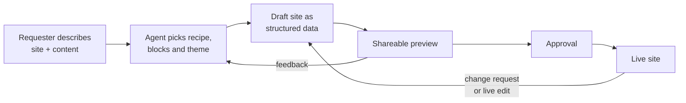
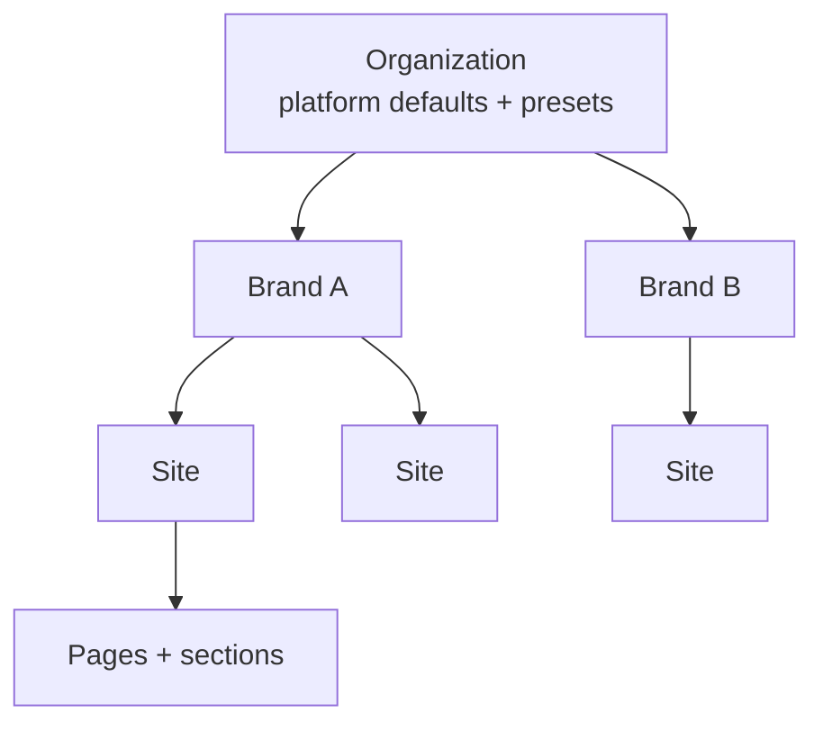
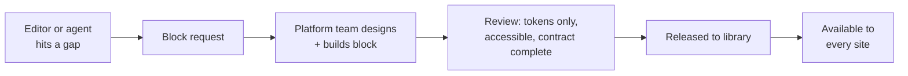

Related docs: [product spec](/product-spec) (what it does) and [technical design](/technical-design) (how it's built, plus the [decision log](/decision-log)).

## The problem and the vision

Pakshi is an internal platform that lets non-technical teams across the organization build, launch and maintain websites without a developer in the loop. People describe what they want to an AI agent, which assembles pages from a curated library of well-designed blocks. Editors fix small things directly on the page in a visual editor.

Every website project repeats the same work: a content system, publishing to a domain, and handing editorial control to non-technical people. Most sites also need the same parts:

- Images and media
- Strong, reusable layouts
- Content pages and blog pages
- Forms, with submissions stored as customer data
- An admin view of that data
- Email sending
- Sometimes payments

Existing tools don't solve this well. Visual builders charge per seat and lock teams in. Headless CMSs give editors form fields but no real control over the page. Either way, developers stay the bottleneck.

**The idea in one line:** we do the hard design work once, as a library of blocks, themes and composition rules. After that, an agent, even a cheap one, only has to arrange existing pieces, not design from scratch.

## Who it's for and guiding principles

Pakshi is an internal accelerator for many groups across one large organization, not a commercial product. It serves several distinct brands, each with its own sites.

| Role                         | What they do in Pakshi                                                         |
| ---------------------------- | ------------------------------------------------------------------------------ |
| Site editors (non-technical) | Create and maintain pages, blogs and content through the agent or live editing |
| Brand owners                 | Define and govern a brand's identity, theme and tone of voice                  |
| Approvers                    | Sign off changes before they go to production, where required                  |
| Platform developers          | Build and improve blocks, themes, recipes and shared services                  |

**Principles**

1. **Constraint creates quality.** Editors and agents choose from well-designed options. They never start from a blank canvas.
2. **The agent edits content, not code.** Pages are structured data, which every change is checked against, and which can be previewed and undone.
3. **Design once, improve everywhere.** All sites render from one central block library. Each site depends on specific block versions and is prompted to upgrade, so improvements spread without surprise breakage.
4. **Production changes only through a publish.** Every change is made in a draft that can be previewed, and each publish follows the approval workflow its owners set.
5. **No per-seat economics.** Anyone who needs access gets it.

## How it works

A site goes from request to live in one conversation, and it stays maintainable through that same conversation afterwards.

The loop works for both new sites and ongoing changes: a new blog, a new page, or a copy fix all follow the same path from draft to preview to approval to live.

**What the agent does:** gathers requirements and content, chooses a page recipe, fills blocks with content, writes copy in the brand's voice, and picks block variants and surfaces.

**What the agent doesn't do:** write code, invent new visual components, or change brand-level design.

## Design system layers

Pakshi's design system has five layers, and each layer only uses the one below it. The block layer is where most of the design investment goes.

| Layer           | What it is                                                                                                                | Who owns it                           |
| --------------- | ------------------------------------------------------------------------------------------------------------------------- | ------------------------------------- |
| 1. Primitives   | shadcn/ui components: buttons, inputs, cards, dialogs, navigation                                                         | Adopted from shadcn                   |
| 2. Theme tokens | Colors, typography, density, depth, surfaces, imagery, motion                                                             | Brand owners, within platform presets |
| 3. Blocks       | Page sections (hero, feature grid, split view, gallery, blog index, form section) with layout variants and content fields | Platform developers                   |
| 4. Recipes      | Composition rules: what a good landing, event or blog page looks like                                                     | Platform developers and designers     |
| 5. Sites        | Content, block choices and a theme                                                                                        | Editors and the agent                 |

**The core rule:** blocks never hard-code a visual decision. They reference tokens only, so a theme change can transform a whole site without touching a single block.

Block contracts, theme tokens and how shadcn/ui is used are covered in the [technical design](/technical-design).

## Brands and theming

Pakshi supports multiple brands, each with its own sites. Settings flow down a four-level hierarchy, and sites use their brand's theme as it is.

Brands own their identity, including voice and tone, since the agent writes copy, not just layouts. Brand owners start from curated theme presets and adjust within safe ranges, so brands can look distinct without anyone designing from scratch. User-facing settings are in the [product spec](/product-spec); token details are in the [technical design](/technical-design#themes).

## Editing experience

Editors get two ways to change a site, and both edit the same underlying page data. They pick whichever is faster for the job.

The **agent** handles new sites, new pages and bigger changes through conversation. **Live visual editing** handles quick fixes directly on the page.

Because both write to the same structured data, a change made one way is immediately visible to the other. The agent always knows the current state of the page.

All work happens in named drafts, which work like branches. A site can have any number of them, and several people can work in one draft at once. When a draft publishes, the others merge in its changes. Pakshi merges most changes automatically and asks a person only about real conflicts.

## Safety rails

Experimentation never touches production. Production can require one or more levels of approval before a change goes live.

- **Drafts:** every change starts in a named draft, separate from the live site.
- **Shareable previews:** every draft has a preview link, shared like a document with named people, the whole organization, or anyone with the link.
- **Approvals:** workflows are set on the organization, a brand or a site, from none to any number of steps before production.
- **Version history and rollback:** every published version is kept. One click undoes the latest publish, and older versions come back as a draft that goes through approval.
- **Validation:** agent and editor changes are checked against block contracts before they can be saved.

## Shared platform services

The backend features every site needs are built once, centrally, and switched on per site. No site builds its own.

These cover media, forms and submissions, an admin view, email, payments and publishing.

Centralizing these keeps personal data and compliance under one set of controls. A new site doesn't bring new risk.

## Growing the library

When someone needs something the library doesn't have, it becomes a new or improved block for everyone, never a one-off hack on a single site.

The agent should recognize a gap and raise a request, rather than forcing an existing block into a job it wasn't built for. Recipes grow the same way as new page types come up.

**Block versioning.** Blocks are versioned, and sites upgrade deliberately, through a draft they can preview, so a live site never changes by surprise. See [decision 001](/decision-log#decision-001) in the decision log.

## Risks

The biggest risk is the block library not being good enough: if early users often feel boxed in, adoption will stall.

| Risk                                           | Mitigation                                               |
| ---------------------------------------------- | -------------------------------------------------------- |
| Library feels limiting                         | Invest heavily up front; fast new-block process          |
| Sites look generic (the "default shadcn" look) | Strong theme presets; expressive block variants          |
| Agent composes pages that are valid but bland  | Recipes and composition rules; strong block descriptions |
| Editors don't trust agent changes              | Previews, approvals and rollback on every change         |

Settled organizational context is in the [product spec](/product-spec#settled-context), and every technical decision is in the [decision log](/decision-log).
